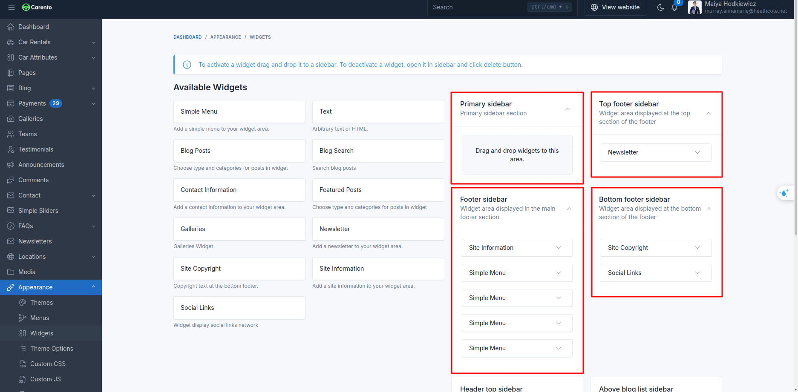
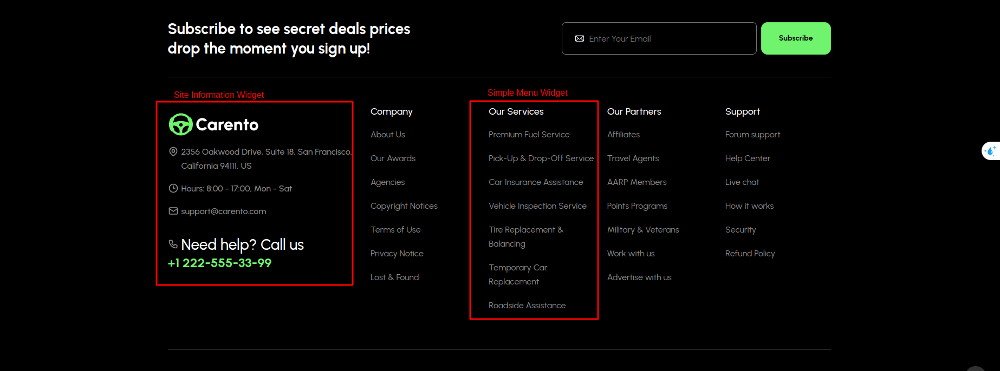
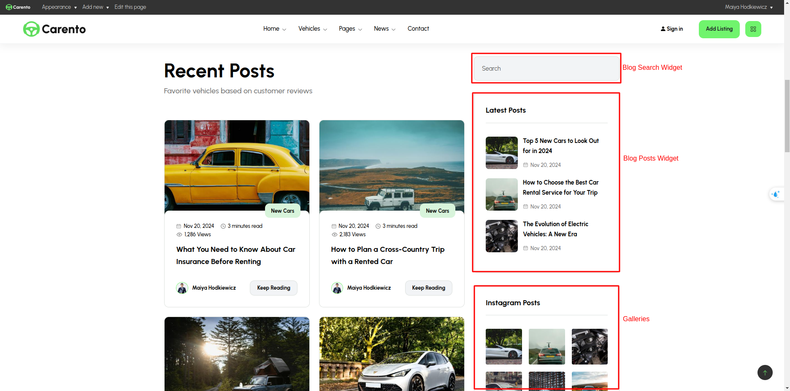
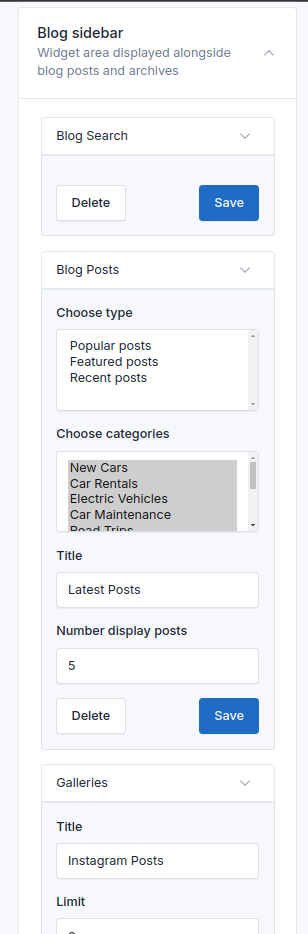

# Widgets

Carento provides five pre-made widget areas to help you customize the user interface and organize content strategically.

These sidebars offer flexibility in placement and functionality, allowing you to tailor the user experience on different
sections of your website.

## Manage Widgets

To manage the widgets, go to the `Appearance` -> `Widgets` menu in the admin panel.

To add a widget to a sidebar, drag and drop the widget from the left side to the sidebar area on the right side.

## Footer

In footer, you can use there widgets: **Site Information**, **Custom Menu** and **Contact Information**.

## Blog Sidebar

In blog sidebar, you can use **Blog Search**, **Blog Posts**, **Galleries** widgets.

