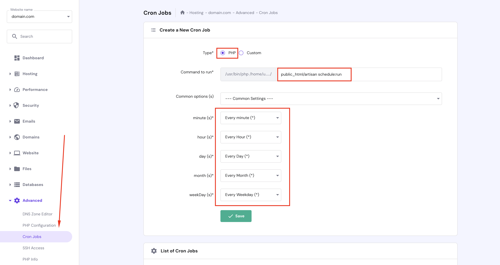
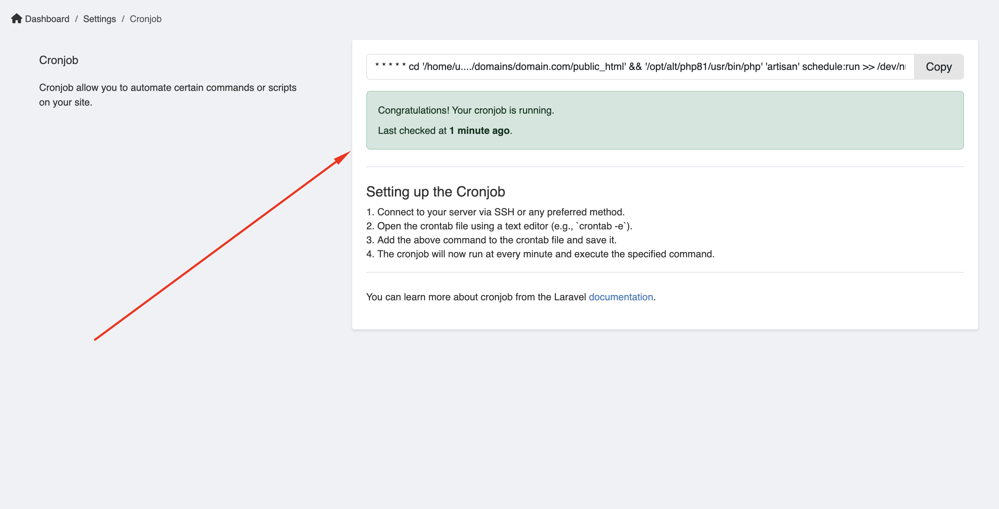

# Setup cronjob

Command:

```bash
* * * * * /usr/local/bin/php /path-to-your-project/artisan schedule:run >> /dev/null 2>&1
```

Check our Cronjob set up instruction in Admin -> Platform administration -> Cronjob.

## For cPanel hosting

For setting up a cron job in cPanel, watch this video tutorial:

<iframe width="100%" height="400" src="https://www.youtube.com/embed/t5mjWGegE-g" title="YouTube video player" frameborder="0" allow="accelerometer; autoplay; clipboard-write; encrypted-media; gyroscope; picture-in-picture; web-share" allowfullscreen></iframe>

## For Hostinger.com

* Go to Dashboard -> Advanced -> Cron Jobs



If you have more than 1 domain on Hostinger, you need to select the domain you want to set up the cron job.


* Verify your cronjob is running or not.


