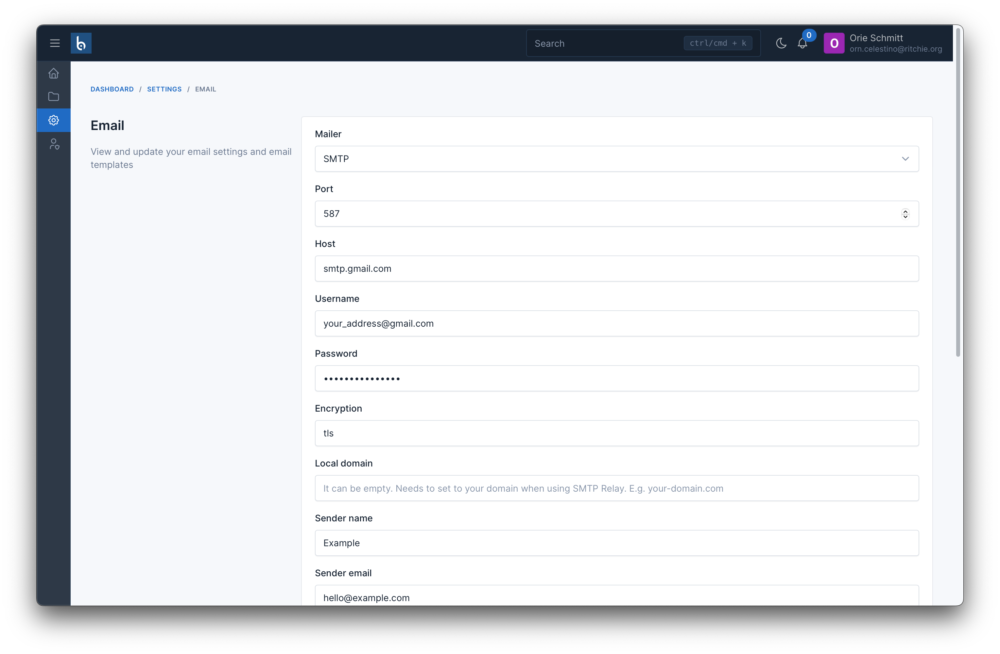
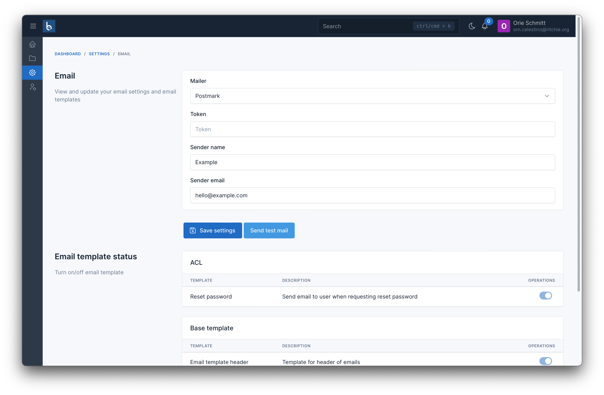

# Email

To send emails for tasks like password recovery, email verification, or notifications, you'll need to set up your email service.

To perform this configuration, you need to navigate to `Settings` -> `Email`.

## Supported Email Services

Currently, full support is provided for several service providers such as SMTP, Mailgun, SES, and Postmark.

This means you only need to select the service provider in the **Mailer** field and enter the authentication information for that service.

### SMTP

To use the SMTP mailer, in the example below, we will use Gmail as the mail service provider.

The credentials information to be filled in is as follows:

- Mailer: `SMTP`
- Port: `587`
- Host: `smtp.gmail.com`
- Username: `Your email address`
- Password: `App password`

::: warning
Note that the **Password** refers to an **app password**, not **your Gmail password**. You can refer to Google's guide on [Sign in with app passwords](https://support.google.com/mail/answer/185833) to learn how to create an app password.
:::

### Mailgun

For Mailgun, you will need to obtain the following information from your Mailgun account:

- Mailer: `Mailgun`
- Domain: `Your Mailgun domain`
- API Key: `Your Mailgun API key`

Once you have obtained these details from your Mailgun account, enter them into the corresponding fields in the email configuration settings.

### SES (Amazon Simple Email Service)

When using Amazon SES, you will require the following details:

- Mailer: `SES`
- AWS Region: `Your AWS region`
- Access Key ID: `Your AWS access key ID`
- Secret Access Key: `Your AWS secret access key`

Make sure you have an AWS account and the necessary permissions to access SES. Enter the provided information into the email configuration settings.

### Postmark

For Postmark, gather the following details:

- Mailer: `Postmark`
- API Token: `Your Postmark API token`

Once you've gathered the necessary information from your service provider, enter it into the corresponding fields in the email configuration settings.

With these settings configured, you'll be able to send emails for various purposes effectively.
