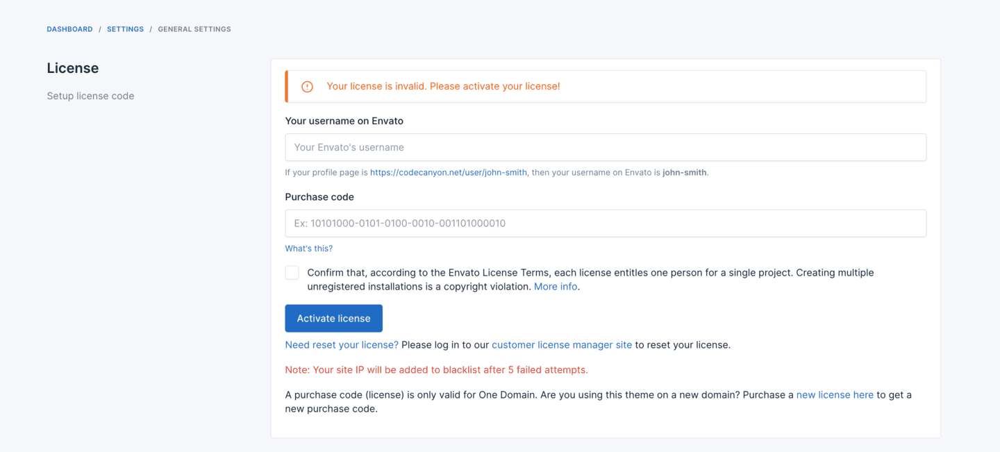

# License

## Understanding Your License

Botble CMS is distributed under the Envato Standard License or Extended License. It's important to understand what each license allows you to do.

### License Types

#### Regular License vs. Extended License

The license type is based on your site's charging model:

- **Regular License**: Suitable if your website does not charge end users for access or services.
- **Extended License**: Required if you have paying users who you charge for accessing or using your service (monthly or yearly subscription, commission fee on each sale as SaaS, etc.).

You can start with a regular license and upgrade to an extended license once you have paying users.

::: tip
Please read the official license rules here: [Envato Standard License](https://codecanyon.net/licenses/standard)
:::

### One License, One Website

As per Envato's licensing rules, one license can only be used for one website. This includes:

- One domain
- One subdomain
- One subfolder
- One IP address

If you want to use Botble CMS for multiple sites or clients, you need to purchase multiple licenses.

### Development Environments

You can use Botble CMS without activating a license on development, staging, or UAT environments for development purposes without violating license terms. All features will work fine except:

- System updater
- Installing new plugins from [Botble Marketplace](https://marketplace.botble.com/products)

This allows you to develop and test your site before deploying to production.

## Activate License

In admin panel, go to `Settings` -> `General` to activate your license.

If you don't know how to get purchase code, check this
article [Where Is My Purchase Code?](https://help.market.envato.com/hc/en-us/articles/202822600-Where-Is-My-Purchase-Code)

::: warning
If you can't activate your license, please create a ticket on https://botble.ticksy.com, our dev team will support you.
Don't try to activate it many times, your domain & IP will be added to blacklist.
:::

## License Usage Guidelines

### Activation Limits

- Regular License can only be activated on 1 domain.
- Each license is tied to a specific domain and cannot be used on multiple websites simultaneously.

### Moving Your Website

- If you want to reinstall or move your website to a new server, you need to either:
  - Back up your license file in `/storage/.license`, or
  - Deactivate your license before moving, then reactivate it on the new server

### Domain Changes

- If you change your website configuration, please deactivate your license first:
  - Switching between www and non-www (e.g., example.com to www.example.com)
  - Changing from HTTP to HTTPS or vice versa
  - Moving to a different domain name

### License Deactivation

- You can deactivate your license in the admin panel under Settings -> General
- If you can't access your admin panel or deactivate your license for any reason, please contact us at contact@botble.com, and we will assist you

### Resetting Your License

If you need to reset your license (for example, if you've changed domains or are experiencing activation issues):

1. Please log in to our customer license manager site https://license.botble.com to reset your license
2. Once reset, you can activate your license again on your new domain

This is particularly useful when:
- You've moved your website to a new domain
- You're experiencing issues with license activation
- You need to reinstall your website

### Multiple Environments

- You can use the same license for both your production and development environments, as long as they're not publicly accessible at the same time
- For agencies developing sites for clients, you should purchase a separate license for each client's website

### License Verification

- Our system periodically verifies license activation
- Using the same license on multiple production websites simultaneously violates the license terms and may result in all sites being deactivated

::: warning
Attempting to bypass license verification or using nulled versions of Botble CMS puts your website at risk of security vulnerabilities and malware. Always use properly licensed software.
:::

::: tip
Contact us via email at contact@botble.com if you have any questions about licensing. We're here to help!
:::

## License Upgrades and Transfers

### Upgrading from Regular to Extended License

If your business model changes and you start charging users, you'll need to upgrade from a Regular License to an Extended License:

1. Purchase an Extended License from [CodeCanyon](https://codecanyon.net/item/botble-cms-php-platform-based-on-laravel-framework/16928182)
2. Contact us at contact@botble.com with both your Regular and Extended License purchase codes
3. We'll help you transition to the Extended License

### License Transfers

Envato allows a license to be transferred to another person or company:

1. The original buyer must initiate the transfer through their Envato account
2. Once transferred, the new owner will receive the purchase code and can activate the license
3. The previous owner must deactivate and stop using the product

For more information on license transfers, please refer to [Envato's License FAQ](https://help.market.envato.com/hc/en-us/articles/202501064-License-FAQ).

## Frequently Asked Questions

### Can I use one license for multiple domains?

No, each domain requires its own license. This includes subdomains and test/staging environments that are publicly accessible.

### Do I need a license for my development environment?

No, you can use Botble CMS on development/staging environments without activating a license, but certain features like system updates and marketplace access will be limited.

### What happens if I don't activate my license?

The system will work normally except for automatic updates and marketplace access. We recommend activating your license to receive security updates and new features.

### Can I use Botble CMS for a client's website?

Yes, but you need to purchase a separate license for each client's website. Alternatively, your client can purchase their own license.

### How do I know if I need an Extended License?

If your website charges users for access or services (subscription model, SaaS, etc.), you need an Extended License. If you're unsure, start with a Regular License and upgrade when necessary.
