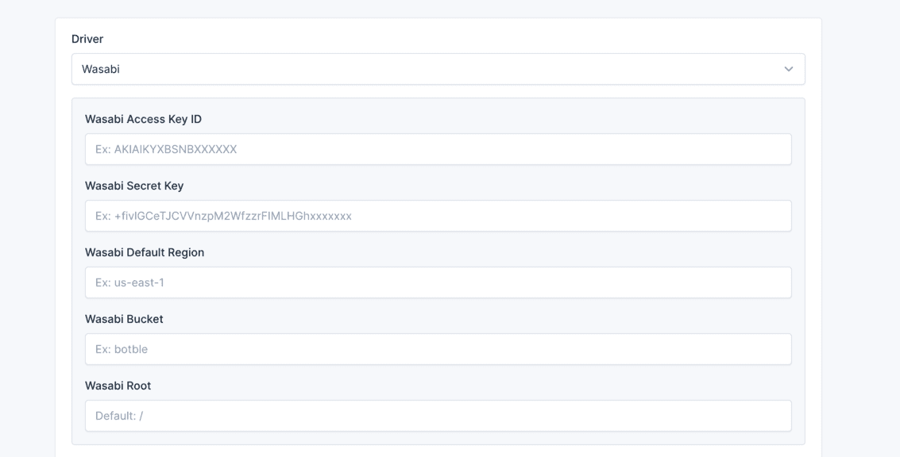
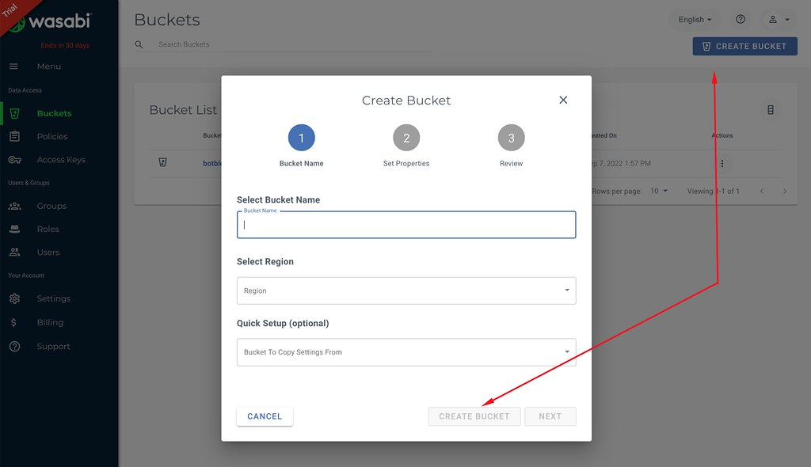
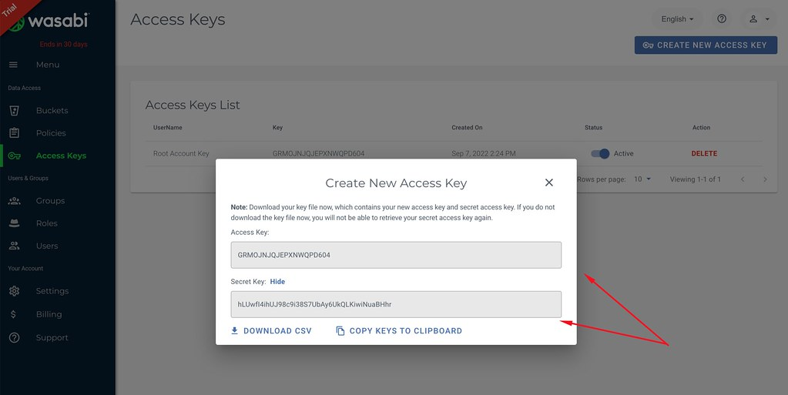

# Media

## Setup Amazon S3

In admin panel, go to `Settings` -> `Media` to configure S3 for storage.


## Video Tutorial

Watch this video for a step-by-step guide:

<iframe width="100%" height="360" src="https://www.youtube.com/embed/FIvxmmgrHEs" title="YouTube video player" frameborder="0" allow="accelerometer; autoplay; clipboard-write; encrypted-media; gyroscope; picture-in-picture" allowfullscreen></iframe>

## Setup Wasabi

In admin panel, go to `Settings` -> `Media` to configure Wasabi for storage.



### Steps

1. Create a new bucket in Wasabi:

   

2. Change your bucket to public:

   

3. Get your access keys from Wasabi:

   

   

## Setup BunnyCDN

In admin panel, go to `Settings` -> `Media` to configure BunnyCDN for storage.


## Video Tutorial

Watch this video for a step-by-step guide:

<iframe width="100%" height="360" src="https://www.youtube.com/embed/Hlw4erp2DGk" title="YouTube video player" frameborder="0" allow="accelerometer; autoplay; clipboard-write; encrypted-media; gyroscope; picture-in-picture" allowfullscreen></iframe>

## Changing or Adding Image Sizes

When an image is uploaded, there will be an original image and thumbnails generated.

By default, there is a thumbnail named **Thumb** with a size of **150x150**.

## Resizing Existing Thumbnail

If you want to modify the size of this **Thumb**, navigate to `Settings` -> `Media`, then scroll down to **Media
thumbnails sizes**


## Adding New Sizes

In case you need to add new sizes for images, you need to manually add them to the `.env` file in the following format:

```bash
CLOUDIFY_MEDIA_SIZES=600x600,1280x900
```

Each size will be separated by a comma `,`. After adding this, revisit the Media settings page, and you will see the
newly registered sizes appearing.

For example, adding two new sizes **600x600** and **1280x900**. When a new image is uploaded, there will be four images
generated: the original image, one default-sized image **150x150**, and 2 images in the newly added sizes.

## Changing File Extensions

By default, the media manager supports the following file extensions:

```bash
jpg,jpeg,png,gif,txt,docx,zip,mp3,bmp,csv,xls,xlsx,ppt,pptx,pdf,mp4,doc,mpga,wav,webp
```

If you want to add or remove any file extensions, you can override this configuration by
adding `CLOUDIFY_MEDIA_ALLOWED_EXTENSIONS` to the `.env` file:

```bash
CLOUDIFY_MEDIA_ALLOWED_EXTENSIONS=jpg,jpeg,png,gif,txt,docx,zip,mp3,bmp,csv,xls,xlsx,ppt,pptx,pdf,mp4,doc,mpga,wav,webp
```

## Increasing Maximum Upload Size

Most hosting providers have a maximum upload size ranging from 2MB to 20MB. Therefore, if you try to upload larger
files, you may encounter some unexpected errors.

To increase the maximum upload size, you need to change the values of `upload_max_filesize` and `post_max_size` in
the `php.ini` file:

```bash
upload_max_filesize = 10M
post_max_size = 10M
```

::: tip
If you're unsure how to do this, you can contact your hosting/VPS provider for assistance.
:::
