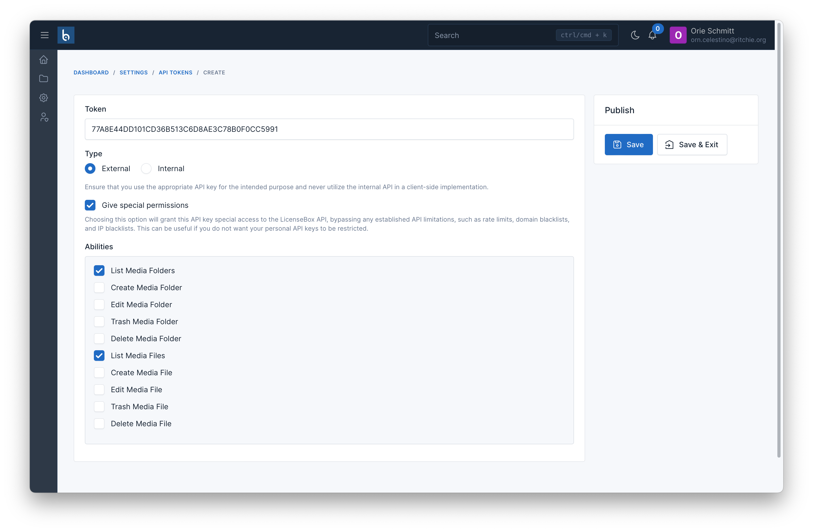

# API Integration

## Quick Start

The Cloudify API provides endpoints to manage media files and folders programmatically. For complete endpoint documentation, see the [API Reference](./api-reference.md).

## Important: Folder Navigation

When working with folders through the API:

- **Root folders only**: `GET /api/v1/media/folders` returns only root-level folders
- **Get subfolders**: Add `folder_id` parameter: `GET /api/v1/media/folders?folder_id={parent_id}`
- **Upload to folder**: Include `folder_id` in your upload request

### Example: Navigating Folder Structure

```bash
# Get root folders
curl -X GET "https://your-domain.com/api/v1/media/folders" \
  -H "X-API-KEY: your-token"

# Get subfolders of folder ID 5
curl -X GET "https://your-domain.com/api/v1/media/folders?folder_id=5" \
  -H "X-API-KEY: your-token"

# Upload file to folder ID 5
curl -X POST "https://your-domain.com/api/v1/media/files" \
  -H "X-API-KEY: your-token" \
  -F "file=@document.pdf" \
  -F "folder_id=5"
```

## Available Endpoints

| Endpoint | Method | Description |
|----------|--------|-------------|
| `/media/folders` | GET | List folders (use `folder_id` param for subfolders) |
| `/media/folders` | POST | Create new folder |
| `/media/folders/{id}` | GET | Get folder details with files |
| `/media/folders/{id}/trash` | PATCH | Move folder to trash |
| `/media/folders/{id}` | DELETE | Delete folder permanently |
| `/media/files` | GET | List files in folder |
| `/media/files` | POST | Upload new file |
| `/media/files/{id}/trash` | PATCH | Move file to trash |
| `/media/files/{id}` | DELETE | Delete file permanently |

For complete API documentation including all parameters and responses, see the [API Reference](./api-reference.md) or view the [Postman Collection](https://documenter.getpostman.com/view/11116730/2sA3JQ3ejZ).

## Create API Token

To use the available APIs for interacting with Media Files or Media Folders such as retrieving lists, creating, or deleting, you need an authentication token. To generate this token, you access the page `Settings` -> `API Tokens` -> `Create`.

The **Token** field is automatically generated, but you can change it if needed

The **Type** field has two options: **External** and **Internal**. Internal is used when you are using the API within your organization, while External is for allowing access to users outside your organization or customers.

The **Give special permissions** field, by default unchecked, grants the token all the permissions that Cloudify supports as listed in the Available Endpoints section.



If you want the token to have access to only specific permissions, you can check the **Give special permissions** field and select the permissions that the token should have access to.

## Upload File Example

In the following example, we will learn how to integrate the Cloudify API to upload files using PHP or Node.js.

First, create a view file to display a form that allows users to select a file to upload:

```html
<form action="" method="post" enctype="multipart/form-data">
    <input type="file" name="file" />
    <button type="submit">Upload</button>
</form>
```

::: code-group

```php [PHP]
$token = 'Paste_your_API_token_here';

if ($_SERVER['REQUEST_METHOD'] === 'POST') {
    $curl = curl_init();
    
    $file = new \CURLFile($_FILES['file']['tmp_name']);
    $file->setPostFilename($_FILES['file']['name']);

    curl_setopt_array($curl, array(
        CURLOPT_URL => 'http://cloudify.test/api/v1/media/files',
        CURLOPT_RETURNTRANSFER => true,
        CURLOPT_ENCODING => '',
        CURLOPT_MAXREDIRS => 10,
        CURLOPT_TIMEOUT => 0,
        CURLOPT_FOLLOWLOCATION => true,
        CURLOPT_HTTP_VERSION => CURL_HTTP_VERSION_1_1,
        CURLOPT_CUSTOMREQUEST => 'POST',
        CURLOPT_POSTFIELDS => array('file'=> $file),
        CURLOPT_HTTPHEADER => array(
            'Accept: application/json',
            'X-API-KEY: ' . $token,
        ),
    ));

    $response = curl_exec($curl);
    curl_close($curl);

    echo '<pre>';
    print_r(json_decode($response, true));
    echo '</pre>';
}
```

```js [Node.js]
const express = require('express')
const multer = require('multer')
const fs = require('fs')
const request = require('request')
const path = require('path')

const app = express()
const upload = multer({ dest: 'uploads/' })

app.use(express.static('public'))

app.post('/upload', upload.single('file'), (req, res) => {
    const filePath = path.join(__dirname, req.file.path)
    const fileStream = fs.createReadStream(filePath)

    const options = {
        method: 'POST',
        url: 'https://cloudify.botble.com/api/v1/media/files',
        headers: {
            Accept: 'application/json',
            X-API-KEY: '{token}',
        },
        formData: {
            file: {
                value: fileStream,
                options: {
                    filename: req.file.originalname,
                    contentType: req.file.mimetype,
                },
            },
        },
    }

    request(options, function (error, response) {
        // Delete the file from local uploads directory after upload
        fs.unlink(filePath, (err) => {
            if (err) {
                console.error('Failed to delete file:', err)
            }
        })

        if (error) {
            throw new Error(error)
        }

        console.log(response.body)
        res.send(response.body)
    })
})

app.listen(3000, () => {
    console.log('Server started on http://localhost:3000')
})
```
