# Commands

Botble CMS provides a variety of Artisan commands to help you manage your application. This page lists all available commands and their usage.

## Command Categories

- [Installation & Setup](#installation--setup)
- [User Management](#user-management)
- [Asset Management](#asset-management)
- [Plugin Management](#plugin-management)
- [Theme Management](#theme-management)
- [Widget Management](#widget-management)
- [Database Management](#database-management)
- [System Maintenance](#system-maintenance)
- [Backup & Restore](#backup--restore)
- [Logging & Monitoring](#logging--monitoring)
- [Miscellaneous](#miscellaneous)

## Installation & Setup

### CMS Installation

Installs the CMS by running migrations, creating a super user, activating plugins, and publishing assets.

```bash
php artisan cms:install
```

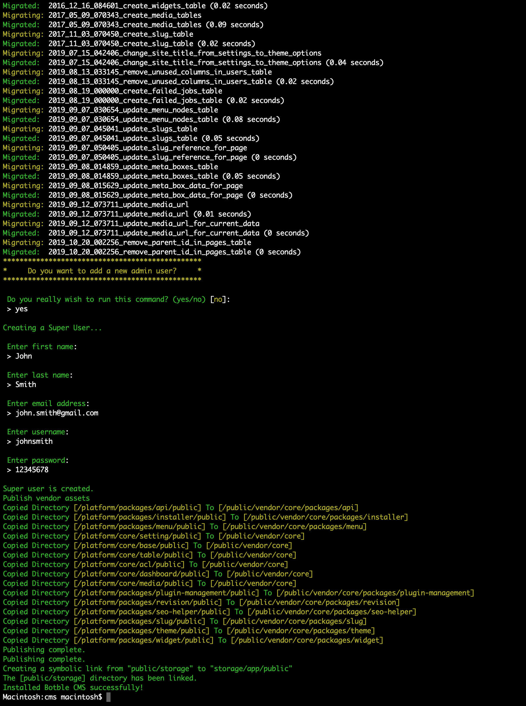

This interactive command will:
1. Run database migrations
2. Optionally create a super user
3. Optionally activate all plugins
4. Optionally seed the database with sample data
5. Publish assets

### Create Admin User

Creates a new administrator user account.

```bash
php artisan cms:user:create
```

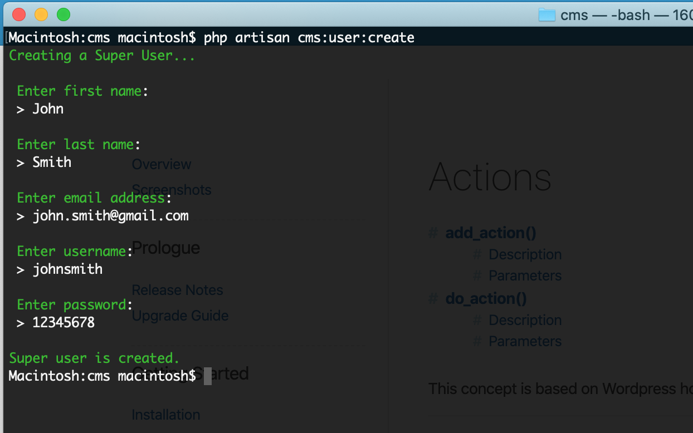

The command will prompt you for:
- First name
- Last name
- Username
- Email
- Password

After creating the user, you can log in at `/admin` with the credentials you provided.

### Publish Assets

Copies assets from the `/platform` directory to make them accessible in the public directory.

```bash
php artisan cms:publish:assets
```

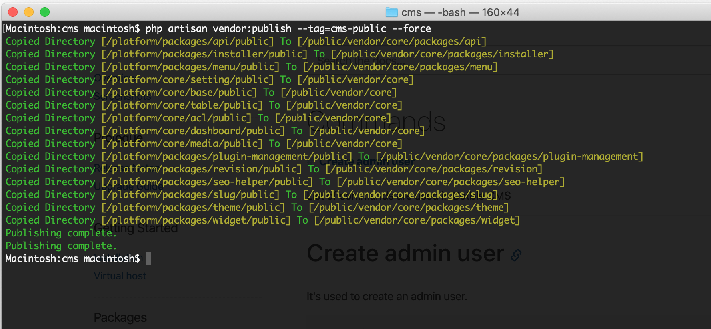

This command publishes:
- Core assets to `/public/vendor/core`
- Plugin assets to `/public/vendor/core/plugins/{plugin}`
- Theme assets to `/public/themes/{theme}`

## Package Management

### Create a Package

Creates a new package in the `/platform/packages` directory.

```bash
php artisan cms:package:create <package>
```

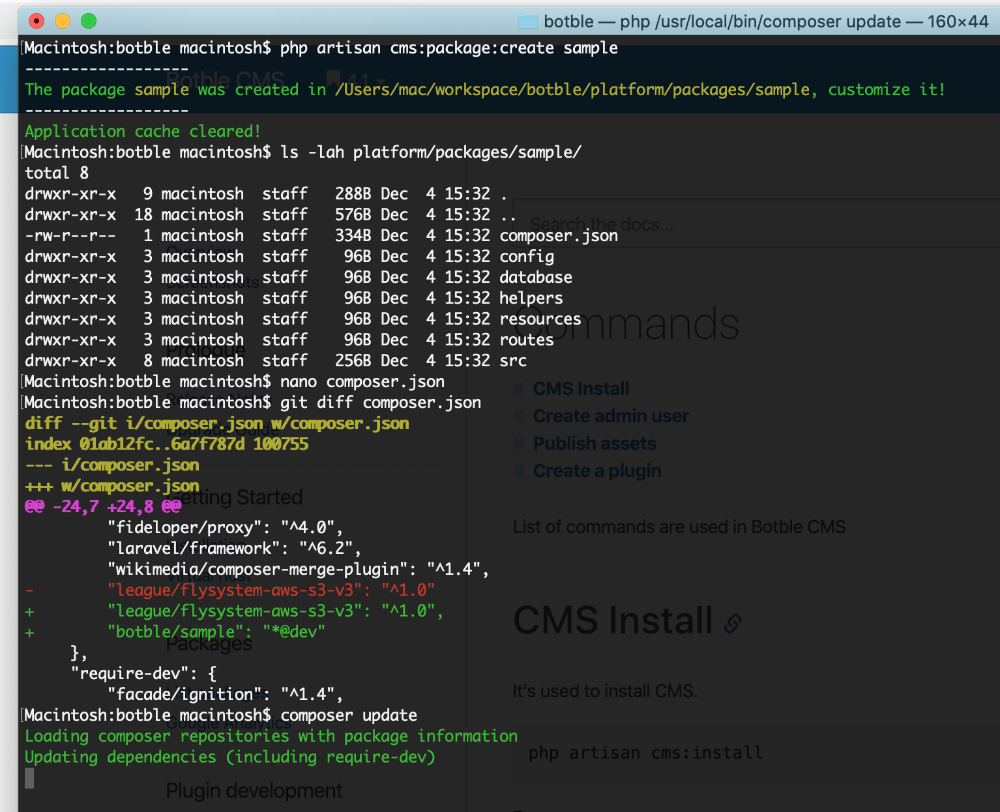

**Note:** After creating a package, you need to add it to your `composer.json` file and run `composer update` to load it.

## Plugin Management

### Create a Plugin

Creates a new plugin in the `/platform/plugins` directory with the basic structure.

```bash
php artisan cms:plugin:create <plugin>
```

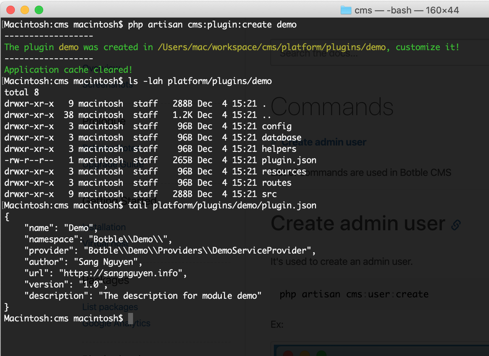

This command generates a complete plugin structure including:
- Controllers
- Models
- Routes
- Views
- Migrations
- Language files
- Service provider

### Activate a Plugin

Activates an existing plugin.

```bash
php artisan cms:plugin:activate <plugin>
```

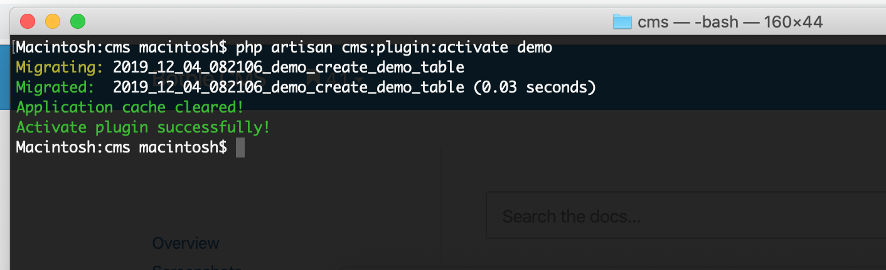

This command:
1. Adds the plugin to the list of activated plugins in the `settings` table
2. Runs migrations to update the database
3. Clears the application cache

### Activate All Plugins

Activates all plugins in the `/platform/plugins` directory.

```bash
php artisan cms:plugin:activate:all
```

### Deactivate a Plugin

Deactivates an existing plugin.

```bash
php artisan cms:plugin:deactivate <plugin>
```

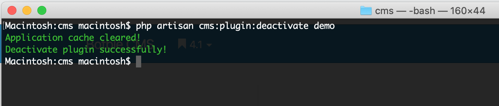

This command:
1. Removes the plugin from the list of activated plugins in the `settings` table
2. Clears the application cache

### Deactivate All Plugins

Deactivates all plugins in the `/platform/plugins` directory.

```bash
php artisan cms:plugin:deactivate:all
```

### Remove a Plugin

Completely removes an existing plugin.

```bash
php artisan cms:plugin:remove <plugin>
```

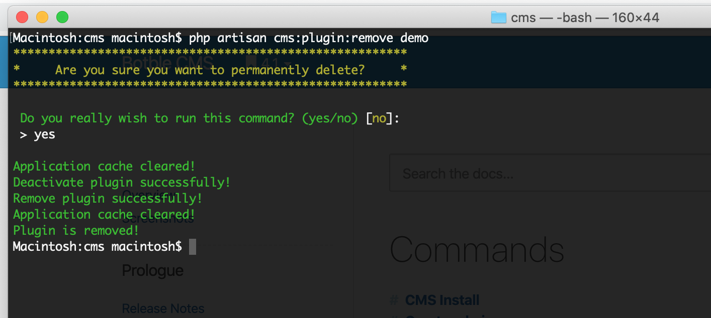

This command:
1. Deactivates the plugin
2. Removes the plugin's assets
3. Drops the plugin's database tables
4. Deletes the plugin directory

### Remove All Plugins

Removes all plugins from the `/platform/plugins` directory.

```bash
php artisan cms:plugin:remove:all
```

### List Plugins

Displays a list of all plugins and their activation status.

```bash
php artisan cms:plugin:list
```

### Publish Plugin Assets

Publishes assets for all or specific plugins.

```bash
php artisan cms:plugin:assets:publish [plugin]
```

### Discover Plugins

Rebuilds the plugin manifest cache.

```bash
php artisan cms:plugin:discover
```

## Theme Management

### Create a Theme

Creates a new theme in the `/platform/themes` directory.

```bash
php artisan cms:theme:create <theme>
```

This command generates a complete theme structure with all necessary files and directories.

### Activate a Theme

Sets a theme as the active theme for your site.

```bash
php artisan cms:theme:activate <theme>
```

This command updates the active theme in the settings and clears the cache.

### Remove a Theme

Completely removes a theme from the system.

```bash
php artisan cms:theme:remove <theme>
```

**Note:** You cannot remove the currently active theme. You must activate another theme first.

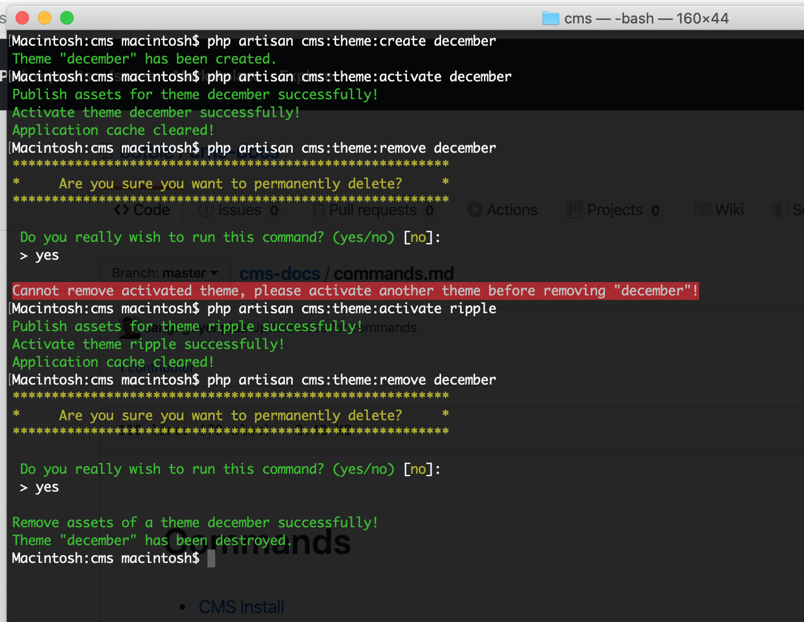

### Publish Theme Assets

Copies theme assets to the public directory to make them accessible.

```bash
php artisan cms:theme:assets:publish [theme]
```

If no theme name is provided, it publishes assets for the currently active theme.

### Remove Theme Assets

Deletes published theme assets from the public directory.

```bash
php artisan cms:theme:assets:remove [theme]
```

### Install Theme Sample Data

Imports sample data for a theme.

```bash
php artisan cms:theme:install-sample-data
```

This command imports the SQL file located at `platform/themes/your-theme/data/sample.sql`.

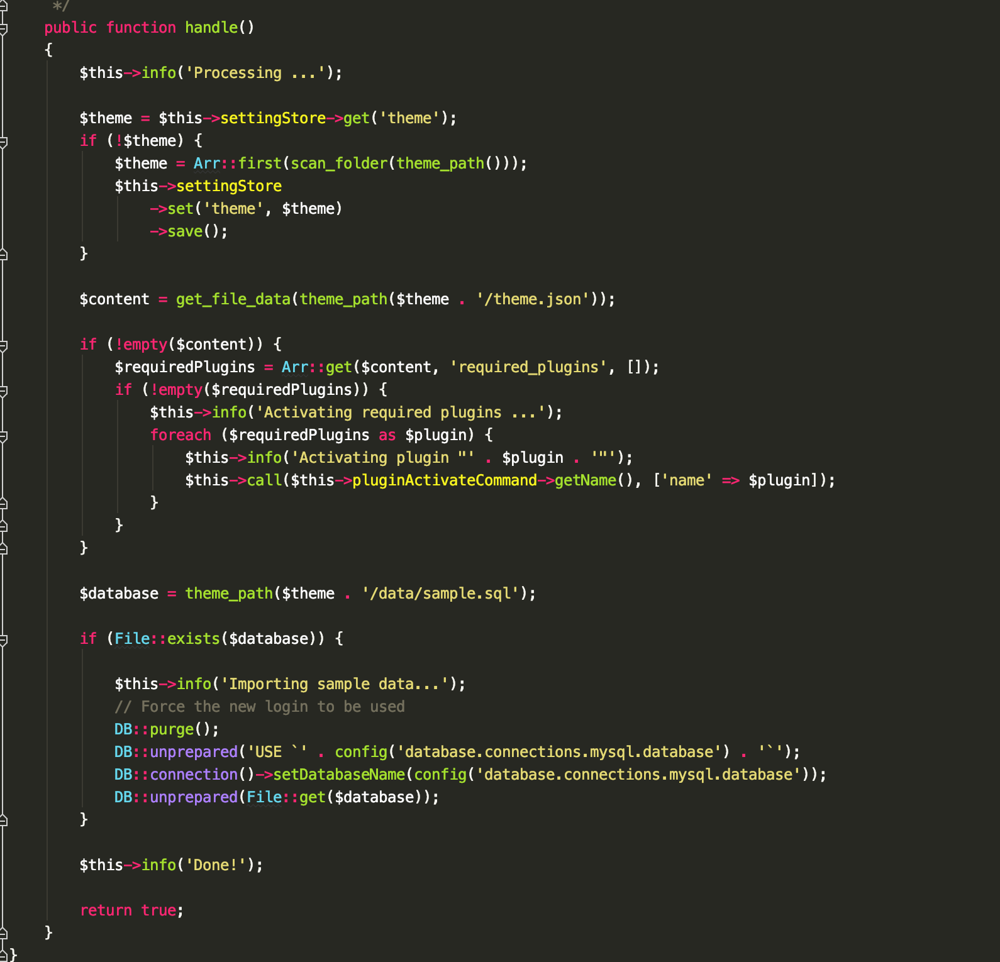

### Check Theme Options

Checks for differences between theme options in the database and option definitions.

```bash
php artisan cms:theme:options:check
```

## Widget Management

Widgets are always associated with a theme and are located within the theme directory.

### Create a Widget

Creates a new widget in the current active theme.

```bash
php artisan cms:widget:create <widget>
```

This command creates a widget in `/platform/themes/your-theme/widgets` and automatically registers it in the `registration.php` file.

### Remove a Widget

Removes an existing widget from the current active theme.

```bash
php artisan cms:widget:remove <widget>
```

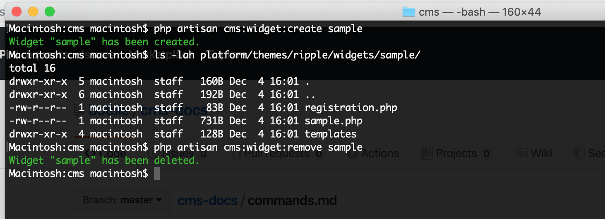

## Database Management

### Export Database

Exports the database to an SQL file.

```bash
php artisan cms:db:export [output]
```

By default, the database is exported to `database.sql` in the root directory. You can specify a different output path as an argument.

### Import Database

Imports a database from an SQL file.

```bash
php artisan cms:db:import [file]
```

By default, the command looks for `database.sql` in the root directory. You can specify a different file path as an argument.

### Change Slug Prefix

Changes or sets the prefix for slugs of a specific model.

```bash
php artisan cms:slug:prefix <class> --prefix=<prefix>
```

Example:
```bash
php artisan cms:slug:prefix "Botble\\Blog\\Models\\Post" --prefix="blog"
```

## System Maintenance

### Clean Up System

Cleans up the database by removing unnecessary data while preserving essential records.

```bash
php artisan cms:system:cleanup
```

**Warning:** This command will delete most data from the database. Use with caution and only when you want to reset your system.

### Clear Expired Cache

Removes expired cache items from the system.

```bash
php artisan cms:cache:clear-expired
```

### Compress Images

Compresses images to reduce file size without significant quality loss.

```bash
php artisan cms:media:compress
```

### Fetch Google Fonts

Downloads Google Fonts for local hosting.

```bash
php artisan cms:google-fonts:fetch
```

### Update Google Fonts

Updates the list of available Google Fonts.

```bash
php artisan cms:google-fonts:update
```

## Backup & Restore

### Create Backup

Creates a backup of the database and uploaded files.

```bash
php artisan cms:backup:create [name] --description=[description]
```

### Restore Backup

Restores a backup from a specific date or the latest backup.

```bash
php artisan cms:backup:restore [backup-date]
```

If no date is provided, it restores the latest backup.

### List Backups

Displays a list of all available backups.

```bash
php artisan cms:backup:list
```

### Remove Backup

Deletes a specific backup.

```bash
php artisan cms:backup:remove [backup-date]
```

### Clean Backups

Removes all backups from the system.

```bash
php artisan cms:backup:clean
```

## Logging & Monitoring

### Clear Log Files

Deletes all log files from the `storage/logs` directory.

```bash
php artisan cms:log:clear
```

### Clear Activity Logs

Deletes all activity logs from the database.

```bash
php artisan cms:activity-logs:clear
```

### Clean Old Activity Logs

Removes activity logs older than 30 days.

```bash
php artisan cms:activity-logs:clean-old-logs
```

### Clear Request Logs

Deletes all request error logs from the database.

```bash
php artisan cms:request-logs:clear
```

## Miscellaneous

### Activate License

Activates your Botble CMS license.

```bash
php artisan cms:license:activate <license-key>
```

### Update CMS

Updates the CMS to the latest version.

```bash
php artisan cms:update
```

This command:
1. Downloads the latest version
2. Extracts the files
3. Updates the core and packages
4. Runs migrations
5. Publishes assets
