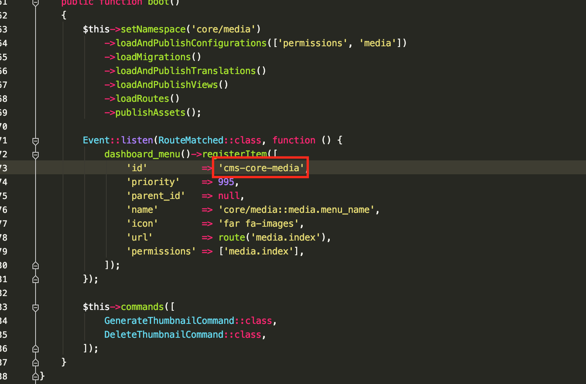
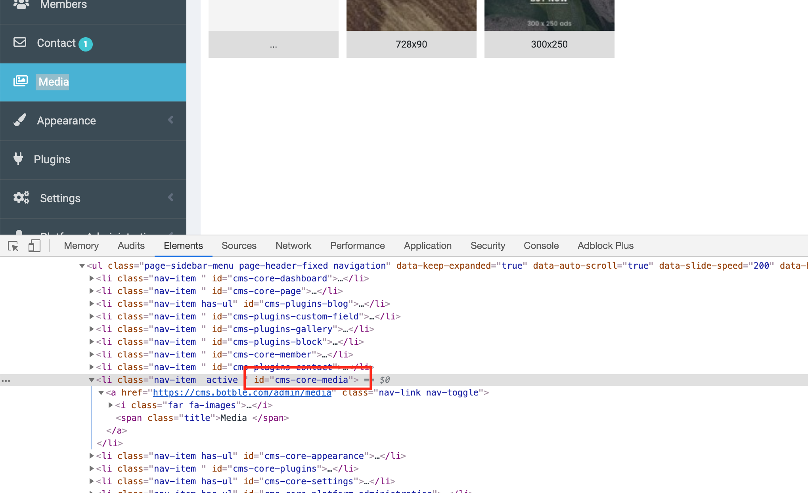

# Dashboard Menu

## Introduction

The `DashboardMenu` class in Botble CMS provides a powerful way to manage the admin dashboard menu. It allows you to register, remove, and organize menu items with a fluent API. The menu system supports hierarchical structures, permissions, and multiple menu groups.

## Menu Architecture

The dashboard menu system consists of two main classes:

1. **DashboardMenu**: The main class that manages menu items, groups, and rendering.
2. **DashboardMenuItem**: A builder class for creating menu items with a fluent API.

Menu items are stored in memory and can be cached for better performance. Each menu item has properties like ID, name, icon, URL, permissions, and parent-child relationships.

## Menu Groups

Botble CMS supports multiple menu groups, allowing you to have different menus for different sections of your application. The default group is 'admin', which is used for the main admin dashboard.

```php
// Working with the default admin menu
DashboardMenu::default()->...

// Working with a custom menu group
DashboardMenu::for('member')->...

// Using the group method for temporary context
DashboardMenu::group('custom-group', function ($menu) {
    // Register items for this group
});
```

## Registering Menu Items

### Using DashboardMenuItem (Recommended)

The recommended way to register menu items is using the `DashboardMenuItem` class with the `beforeRetrieving` method:

```php
use Botble\Base\Facades\DashboardMenu;
use Botble\Base\Supports\DashboardMenuItem;

DashboardMenu::default()->beforeRetrieving(function () {
    DashboardMenu::make()
        ->registerItem(
            DashboardMenuItem::make()
                ->id('cms-plugins-your-plugin')
                ->priority(99)
                ->parentId(null) // or parent ID for submenu items
                ->name('plugins/your-plugin::your-plugin.name')
                ->icon('ti ti-package')
                ->route('your-plugin.index')
                ->permissions(['your-plugin.index'])
        );
});
```

### Using Array Syntax

You can also register menu items using an array:

```php
DashboardMenu::default()->beforeRetrieving(function () {
    DashboardMenu::make()->registerItem([
        'id' => 'cms-plugins-your-plugin',
        'priority' => 99,
        'parent_id' => null,
        'name' => 'plugins/your-plugin::your-plugin.name',
        'icon' => 'ti ti-package',
        'route' => 'your-plugin.index',
        'permissions' => ['your-plugin.index'],
    ]);
});
```

### Menu Item Properties

- **id**: Unique identifier for the menu item (required)
- **priority**: Order priority (lower numbers appear first)
- **parent_id**: ID of the parent menu item (null for top-level items)
- **name**: Display name (preferably a translation key)
- **icon**: Icon class (Tabler icons or Font Awesome)
- **url**: Direct URL for the menu item
- **route**: Route name (will be converted to URL)
- **permissions**: Required permissions to view this menu item

### Creating Submenus

To create a submenu, set the `parentId` to the ID of the parent menu item:

```php
// Parent menu
DashboardMenuItem::make()
    ->id('cms-plugins-your-plugin')
    ->name('Your Plugin')
    ->icon('ti ti-package');

// Submenu items
DashboardMenuItem::make()
    ->id('cms-plugins-your-plugin-items')
    ->parentId('cms-plugins-your-plugin')
    ->name('Items')
    ->route('your-plugin.items.index')
    ->permissions(['your-plugin.items.index']);

DashboardMenuItem::make()
    ->id('cms-plugins-your-plugin-settings')
    ->parentId('cms-plugins-your-plugin')
    ->name('Settings')
    ->route('your-plugin.settings')
    ->permissions(['your-plugin.settings']);
```

## Removing Menu Items

### Removing a Single Item

```php
DashboardMenu::default()->beforeRetrieving(function () {
    DashboardMenu::make()->removeItem('cms-core-media');
});
```

### Removing Multiple Items

```php
DashboardMenu::default()->beforeRetrieving(function () {
    DashboardMenu::make()->removeItem([
        'cms-core-media',
        'cms-core-plugins',
    ]);
});
```

### Removing a Submenu Item

When removing a submenu item, you only need to specify its ID:

```php
DashboardMenu::default()->beforeRetrieving(function () {
    DashboardMenu::make()->removeItem('cms-core-system-information');
});
```

### Preventing Access to Removed Menu Items

When you remove a menu item, the corresponding URL may still be accessible. To prevent access, you should also check the current route:

```php
DashboardMenu::default()->beforeRetrieving(function () {
    DashboardMenu::make()->removeItem('cms-core-system-information');
});

if (in_array(Route::currentRouteName(), ['system.info'])) {
    abort(403);
}
```

## Advanced Usage

### Menu Hooks

The dashboard menu system provides hooks for customizing the menu:

```php
// Execute code before retrieving the menu
DashboardMenu::default()->beforeRetrieving(function (DashboardMenu $menu) {
    // Register or modify menu items
});

// Execute code after the menu is retrieved
DashboardMenu::default()->afterRetrieved(function (DashboardMenu $menu, Collection $items) {
    // Modify the retrieved menu items
});
```

### Checking for Menu Items

```php
if (DashboardMenu::default()->hasItem('cms-plugins-your-plugin')) {
    // The menu item exists
}
```

### Getting Menu Items

```php
// Get all menu items
$allItems = DashboardMenu::default()->getAll();

// Get a specific menu item by ID
$item = DashboardMenu::default()->getItemById('cms-plugins-your-plugin');

// Get all items with a specific parent ID
$childItems = DashboardMenu::default()->getItemsByParentId('cms-plugins-your-plugin');
```

### Menu Caching

The dashboard menu can be cached for better performance. The cache is user-specific and respects permissions:

```php
// Clear the menu cache for the current user
DashboardMenu::default()->clearCachesForCurrentUser();

// Clear the menu cache for all users
DashboardMenu::default()->clearCaches();

// Check if the menu is cached
if (DashboardMenu::default()->hasCache()) {
    // The menu is cached
}
```

## Best Practices

1. **Use Consistent ID Naming**: Follow the pattern `cms-plugins-your-plugin` for plugin menu items.

2. **Use Translation Keys**: Always use translation keys for menu names for better localization.

3. **Set Appropriate Permissions**: Ensure menu items have the correct permissions to control visibility.

4. **Use Tabler Icons**: Prefer Tabler icons (`ti ti-*`) over Font Awesome for consistency with the admin theme.

5. **Register in Service Providers**: Register menu items in your plugin's service provider's `boot` method.

6. **Use beforeRetrieving**: Register menu items using the `beforeRetrieving` method to ensure proper ordering and caching.

## Finding Menu IDs

You can find menu IDs in the source code or by inspecting the HTML in your browser:



Or from browser inspector:


