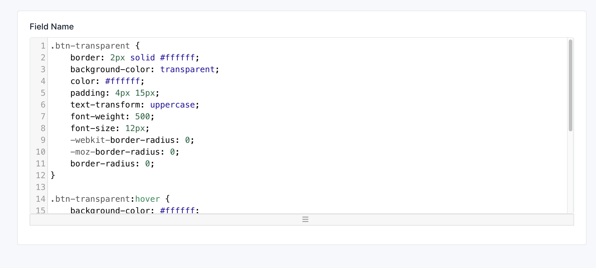
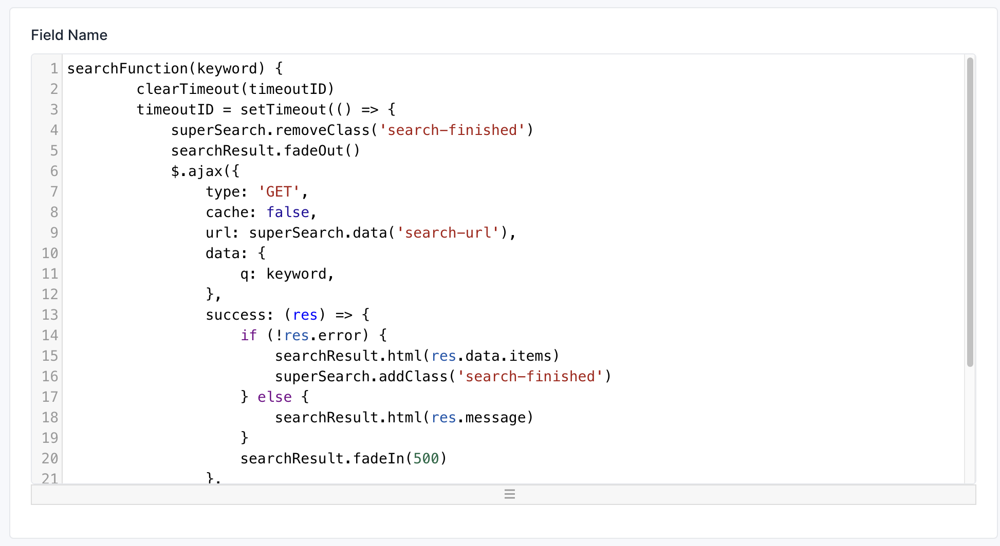

# Code Editor Field

```php

use Botble\Base\Forms\Fields\CodeEditorField;
use Botble\Base\Forms\FieldOptions\CodeEditorFieldOption;

$this->add(
    'field_name', 
    CodeEditorField::class,
    CodeEditorFieldOption::make()
        ->mode('css') // Set mode for code editor (html, css, js, php, ...)
);

```

Result:

- CSS:



- JavaScript:

