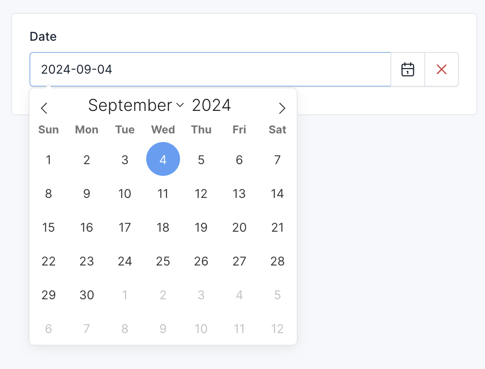
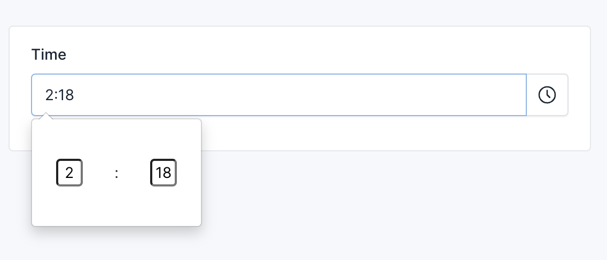

# Date & Time Fields

## Date Field

The date field provides a simple date input.

```php
use Botble\Base\Forms\Fields\DateField;
use Botble\Base\Forms\FieldOptions\DateFieldOption;

$this->add(
    'date', 
    DateField::class, 
    DateFieldOption::make()
        ->label(__('Date'))
);
```

## Date Picker Field

The date picker field provides a date picker with a calendar interface.

```php
use Botble\Base\Forms\Fields\DatePickerField;
use Botble\Base\Forms\FieldOptions\DatePickerFieldOption;

$this->add(
    'date', 
    DatePickerField::class, 
    DatePickerFieldOption::make()
        ->label(__('Date'))
        ->format('Y-m-d') // Default format
);
```

Result:



## Datetime Field

The datetime field provides a datetime input with date and time selection.

```php
use Botble\Base\Forms\Fields\DatetimeField;
use Botble\Base\Forms\FieldOptions\DatetimeFieldOption;

$this->add(
    'datetime', 
    DatetimeField::class, 
    DatetimeFieldOption::make()
        ->label(__('Date & Time'))
);
```

## Time Field

The time field provides a simple time input.

```php
use Botble\Base\Forms\Fields\TimeField;
use Botble\Base\Forms\FieldOptions\TimeFieldOption;

$this->add(
    'time', 
    TimeField::class, 
    TimeFieldOption::make()
        ->label(__('Time'))
);
```

## Time Picker Field

The time picker field provides a time picker with a dropdown interface.

```php
use Botble\Base\Forms\Fields\TimePickerField;
use Botble\Base\Forms\FieldOptions\TimePickerFieldOption;

$this->add(
    'time', 
    TimePickerField::class, 
    TimePickerFieldOption::make()
        ->label(__('Time'))
);
```

Result:


