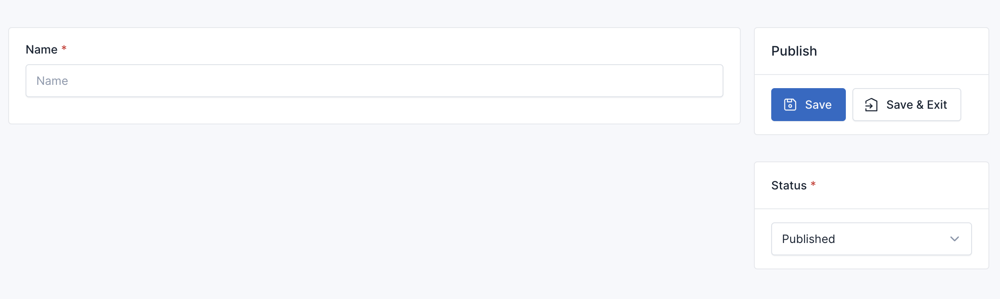
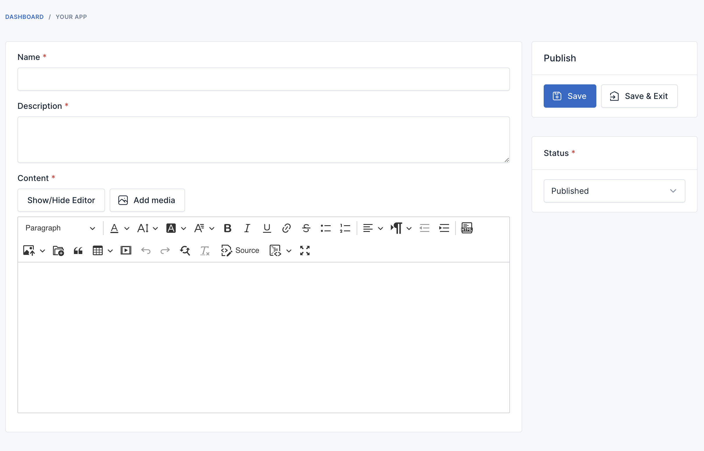
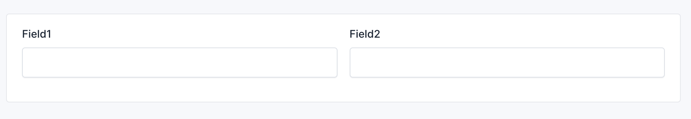
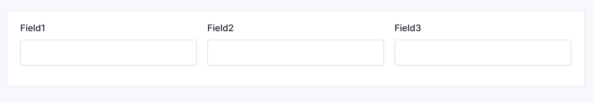
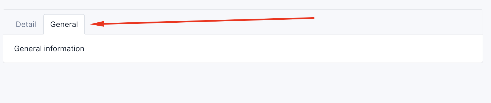

# Form Builder - Get Started

We're utilizing the - [kristijanhusak/laravel-form-builder](https://github.com/kristijanhusak/laravel-form-builder) package for form construction. 
For more details, please refer to the official documentation - [here](https://kristijanhusak.github.io/laravel-form-builder).

## Creating a form

```
php artisan cms:make:form TodoForm
```

Result:



## Adding fields to a form

```php
use Botble\Todo\Models\Todo;
use Botble\Todo\Http\Requests\TodoRequest;
use Botble\Base\Forms\Fields\EditorField;
use Botble\Base\Forms\Fields\TextField;
use Botble\Base\Forms\Fields\TextareaField;
use Botble\Base\Forms\FieldOptions\TextFieldOption;
use Botble\Base\Forms\FieldOptions\TextareaFieldOption;
use Botble\Base\Forms\FieldOptions\EditorFieldOption;

$this
    ->setUpModel(new Todo()) // Model which will be used in form (data will be saved to this model)
    ->setValidatorClass(TodoRequest::class) // Will parse Laravel request rules in client side (using jquery validate)
    ->add('name', TextField::class, TextFieldOption::make()->required())
    ->add('description', TextareaField::class, TextareaFieldOption::make()->required())
    ->add('content', EditorField::class, EditorFieldOption::make()->required())
```

Result:



## Displaying form

```php
{!! \Botble\Todo\Forms\TodoForm::create()->renderForm() !!}
```

### From controller, you can use:

```php
use Botble\Todo\Forms\TodoForm;

public function create(TodoForm $form)
{
    return $form->renderForm();
}
```

### Set model for form

```php
use Botble\Todo\Models\Todo;
use Botble\Todo\Forms\TodoForm;

public function edit(Todo $todo)
{
    return TodoForm::createFromModel($todo)->renderForm();
}
```

### Saving form data

```php

use Botble\Todo\Models\Todo;
use Botble\Todo\Forms\TodoForm;

public function store(Request $request)
{
    TodoForm::create()->setRequest($request)->save();
    
    return redirect()->route('todo.index');
}

public function update(Request $request, Todo $todo)
{
    TodoForm::createFromModel($todo)->setRequest($request)->save();
    
    return redirect()->route('todo.index');
}
```

### Form layouts

- 2 columns layout

```php
use Botble\Base\Forms\Fields\TextField;
use Botble\Base\Forms\Fields\TextareaField;

$this
    ->columns() // Use 2 columns layout
    ->add('field1', TextField::class, TextFieldOption::make()->colspan(6))
    ->add('field2', TextField::class, TextFieldOption::make()->colspan(6));
```



- 3 columns layout

```php
use Botble\Base\Forms\Fields\TextField;
use Botble\Base\Forms\Fields\TextareaField;

$this
    ->columns(3) // Use 3 columns layout
    ->add('field1', TextField::class, TextFieldOption::make()->colspan(4))
    ->add('field2', TextField::class, TextFieldOption::make()->colspan(4))
    ->add('field3', TextField::class, TextFieldOption::make()->colspan(4));
```



### Remove master layout from form

```php
use Botble\Base\Forms\Fields\TextField;

$this
    ->contentOnly() // Remove master layout from form
    ->add('field1', TextField::class, TextFieldOption::make())
    ->add('field2', TextField::class, TextFieldOption::make());
```

### Add tab to form
    
```php
use Botble\Base\Forms\Fields\TextField;
use Botble\Base\Forms\FormTab;

$this
    ->add('title', TextField::class)
    ->addTab(FormTab::make()->label('General')->content('General information'))
    ->add(FormTab::make()->label('Tab 2')->content(view('your-view'))) // Can be loaded from a Blade view
```



## Available fields

## Other Fields
- AlertField.php: platform/core/base/src/Forms/Fields/AlertField.php
- AutocompleteField.php: platform/core/base/src/Forms/Fields/AutocompleteField.php
- CheckboxField.php: platform/core/base/src/Forms/Fields/CheckboxField.php
- CkEditorField.php: platform/core/base/src/Forms/Fields/CkEditorField.php
- CodeEditorField.php: platform/core/base/src/Forms/Fields/CodeEditorField.php
- ColorField.php: platform/core/base/src/Forms/Fields/ColorField.php
- ColorSelectorField.php: platform/core/base/src/Forms/Fields/ColorSelectorField.php
- CoreIconField.php: platform/core/base/src/Forms/Fields/CoreIconField.php
- DateField.php: platform/core/base/src/Forms/Fields/DateField.php
- DatePickerField.php: platform/core/base/src/Forms/Fields/DatePickerField.php
- DatetimeField.php: platform/core/base/src/Forms/Fields/DatetimeField.php
- EditorField.php: platform/core/base/src/Forms/Fields/EditorField.php
- EmailField.php: platform/core/base/src/Forms/Fields/EmailField.php
- GoogleFontsField.php: platform/core/base/src/Forms/Fields/GoogleFontsField.php
- HtmlField.php: platform/core/base/src/Forms/Fields/HtmlField.php
- LabelField.php: platform/core/base/src/Forms/Fields/LabelField.php
- MediaFileField.php: platform/core/base/src/Forms/Fields/MediaFileField.php
- MediaImageField.php: platform/core/base/src/Forms/Fields/MediaImageField.php
- MediaImagesField.php: platform/core/base/src/Forms/Fields/MediaImagesField.php
- MultiCheckListField.php: platform/core/base/src/Forms/Fields/MultiCheckListField.php
- NumberField.php: platform/core/base/src/Forms/Fields/NumberField.php
- OnOffCheckboxField.php: platform/core/base/src/Forms/Fields/OnOffCheckboxField.php
- OnOffField.php: platform/core/base/src/Forms/Fields/OnOffField.php
- PasswordField.php: platform/core/base/src/Forms/Fields/PasswordField.php
- PhoneNumberField.php: platform/core/base/src/Forms/Fields/PhoneNumberField.php
- RadioField.php: platform/core/base/src/Forms/Fields/RadioField.php
- RepeaterField.php: platform/core/base/src/Forms/Fields/RepeaterField.php
- SelectField.php: platform/core/base/src/Forms/Fields/SelectField.php
- TagField.php: platform/core/base/src/Forms/Fields/TagField.php
- TextareaField.php: platform/core/base/src/Forms/Fields/TextareaField.php
- TextField.php: platform/core/base/src/Forms/Fields/TextField.php
- TimeField.php: platform/core/base/src/Forms/Fields/TimeField.php
- TimePickerField.php: platform/core/base/src/Forms/Fields/TimePickerField.php
- TinyMceField.php: platform/core/base/src/Forms/Fields/TinyMceField.php
- TreeCategoryField.php: platform/core/base/src/Forms/Fields/TreeCategoryField.php
- UiSelectorField.php: platform/core/base/src/Forms/Fields/UiSelectorField.php