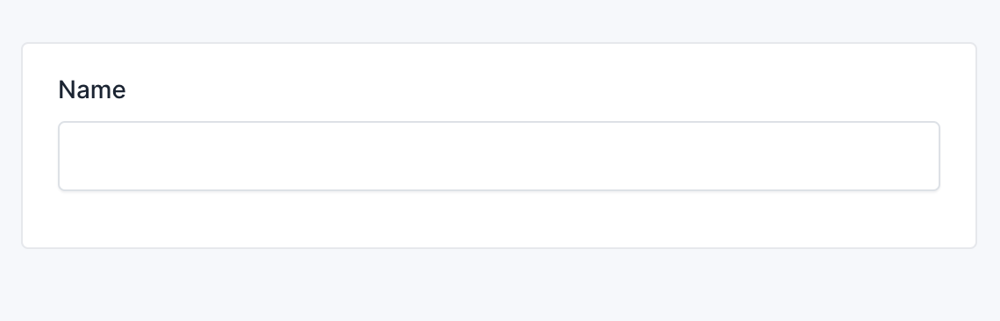
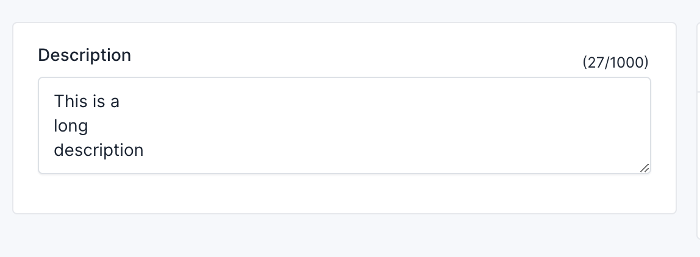
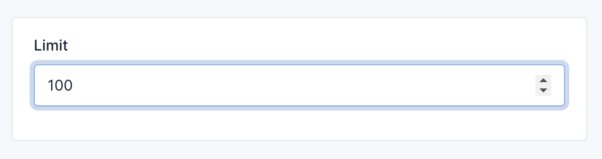
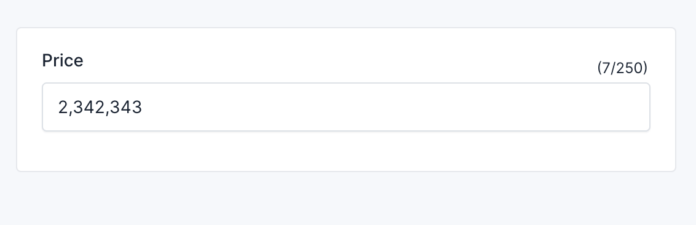
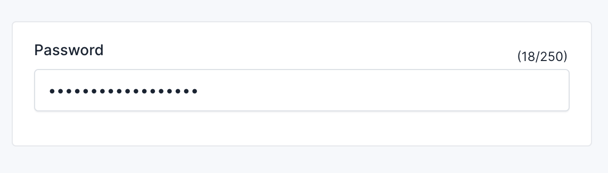
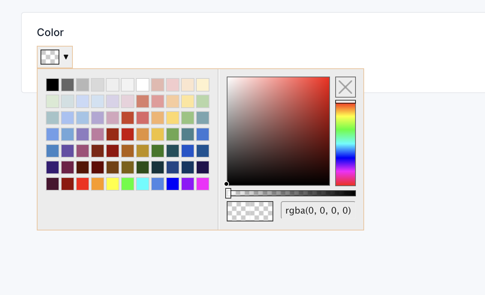
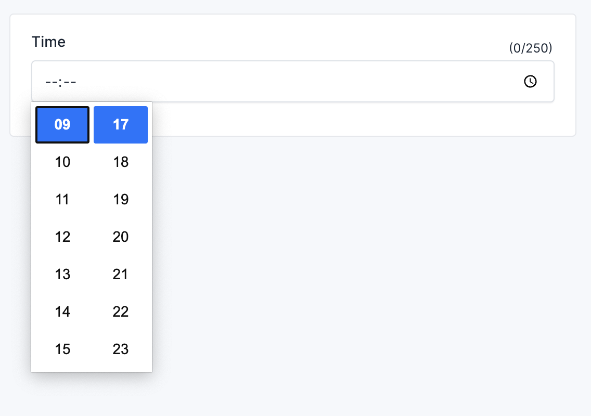

# Input Fields

## Text Field

The text input allows you to interact with a string:

```php
use Botble\Base\Forms\Fields\TextField;
use Botble\Base\Forms\FieldOptions\TextFieldOption;

$this
    ->add('name', TextField::class, TextFieldOption::make());
```

Result:



## Methods

```php
use Botble\Base\Forms\Fields\TextField;
use Botble\Base\Forms\FieldOptions\TextFieldOption;

$this
    ->add(
        'name', 
        TextField::class, 
        TextFieldOption::make()
            ->required() // Required field
            ->label('Name') // Field label
            ->append('append') // Append text/HTML
            ->prepend('prepend') // Prepend text/HTML
            ->helpText('Helper text') // Instruction for user
            ->placeholder('Enter your name') // Placeholder text
            ->value('John Doe') // Default value
            ->labelAttributes(['class' => 'control-label']) // Label attributes
            ->attributes(['class' => 'form-control']) // Field attributes
            ->wrapperAttributes(['class' => 'form-group']) // Wrapper attributes
            ->metadata() // If it's a custom field, not in the model table, you can use this method to store it in table meta_boxes
            ->disabled() // Disable field
            ...
            
    );
```

::: info
The same as other input fields, you can use the same methods as the text field.
:::


## Textarea Field

```php
use Botble\Base\Forms\Fields\TextareaField;
use Botble\Base\Forms\FieldOptions\TextareaFieldOption;

$this->add('description', TextareaField::class, TextareaFieldOption::make());
```

Result:



## Number Field

```php
use Botble\Base\Forms\Fields\NumberField;
use Botble\Base\Forms\FieldOptions\NumberFieldOption;

$this->add('limit', NumberField::class, NumberFieldOption::make());
```

Result:



## Number field with jQuery input mask

```php
use Botble\Base\Facades\Assets;
use Botble\Base\Forms\Fields\TextField;
use Botble\Member\Forms\Fronts\Auth\FieldOptions\TextFieldOption;

public function setup(): void
{
    Assets::addScripts(['input-mask']); // add jQuery input mask
    
    $this->add(
        'price',
        TextField::class, // Must be a text field, not number field
        TextFieldOption::make()
            ->addAttribute('class', 'form-control input-mask-number')
    );
}
```

Result:



## Password Field

```php
use Botble\Base\Forms\Fields\PasswordField;
use Botble\Base\Forms\FieldOptions\TextFieldOption;

$this->add('password', PasswordField::class, TextFieldOption::make());
```

Result:



## Color Field

```php
use Botble\Base\Forms\Fields\ColorField;
use Botble\Base\Forms\FieldOptions\ColorFieldOption;

$this->add('color', ColorField::class, ColorFieldOption::make());
```

Result:



## Time Field

```php
use Botble\Base\Forms\Fields\TimeField;
use Botble\Base\Forms\FieldOptions\TextFieldOption;

$this->add('time', TimeField::class, TextFieldOption::make());
```

Result:



## Time field with jquery time picker

```php
use Botble\Base\Forms\Fields\TimePickerField;
use Botble\Base\Forms\FieldOptions\TextFieldOption;

$this->add('time', TimePickerField::class, TextFieldOption::make());
```

Result:


## Date picker field

```php
use Botble\Base\Forms\Fields\DatePickerField;
use Botble\Base\Forms\FieldOptions\DatePickerFieldOption;

$this->add('date', DatePickerField::class, DatePickerFieldOption::make());
```

Result:

