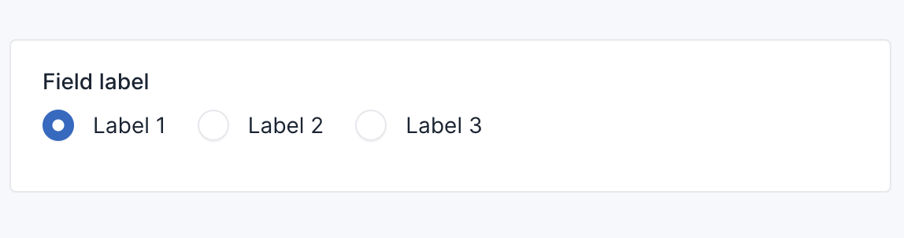

# Radio Field

```php
use Botble\Base\Forms\Fields\RadioField;
use Botble\Base\Forms\FieldOptions\RadioFieldOption;

$this->add(
    'field_name', 
    RadioField::class, 
    RadioFieldOption::make()
        ->label(__('Field label'))
        ->choices([
            'value1' => 'Label 1',
            'value2' => 'Label 2',
            'value3' => 'Label 3',
        ])
        ->defaultValue('value1')
);
```

Result:


```