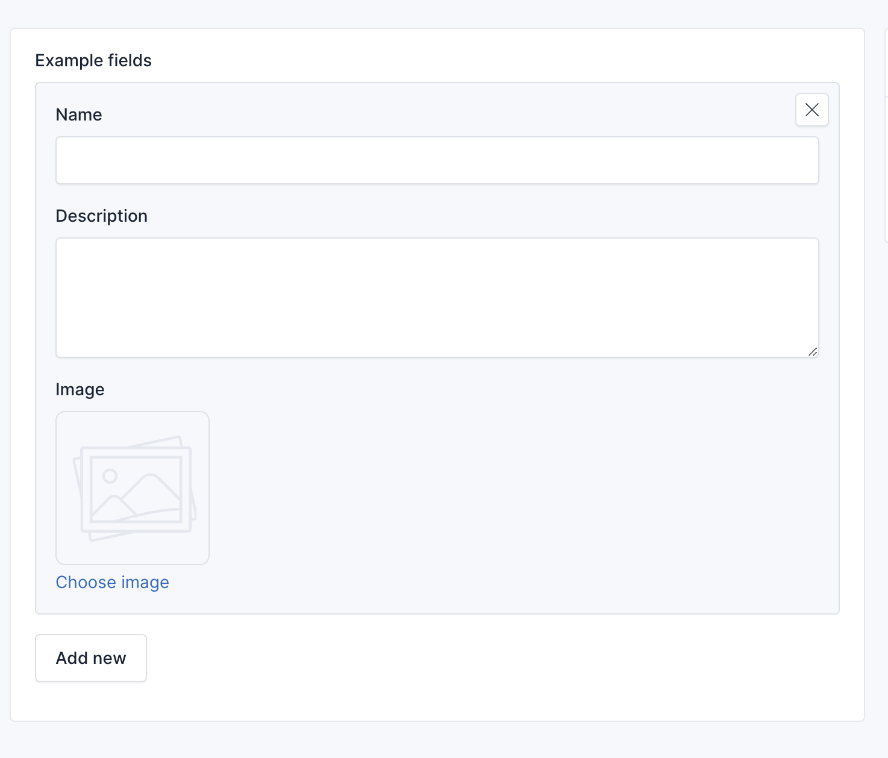

# Repeater Field

```php

use Botble\Base\Forms\FieldOptions\RepeaterFieldOption;
use Botble\Base\Forms\Fields\RepeaterField;

$this
    ->add(
        'example_fields',
        RepeaterField::class,
        RepeaterFieldOption::make()
            ->label('Example fields')
            ->fields([
                'name' => [ // Requires index key
                    'type' => 'text',
                    'label' => 'Name',
                    'attributes' => [
                        'name' => 'name',
                        'value' => null,
                        'options' => [
                            'class' => 'form-control',
                            'data-counter' => 255,
                        ],
                    ],
                ],
                'description' => [
                    'type' => 'textarea',
                    'label' => 'Description',
                    'attributes' => [
                        'name' => 'description',
                        'value' => null,
                        'options' => [
                            'class' => 'form-control',
                            'rows' => 4,
                        ],
                    ],
                ],
                'image' => [
                    'type' => 'mediaImage',
                    'label' => 'Image',
                    'attributes' => [
                        'name' => 'image',
                        'value' => null,
                    ],
                ],
            ])
    );

```

Result: 

