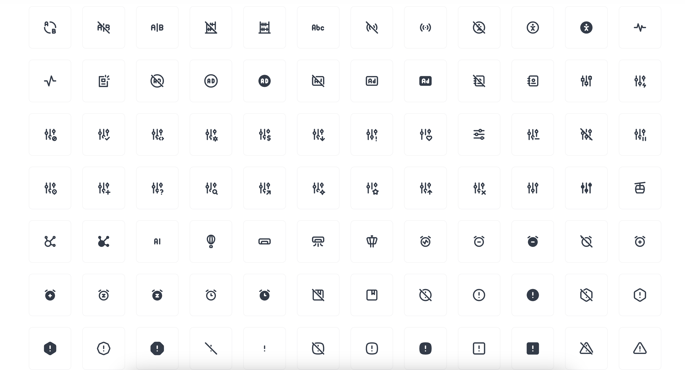
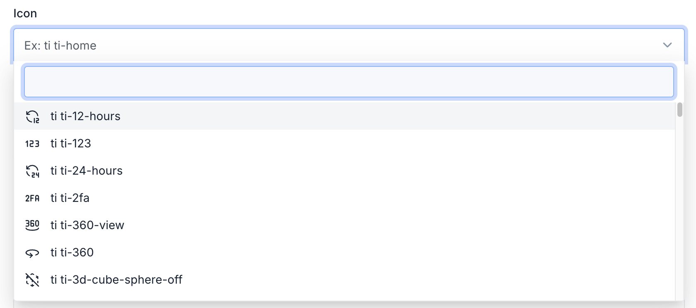

# Icons



## Usage

We are using icons from [Tabler Icons](https://tabler.io/icons). You can use any icon from Tabler Icons by using the following syntax:

Using Blade component:
```html
<x-core::icon name="icon-name" />
```

Example:

```html
<x-core::icon name="ti ti-user-heart" />
```

Using helper:

```php
use Botble\Base\Facades\BaseHelper;

BaseHelper::renderIcon('ti ti-user-heart');
```

## Using in Form Builder

You can use icons in form builder by using the following syntax:

```php
use Botble\Base\Forms\FieldOptions\CoreIconFieldOption;
use Botble\Base\Forms\Fields\CoreIconField;

$this->add('icon', CoreIconField::class, CoreIconFieldOption::make());
```

Result:




## Update available icons

To update the list of available icons, you can run the following command:

```bash
php artisan cms:icons:update
```

It will download the latest icons from [Tabler Icons Releases](https://github.com/tabler/tabler-icons/releases) and save them to folder `platform/core/icon/resources/svg`.