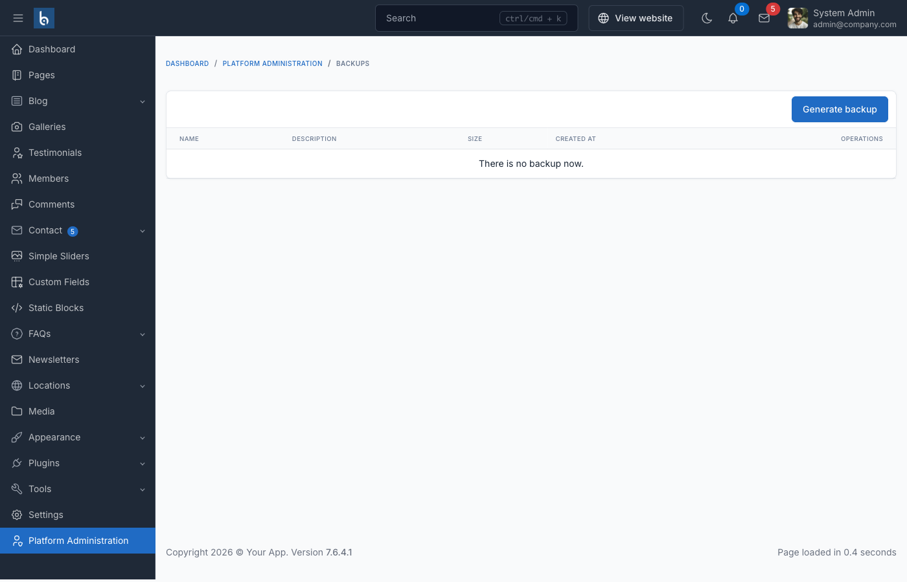

# Backup Plugin

## Introduction

The Backup plugin for Botble CMS provides a simple and efficient way to backup your website's database and uploaded files. This plugin is essential for maintaining regular backups of your site's critical data, allowing you to restore your website in case of data loss or corruption.

Key features of the Backup plugin include:

- Backup of database (MySQL and PostgreSQL supported)
- Backup of uploaded files (media library)
- Scheduled automatic backups
- Easy restoration process
- Command-line interface for automation
- User-friendly admin interface

## Basic Usage

### Accessing the Backup Manager

To access the Backup Manager, go to **Admin Panel** → **System Administration** → **Backups**.



From this interface, you can:

1. Create new backups
2. Download existing backups
3. Restore from a backup
4. Delete old backups

### Creating a Backup

To create a backup through the admin interface:

1. Go to the Backup Manager
2. Click the **Create** button
3. Enter a name for your backup
4. Optionally add a description
5. Choose whether to backup only the database or both database and uploaded files
6. Click **Create** to start the backup process

### Restoring from a Backup

To restore your website from a backup:

1. Go to the Backup Manager
2. Find the backup you want to restore
3. Click the **Restore** button next to it
4. Confirm the restoration process

::: warning
Restoring from a backup will overwrite your current database and/or files. Make sure you have a backup of your current data before proceeding with a restore operation.
:::

## Command Line Interface

The Backup plugin provides several Artisan commands that allow you to manage backups from the command line. This is particularly useful for setting up automated backups via cron jobs.

### Creating a Backup

```bash
php artisan cms:backup:create [name of backup] --description=[description]
```

Parameters:
- `name`: (Required) The name of the backup
- `--description`: (Optional) A description for the backup

Example:

```bash
php artisan cms:backup:create "Weekly Backup" --description="Regular weekly backup"
```

### Restoring a Backup

```bash
php artisan cms:backup:restore [backup date]
```

Parameters:
- `backup date`: (Optional) The date of the backup to restore in the format "YYYY-MM-DD HH-MM-SS". If not provided, the latest backup will be restored.

Example:

```bash
php artisan cms:backup:restore 2023-05-15 10-30-45
```

### Deleting a Backup

```bash
php artisan cms:backup:remove [backup date]
```

Parameters:
- `backup date`: (Required) The date of the backup to delete in the format "YYYY-MM-DD HH-MM-SS".

Example:

```bash
php artisan cms:backup:remove 2023-05-15 10-30-45
```

### Listing All Backups

```bash
php artisan cms:backup:list
```

This command displays a table with all available backups, including their names, descriptions, and dates.

### Cleaning All Backups

```bash
php artisan cms:backup:clean
```

This command removes all backups from the system. Use with caution!

## Setting Up Automated Backups

You can set up automated backups using cron jobs on your server. Here's how to configure a weekly backup:

1. Access your server's crontab:

```bash
crontab -e
```

2. Add a line to run the backup command at your desired schedule:

```
0 0 * * 0 cd /path/to/your/project && php artisan cms:backup:create "Weekly Backup" --description="Automated weekly backup"
```

This example creates a backup every Sunday at midnight.

## Database Support

The Backup plugin supports the following database systems:

- **MySQL**: Uses the `mysqldump` command for optimal performance. If the command is not available, it falls back to a PHP implementation.
- **PostgreSQL**: Uses the `pg_dump` command for database backups.

### Configuring Database Paths

If your database executables are not in the system path, you can specify their location in your `.env` file:

```
BACKUP_MYSQL_EXECUTE_PATH=/path/to/mysql/bin/
BACKUP_PGSQL_EXECUTE_PATH=/path/to/pgsql/bin/
```

## Backup Storage

Backups are stored in the `storage/app/backup` directory by default. Each backup is stored in a separate folder named with the date and time of the backup (format: YYYY-MM-DD-HH-MM-SS).

A backup typically includes:

- `database-YYYY-MM-DD-HH-MM-SS.zip`: The database backup
- `storage-YYYY-MM-DD-HH-MM-SS.zip`: The uploaded files backup (if selected)
- A reference in the `backup.json` file that contains metadata about all backups

## Best Practices

1. **Regular Backups**: Set up automated backups to run regularly (daily, weekly, or monthly depending on how frequently your content changes).

2. **Multiple Backup Locations**: Don't rely solely on local backups. Consider downloading important backups and storing them in a separate location.

3. **Backup Before Updates**: Always create a backup before updating your CMS or installing new plugins.

4. **Test Restoration**: Periodically test the restoration process to ensure your backups are working correctly.

5. **Manage Backup Size**: Regularly clean old backups to prevent your server from running out of disk space.

## Troubleshooting

### Backup Creation Fails

If backup creation fails, check the following:

1. Ensure your server has enough disk space
2. Verify that the `storage/app/backup` directory is writable
3. Check if the database credentials in your `.env` file are correct
4. For MySQL backups, ensure the `mysqldump` command is available or specify the path in your `.env` file
5. For PostgreSQL backups, ensure the `pg_dump` command is available or specify the path in your `.env` file

### Restoration Fails

If restoration fails, check the following:

1. Ensure the backup files are not corrupted
2. Verify that your database server is running and accessible
3. Check if the user has sufficient privileges to restore the database
4. Ensure the `storage` directory is writable

## Limitations

- The Backup plugin only backs up the database and uploaded files, not the entire source code
- Very large databases or file collections may require additional memory and execution time
- The plugin does not handle external services or third-party integrations
