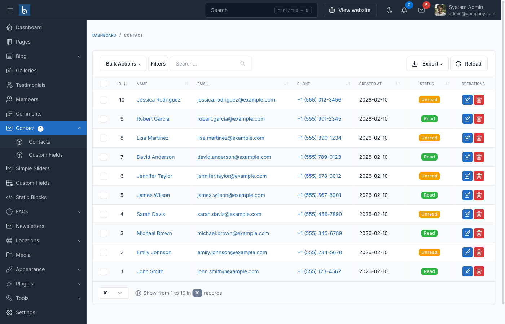

# Contact Form

## Introduction

The Contact Form plugin for Botble CMS provides a flexible and customizable contact form that you can easily add to your website. It includes features like email notifications, custom fields, and spam protection.



## Basic Usage

### Using the Shortcode

The simplest way to add a contact form to your website is by using the `contact-form` shortcode. You can add it to any page content in the admin panel:

```
[contact-form][/contact-form]
```

Or you can add it directly in any Blade view:

```blade
{!! do_shortcode('[contact-form][/contact-form]') !!}
```

### Shortcode Parameters

The contact form shortcode supports several parameters to customize its behavior:

```
[contact-form display_fields="name,email,phone,address,subject" mandatory_fields="name,email" view="custom.view"][/contact-form]
```

- **display_fields**: Comma-separated list of fields to display (default: "phone,email,address,subject")
- **mandatory_fields**: Comma-separated list of fields that are required (default: "email")
- **view**: Custom view path to override the default form template

## Customizing the Form

### Using a Custom View

You can create a custom view for your contact form by specifying the `view` parameter in the shortcode:

```
[contact-form view="theme.your-theme::partials.contact-form"][/contact-form]
```

Create a file at `/platform/themes/your-theme/views/partials/contact-form.blade.php` with your custom form markup. The simplest custom view would be:

```blade
{!! $form->renderForm() !!}
```

This will render the form using the Form Builder with all the default fields and validation.

### Customizing Form Fields in the Admin Panel

You can customize which fields are displayed and which are required directly in the admin panel when adding the shortcode to a page. In the page editor:

1. Click the "Shortcode" button in the editor toolbar
2. Select "Contact form"
3. In the shortcode configuration panel, you can:
   - Select which fields to display
   - Select which fields are mandatory
4. Click "Add shortcode" to insert it into your content

### Adding Custom Fields

The Contact Form plugin supports custom fields that you can add through the admin panel:

1. Go to **Contact** → **Custom Fields**
2. Click **Create** to add a new custom field
3. Configure the field:
   - **Name**: The label for the field
   - **Type**: Choose from Text, Email, Number, Textarea, Checkbox, Select, Radio, etc.
   - **Required**: Whether the field is mandatory
   - **Order**: The display order of the field
4. Save the custom field

Custom fields will automatically appear in your contact form.

## Form Submission and Notifications

### Email Notifications

When a contact form is submitted, email notifications are sent to:

1. **Admin**: The site administrator receives a notification with all the form data
2. **Sender**: The person who submitted the form receives a confirmation email

You can configure these email templates in **Settings** → **Email** → **Templates** → **Contact**.

### Configuring Recipients

To configure who receives contact form submissions:

1. Go to **Settings** → **Contact**
2. Add email addresses to the **Recipient emails** field
3. Save changes

### Spam Protection

The Contact Form plugin includes several spam protection features:

1. **Blacklist Keywords**: You can add keywords to block in form submissions
2. **Blacklist Email Domains**: You can block submissions from specific email domains
3. **CAPTCHA Integration**: If the CAPTCHA plugin is active, you can enable CAPTCHA for contact forms

Configure these settings in **Settings** → **Contact**.

## Advanced Usage

### Accessing Contact Form Submissions

All contact form submissions are stored in the database and can be accessed in the admin panel:

1. Go to **Contact** → **Contacts**
2. View, filter, and manage all submissions
3. Reply to contacts directly from the admin panel

### Programmatically Creating a Contact Form

You can programmatically create a contact form in your theme or plugin:

```php
use Botble\Contact\Forms\Fronts\ContactForm;

$form = ContactForm::createFromArray([
    'display_fields' => 'name,email,phone,subject',
    'mandatory_fields' => 'name,email',
]);

echo $form->renderForm();
```

### Handling Form Submission Events

You can listen for contact form submission events in your theme or plugin:

```php
// In a service provider
Event::listen(\Botble\Contact\Events\SentContactEvent::class, function ($event) {
    $contact = $event->contact;

    // Do something with the contact data
    // For example, integrate with a CRM
    // $contact->name, $contact->email, $contact->content, etc.
});
```

## Styling the Contact Form

The contact form includes basic styling, but you can customize it to match your theme:

### CSS Classes

The main form has the class `contact-form`. You can target this class in your CSS to style the form:

```css
.contact-form {
    /* Your custom styles */
}

.contact-form .form-group {
    margin-bottom: 20px;
}

.contact-form .contact-button {
    background-color: #your-color;
    color: #fff;
}
```

### JavaScript Integration

The contact form includes JavaScript for AJAX submission and validation. The form submission is handled by `contact-public.js`, which you can override in your theme if needed.

## Best Practices

1. **Keep it Simple**: Only include the fields you actually need
2. **Clear Labels**: Use clear, concise labels for form fields
3. **Validation Messages**: Customize validation messages to be helpful
4. **Thank You Message**: Configure a clear thank you message after submission
5. **Responsive Design**: Ensure your form looks good on all devices
