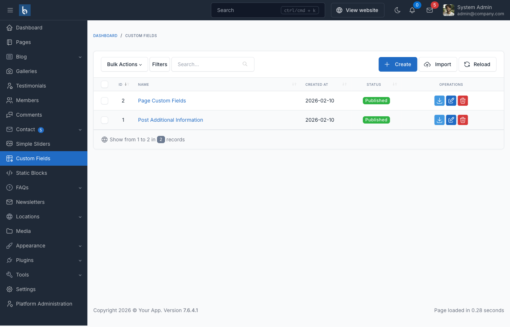

# Custom Fields

## Introduction

The Custom Fields plugin for Botble CMS allows you to add custom fields to any supported content type in your website. This powerful tool gives you complete control over your edit screens and custom field data, enabling you to extend your content with additional information beyond the standard fields.



With the Custom Fields plugin, you can:

- Add custom fields to pages, posts, categories, and other content types
- Create field groups with rules to control where they appear
- Use various field types including text, textarea, select, radio, checkbox, repeater, and more
- Display custom field values in your theme templates
- Import and export field groups for reuse across sites

## Field Types

The Custom Fields plugin supports a variety of field types:

- **Text**: Single line text input
- **Textarea**: Multi-line text input
- **Number**: Numeric input
- **Email**: Email input with validation
- **Password**: Password input
- **Select**: Dropdown selection
- **Radio**: Radio button selection
- **Checkbox**: Checkbox selection
- **Image**: Image upload and selection
- **File**: File upload and selection
- **Repeater**: Group of fields that can be repeated
- **Wysiwyg Editor**: Rich text editor
- **Date**: Date picker
- **Time**: Time picker
- **Date-Time**: Combined date and time picker

## Installation and Setup

### Activating the Plugin

1. Go to **Admin Dashboard** → **Plugins**
2. Find the **Custom Fields** plugin and click **Activate**

By default, the plugin supports **Pages** and **Blog** content types.

### Creating Field Groups

1. Go to **Custom Fields** in the admin menu
2. Click **Create** to create a new field group
3. Enter a title for the field group
4. Add fields using the field builder interface
5. Set rules to determine where the field group should appear
6. Save the field group

## Using Custom Fields in Themes

The Custom Fields plugin provides several helper functions to retrieve and display custom field values in your theme templates.

### Retrieving Custom Field Values

#### get_field

Retrieves a custom field value from a model.

```php
get_field($data, $alias = null, $default = null)
```

Parameters:
- `$data`: The model instance (e.g., Page, Post)
- `$alias`: The field slug/name
- `$default`: Default value if the field doesn't exist

Example:

```php
// In a controller
$page = \Botble\Page\Models\Page::find(1);
$field = get_field($page, 'hero_title');

// In a Blade template
{{ get_field($page, 'hero_title') }}
```

#### has_field

Checks if a model has a specific custom field.

```php
has_field($data, $alias)
```

Parameters:
- `$data`: The model instance
- `$alias`: The field slug/name

Example:

```php
$page = \Botble\Page\Models\Page::find(1);
if (has_field($page, 'hero_title')) {
    // Do something with the field
}
```

### Working with Repeater Fields

Repeater fields allow you to create groups of fields that can be repeated multiple times.

#### get_sub_field

Retrieves a field value from a repeater field item.

```php
get_sub_field(array $parentField, $alias, $default = null)
```

Parameters:
- `$parentField`: The repeater field item
- `$alias`: The sub-field slug/name
- `$default`: Default value if the sub-field doesn't exist

Example:

```php
$page = \Botble\Page\Models\Page::find(1);
$faqItems = get_field($page, 'faq_items');

if ($faqItems) {
    foreach ($faqItems as $item) {
        $question = get_sub_field($item, 'question');
        $answer = get_sub_field($item, 'answer');

        echo "<h3>{$question}</h3>";
        echo "<p>{$answer}</p>";
    }
}
```

#### has_sub_field

Checks if a repeater field item has a specific sub-field.

```php
has_sub_field(array $parentField, $alias)
```

Parameters:
- `$parentField`: The repeater field item
- `$alias`: The sub-field slug/name

Example:

```php
$page = \Botble\Page\Models\Page::find(1);
foreach (get_field($page, 'team_members') as $member) {
    if (has_sub_field($member, 'social_links')) {
        // Process social links
    }
}
```

## Real-World Examples

### Creating a Hero Section

```php
// In your Blade template
@if (has_field($page, 'hero_enabled') && get_field($page, 'hero_enabled'))
    <section class="hero">
        <div class="container">
            <h1>{{ get_field($page, 'hero_title') }}</h1>
            <p>{{ get_field($page, 'hero_subtitle') }}</p>

            @if (has_field($page, 'hero_button_text'))
                <a href="{{ get_field($page, 'hero_button_url') }}" class="btn btn-primary">
                    {{ get_field($page, 'hero_button_text') }}
                </a>
            @endif

            @if (has_field($page, 'hero_image'))
                
            @endif
        </div>
    </section>
@endif
```

### Creating an FAQ Section with Structured Data

```php
// In your Blade template
@if (has_field($page, 'faq_items'))
    <section class="faq">
        <div class="container">
            <h2>{{ get_field($page, 'faq_title', 'Frequently Asked Questions') }}</h2>

            <div class="accordion">
                @php $faqItems = get_field($page, 'faq_items'); @endphp
                @foreach ($faqItems as $item)
                    <div class="accordion-item">
                        <h3 class="accordion-header">{{ get_sub_field($item, 'question') }}</h3>
                        <div class="accordion-body">
                            {!! get_sub_field($item, 'answer') !!}
                        </div>
                    </div>
                @endforeach
            </div>
        </div>
    </section>

    <!-- Structured Data for SEO -->
    <script type="application/ld+json">
    {
        "@context": "https://schema.org",
        "@type": "FAQPage",
        "mainEntity": [
            @foreach ($faqItems as $index => $item)
            {
                "@type": "Question",
                "name": "{{ get_sub_field($item, 'question') }}",
                "acceptedAnswer": {
                    "@type": "Answer",
                    "text": "{{ strip_tags(get_sub_field($item, 'answer')) }}"
                }
            }@if ($index < count($faqItems) - 1),@endif
            @endforeach
        ]
    }
    </script>
@endif
```

## Adding Custom Fields Support to Your Plugin

You can add Custom Fields support to your own plugins by registering your model with the Custom Fields system. Add the following code to the `boot()` method of your plugin's service provider:

```php
use Botble\CustomField\Facades\CustomField;
use YourPlugin\Models\YourModel;

$this->app->booted(function () {
    if (defined('CUSTOM_FIELD_MODULE_SCREEN_NAME')) {
        CustomField::registerModule(YourModel::class)
            ->registerRule('basic', __('Your plugin name'), YourModel::class, function () {
                return YourModel::query()->pluck('name', 'id')->all();
            })
            ->expandRule('other', trans('plugins/custom-field::rules.model_name'), 'model_name', function () {
                return [
                    YourModel::class => __('Your plugin name'),
                ];
            });
    }
});
```

### Example from Block Plugin

```php
use Botble\Block\Models\Block;
use Botble\CustomField\Facades\CustomField;

$this->app->booted(function () {
    if (defined('CUSTOM_FIELD_MODULE_SCREEN_NAME')) {
        CustomField::registerModule(Block::class)
            ->registerRule('basic', trans('plugins/block::block.name'), Block::class, function () {
                return Block::query()->pluck('name', 'id')->all();
            })
            ->expandRule('other', trans('plugins/custom-field::rules.model_name'), 'model_name', function () {
                return [
                    Block::class => trans('plugins/block::block.name'),
                ];
            });
    }
});
```

## Advanced Usage

### Importing and Exporting Field Groups

The Custom Fields plugin allows you to import and export field groups, making it easy to transfer configurations between sites.

1. **Exporting**: Go to **Custom Fields** → select a field group → click **Export**
2. **Importing**: Go to **Custom Fields** → click **Import** → upload the JSON file

### Programmatically Saving Custom Fields

You can programmatically save custom fields using the `CustomField` facade:

```php
use Botble\CustomField\Facades\CustomField;

// In a controller
public function store(Request $request)
{
    $model = YourModel::create($request->only(['name', 'description']));

    // Save custom fields
    CustomField::saveCustomFields($request, $model);

    return redirect()->route('your.route');
}
```

### Deleting Custom Fields

When deleting a model, you should also delete its associated custom fields:

```php
use Botble\CustomField\Facades\CustomField;

// In a controller
public function destroy($id)
{
    $model = YourModel::findOrFail($id);

    // Delete custom fields
    CustomField::deleteCustomFields($model);

    $model->delete();

    return redirect()->route('your.route');
}
```

## Best Practices

1. **Use Descriptive Field Names**: Choose clear, descriptive names for your fields to make them easier to identify and use.

2. **Group Related Fields**: Use field groups to organize related fields together, making the admin interface more intuitive.

3. **Set Appropriate Rules**: Configure rules carefully to ensure field groups appear only where they're needed.

4. **Use Repeater Fields Wisely**: Repeater fields are powerful but can become complex. Use them for truly repeatable content like team members, testimonials, or FAQ items.

5. **Check for Field Existence**: Always use `has_field()` to check if a field exists before trying to display it to avoid errors.

6. **Provide Default Values**: Use the third parameter of `get_field()` to provide default values for fields that might not exist.

7. **Keep Field Groups Focused**: Create multiple field groups with specific purposes rather than one large group with many fields.

## Video Tutorials

- Working with Custom Fields plugin: [https://www.youtube.com/watch?v=aju8b1MhWbE](https://www.youtube.com/watch?v=aju8b1MhWbE)
- Generate FAQ rich snippet using Custom Fields: [https://www.youtube.com/watch?v=mEMOy3BMnYI](https://www.youtube.com/watch?v=mEMOy3BMnYI)
