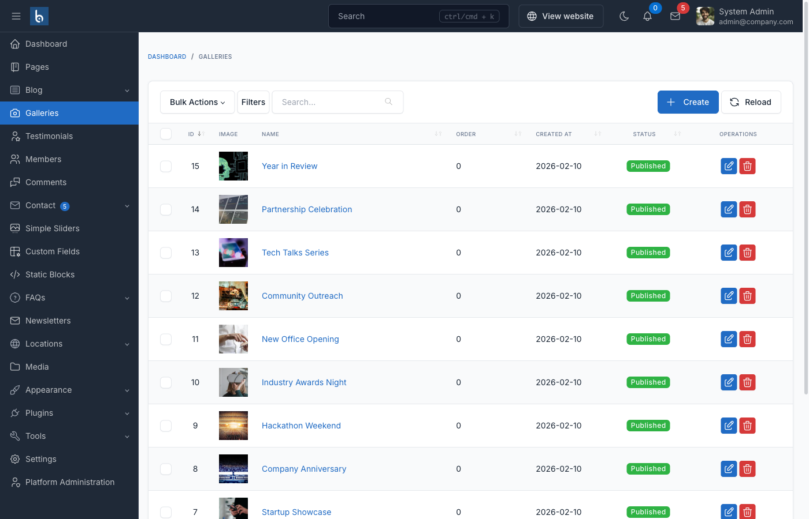

# Gallery Plugin

## Introduction

The Gallery plugin for Botble CMS allows you to create and manage image galleries on your website. It provides a flexible way to organize images into galleries and display them in various layouts. The plugin also integrates with other content types like pages and posts, allowing you to attach image galleries to your content.

Key features of the Gallery plugin include:

- Create and manage multiple galleries
- Attach galleries to pages, posts, and other content types
- Display galleries using shortcodes
- Responsive gallery layouts with lightbox support
- Customizable gallery templates

## Basic Usage

### Creating Galleries



1. Go to **Gallery** in the admin menu
2. Click **Create** to create a new gallery
3. Enter a name and description for the gallery
4. Upload a featured image for the gallery
5. Save the gallery
6. After saving, you can add images to the gallery using the **Gallery Images** meta box

### Displaying Galleries in Themes

There are several ways to display galleries in your theme:

#### Using the Helper Function

The simplest way to display galleries is using the `render_galleries()` helper function:

```blade
@if (function_exists('render_galleries'))
   {!! render_galleries(8) !!}
@endif
```

Parameters:
- First parameter: Number of galleries to display (default: 8)
- Second parameter: Image size (default: null, options: 'small', 'medium', 'large')

This function will use the template `platform/plugins/gallery/resources/views/shortcodes/gallery.blade.php` to render the galleries.

#### Using the Shortcode

You can also use the `[gallery]` shortcode in your content:

```
[gallery title="Our Galleries" limit="5" gallery_ids="1,2,3"][/gallery]
```

Parameters:
- `title`: The title to display above the galleries
- `limit`: Number of galleries to display (default: 5)
- `gallery_ids`: Comma-separated list of gallery IDs to display specific galleries

#### Customizing Gallery Display

To customize how galleries are displayed, you can create your own view file and override the default template:

1. Create a file in your theme's views directory, e.g., `platform/themes/your-theme/views/galleries.blade.php`
2. Copy the content from `platform/plugins/gallery/resources/views/shortcodes/gallery.blade.php` and modify it as needed
3. Register your custom view using a filter:

```php
add_filter('galleries_box_template_view', function() {
    return 'theme.your-theme::galleries';
});
```

### Displaying Gallery Images for Pages and Posts

The Gallery plugin allows you to attach gallery images to pages, posts, and other supported content types. To display these gallery images in your theme templates:

#### For Pages

Add this code to your theme's `page.blade.php` file:

```blade
@if (defined('GALLERY_MODULE_SCREEN_NAME') && !empty($galleries = gallery_meta_data($page)))
  {!! render_object_gallery($galleries) !!}
@endif
```

#### For Posts

Add this code to your theme's `post.blade.php` file:

```blade
@if (defined('GALLERY_MODULE_SCREEN_NAME') && !empty($galleries = gallery_meta_data($post)))
    {!! render_object_gallery($galleries, ($post->categories()->first() ? $post->categories()->first()->name : __('Uncategorized'))) !!}
@endif
```

The `render_object_gallery()` function accepts two parameters:
- First parameter: Gallery images data from `gallery_meta_data()`
- Second parameter (optional): Category name for the gallery

## Advanced Usage

### Adding Gallery Support to Your Plugin

You can add gallery support to your own plugin by registering your model with the Gallery system. Add the following code to the `boot()` method of your plugin's service provider:

```php
use Botble\Gallery\Facades\Gallery;
use YourPlugin\Models\YourModel;

// In your service provider's boot method
Gallery::registerModule(YourModel::class);
```

This will add a **Gallery Images** meta box to your model's edit page, allowing users to attach gallery images to your model.

### Retrieving Gallery Images

To retrieve gallery images for a model, use the `gallery_meta_data()` helper function:

```php
$galleries = gallery_meta_data($yourModel);

foreach ($galleries as $gallery) {
    $image = $gallery['img'];
    $description = $gallery['description'];

    // Use the image and description
}
```

### Creating a Gallery Page

You can create a dedicated page for displaying all galleries:

1. Create a new page in the admin panel
2. Go to **Settings** > **Theme Options** > **Gallery**
3. Select the page you created as the **Galleries page**

The selected page will automatically display all galleries using the template `platform/plugins/gallery/resources/views/themes/galleries.blade.php` or your theme's custom template if available.

### Customizing Gallery Templates

The Gallery plugin provides several templates that you can override in your theme:

1. **Gallery List**: `platform/plugins/gallery/resources/views/themes/galleries.blade.php`
2. **Single Gallery**: `platform/plugins/gallery/resources/views/themes/gallery.blade.php`
3. **Gallery Shortcode**: `platform/plugins/gallery/resources/views/shortcodes/gallery.blade.php`
4. **Object Gallery**: `platform/plugins/gallery/resources/views/partials/object-gallery.blade.php`

To override these templates, create files with the same names in your theme's views directory.

## Helper Functions

The Gallery plugin provides several helper functions:

### gallery_meta_data()

Retrieves gallery images for a model:

```php
gallery_meta_data(Model $object, array $select = ['gallery_meta.id', 'gallery_meta.images']): array
```

### get_galleries()

Retrieves a collection of galleries:

```php
get_galleries(int $limit = 8, array $with = ['slugable', 'user'], array $condition = []): Collection
```

### render_galleries()

Renders a list of galleries:

```php
render_galleries(int $limit, $imageSize = null): string
```

### render_object_gallery()

Renders gallery images for a model:

```php
render_object_gallery(array $galleries, ?string $category = null): string
```

## Best Practices

1. **Optimize Images**: Ensure your gallery images are optimized for web to improve page load times
2. **Use Appropriate Image Sizes**: Choose the appropriate image size parameter when displaying galleries
3. **Limit Gallery Size**: Avoid adding too many images to a single gallery to maintain performance
4. **Custom Templates**: Create custom templates in your theme for better integration with your design
5. **Responsive Design**: Ensure your custom gallery templates are responsive for mobile devices
