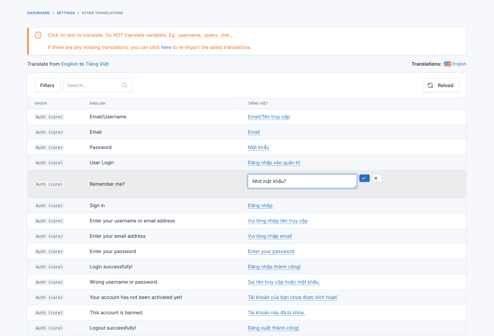
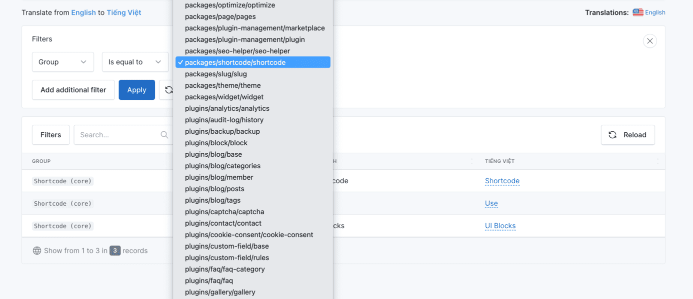

# Translation

## Introduction

Botble CMS provides a comprehensive translation system that allows you to create multilingual websites. The translation functionality is built on top of Laravel's localization features and extended with additional capabilities specific to Botble CMS.

## Adding a new Language

For detailed instructions on adding a new language, please refer to the [Multi Language](./usage-multi-language.md#adding-a-new-language) documentation.

## Translation Management

Botble CMS provides several ways to manage translations:

### Translating the Theme

To translate theme-specific text:

1. Go to **Admin** → **Settings** → **Theme translations**
2. Select your language from the list on the right side
3. Enter translations for each text string
4. Click **Save Changes**


### Translating Other Elements

To translate admin panel and plugin text:

1. Go to **Admin** → **Settings** → **Other translations**
2. Select your language from the list on the right side
3. Enter translations for each text string
4. Click **Save Changes**



You can filter the translations by group to make it easier to find specific text:



## Auto-Translation Features

Botble CMS includes powerful auto-translation capabilities that use Google Translate to automatically translate your website content.

### Auto-Translate Theme

To automatically translate your theme to a new language:

```bash
php artisan cms:translation:auto-translate-theme <locale>
```

For example, to translate your theme to Spanish:

```bash
php artisan cms:translation:auto-translate-theme es
```

To force re-translation of already translated strings, use the `--override` or `-o` option:

```bash
php artisan cms:translation:auto-translate-theme es --override
```

### Auto-Translate Core

To automatically translate the core and plugin text to a new language:

```bash
php artisan cms:translation:auto-translate-core <locale>
```

For example, to translate the core to French:

```bash
php artisan cms:translation:auto-translate-core fr
```

To force re-translation of already translated strings, use the `--override` or `-o` option:

```bash
php artisan cms:translation:auto-translate-core fr --override
```

## Managing Translations

### Downloading Locales

You can download translation files for a specific locale:

```bash
php artisan cms:translation:download <locale>
```

This command downloads the latest translation files for the specified locale from the Botble repository.

### Removing Locales

To remove a locale and all its translation files:

```bash
php artisan cms:translation:remove <locale>
```

### Updating Theme Translations

To scan your theme for new translatable strings and add them to the translation system:

```bash
php artisan cms:translations:update-theme-translations
```

### Removing Unused Translations

To clean up unused translation strings:

```bash
php artisan cms:translations:remove-unused-translations
```

## Import and Export Translations

Botble CMS provides tools to import and export translations for backup or migration purposes.

### Exporting Translations

1. Go to **Admin** → **Tools** → **Data Synchronize** → **Export**
2. Select either "Theme translations" or "Other translations"
3. Choose the language you want to export
4. Click **Export**

### Importing Translations

1. Go to **Admin** → **Tools** → **Data Synchronize** → **Import**
2. Select either "Theme translations" or "Other translations"
3. Upload the previously exported translation file
4. Click **Import**

## Developer Information

### Translation in Themes

Theme translations use JSON files located in the theme's `lang` directory. For example, to add Spanish translations to your theme:

1. Create a file at `platform/themes/your-theme/lang/es.json`
2. Add translations in JSON format:

```json
{
  "Home": "Inicio",
  "About": "Acerca de",
  "Contact": "Contacto",
  "Welcome to our website": "Bienvenido a nuestro sitio web"
}
```

### Using Translations in Blade Templates

To make your theme translatable, use the `__()` helper function:

```blade
<h1>{{ __('Welcome to our website') }}</h1>
<ul>
    <li><a href="/">{{ __('Home') }}</a></li>
    <li><a href="/about">{{ __('About') }}</a></li>
    <li><a href="/contact">{{ __('Contact') }}</a></li>
</ul>
```

### Using Translations in PHP

In PHP files, you can use the same `__()` helper function:

```php
echo __('Welcome to our website');
```

### Translation with Variables

You can include variables in your translations:

```php
// In your code
echo __('Hello, :name', ['name' => 'John']);

// In your translation file (es.json)
{
  "Hello, :name": "Hola, :name"
}
```

## Best Practices

1. **Use Simple Keys**: Keep translation keys simple and descriptive
2. **Be Consistent**: Use consistent naming conventions for your translation keys
3. **Context Matters**: Include context in your translation keys when necessary
4. **Use Auto-Translation as a Starting Point**: Auto-translation is helpful but may require manual refinement
5. **Regular Updates**: Regularly update your translations as your website content changes
6. **Test Thoroughly**: Test your translations in all supported languages to ensure proper display
7. **Consider Text Expansion**: Some languages may require more space than others, so design your UI accordingly
8. **Export Regularly**: Regularly export your translations as backups
9. **Document Custom Translations**: Keep documentation of any specialized terminology or brand-specific translations
