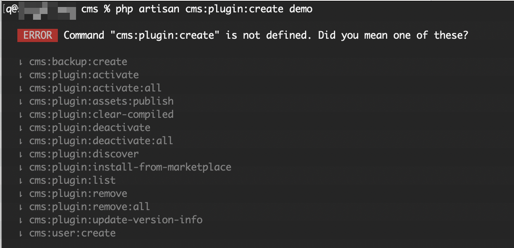

# Plugin Development

## Introduction

Plugins are a great way to extend the functionality of Botble CMS. They allow you to add new features to your website without modifying the core code. This guide will walk you through the process of creating, activating, and managing plugins in Botble CMS.

::: warning
Dev tools are removed in the download package, you need to delete folder `/vendor` and run command `composer install` to reinstall it, then you can use dev commands.
:::

## Commands

- Check this video: https://www.youtube.com/watch?v=JAiKnnb9dH8

### Create a plugin

**- Open CMD or Terminal then run:**

```bash
php artisan cms:plugin:create <plugin-name>
```

For example, to create a plugin named "Foo":

```bash
php artisan cms:plugin:create foo
```

This command will generate a new plugin with the following structure:

```
platform/plugins/foo/
├── config/
│   └── permissions.php
├── database/
│   ├── migrations/
│   └── seeders/
├── helpers/
├── resources/
│   ├── assets/
│   ├── lang/
│   └── views/
├── routes/
│   └── web.php
├── src/
│   ├── Forms/
│   ├── Http/
│   │   ├── Controllers/
│   │   └── Requests/
│   ├── Models/
│   ├── Providers/
│   │   └── FooServiceProvider.php
│   ├── Repositories/
│   └── Plugin.php
└── plugin.json
```

The command will also register the plugin in the system and activate it automatically.

### Troubleshoot

If you get an error like this:



You need to delete folder `/vendor` and run command `composer install` to reinstall it, then you will have that command.

## Activate a plugin

**- Open CMD or Terminal then run:**

```bash
php artisan cms:plugin:activate <plugin name>
```

### Deactivate a plugin

**- Open CMD or Terminal then run:**

```bash
php artisan cms:plugin:deactivate <plugin name>
```

### Remove a plugin

**- Command:**

```bash
php artisan cms:plugin:remove demo
```

::: info
`demo` is a plugin.
:::

When you run this command. It will do:

+ Deactivate `demo` plugin.

+ It will be remove `demo` table and its permissions

+ Delete folder demo in `/plugins` and delete `/plugins` directory if it's empty

## Plugin Structure

### Key Components

#### plugin.json

This file contains metadata about your plugin, including its name, namespace, provider, author, and description. It's required for every plugin.

```json
{
    "name": "Foo",
    "namespace": "Botble\\Foo\\",
    "provider": "Botble\\Foo\\Providers\\FooServiceProvider",
    "author": "Your Name",
    "url": "https://yourwebsite.com",
    "version": "1.0",
    "description": "A simple foo plugin for Botble CMS",
    "minimum_core_version": "7.3.0"
}
```

#### Plugin.php

This file handles the plugin lifecycle events: activation, deactivation, and removal. It implements the `PluginInterface` or extends `PluginOperationAbstract`.

```php
<?php

namespace Botble\Foo;

use Botble\PluginManagement\Abstracts\PluginOperationAbstract;
use Illuminate\Support\Facades\Schema;

class Plugin extends PluginOperationAbstract
{
    public static function activate(): void
    {
        // Logic to run when the plugin is activated
    }

    public static function deactivate(): void
    {
        // Logic to run when the plugin is deactivated
    }

    public static function remove(): void
    {
        // Clean up when the plugin is removed
        Schema::dropIfExists('foo_items');
        Schema::dropIfExists('foo_categories');
    }
}
```

#### Service Provider

The service provider is the main entry point of your plugin. It registers routes, views, translations, and other resources.

```php
<?php

namespace Botble\Foo\Providers;

use Botble\Base\Facades\DashboardMenu;
use Botble\Base\Traits\LoadAndPublishDataTrait;
use Illuminate\Support\ServiceProvider;

class FooServiceProvider extends ServiceProvider
{
    use LoadAndPublishDataTrait;

    public function register(): void
    {
        // Register bindings, repositories, etc.
    }

    public function boot(): void
    {
        $this
            ->setNamespace('plugins/foo')
            ->loadHelpers()
            ->loadAndPublishConfigurations(['permissions'])
            ->loadMigrations()
            ->loadAndPublishTranslations()
            ->loadAndPublishViews()
            ->loadRoutes(['web']);

        // Register menu items
        DashboardMenu::default()->beforeRetrieving(function (): void {
            DashboardMenu::make()
                ->registerItem([
                    'id' => 'cms-plugins-foo',
                    'priority' => 5,
                    'name' => 'plugins/foo::foo.name',
                    'icon' => 'ti ti-box',
                    'url' => route('foo.index'),
                    'permissions' => ['foo.index'],
                ]);
        });
    }
}
```

### Models

Models represent database tables and define relationships between entities.

```php
<?php

namespace Botble\Foo\Models;

use Botble\Base\Casts\SafeContent;
use Botble\Base\Enums\BaseStatusEnum;
use Botble\Base\Models\BaseModel;

class Item extends BaseModel
{
    protected $table = 'foo_items';

    protected $fillable = [
        'name',
        'description',
        'content',
        'status',
        'user_id',
        'image',
    ];

    protected $casts = [
        'status' => BaseStatusEnum::class,
        'name' => SafeContent::class,
        'description' => SafeContent::class,
    ];
}
```

### Controllers

Controllers handle HTTP requests and return responses.

```php
<?php

namespace Botble\Foo\Http\Controllers;

use Botble\Base\Http\Controllers\BaseController;
use Botble\Foo\Forms\ItemForm;
use Botble\Foo\Http\Requests\ItemRequest;
use Botble\Foo\Models\Item;
use Botble\Foo\Tables\ItemTable;

class ItemController extends BaseController
{
    public function index(ItemTable $table)
    {
        $this->pageTitle(trans('plugins/foo::items.name'));

        return $table->renderTable();
    }

    public function create()
    {
        $this->pageTitle(trans('plugins/foo::items.create'));

        return ItemForm::create()->renderForm();
    }

    public function store(ItemRequest $request)
    {
        $item = Item::query()->create($request->validated());

        return $this
            ->httpResponse()
            ->setPreviousUrl(route('foo.index'))
            ->setNextUrl(route('foo.edit', $item->id))
            ->setMessage(trans('core/base::notices.create_success_message'));
    }
}
```

## Best Practices

### Naming Conventions

- **Plugin Name**: Use PascalCase for plugin names (e.g., `Blog`, `Ecommerce`)
- **Database Tables**: Prefix tables with your plugin name (e.g., `blog_posts`, `blog_categories`)
- **Routes**: Use kebab-case for route names (e.g., `blog.posts.create`)
- **Translation Keys**: Use dot notation and lowercase (e.g., `plugins/blog::posts.create`)

### Code Organization

- Keep your code organized in appropriate directories
- Use namespaces consistently
- Follow PSR-12 coding standards
- Use type hints and return types in PHP 8.2+

### Security

- Always validate user input using Request classes
- Use the permission system to restrict access to features
- Sanitize output using the `SafeContent` cast

### Performance

- Use eager loading to avoid N+1 query problems
- Cache frequently accessed data
- Optimize database queries

## Video tutorials

- Make CRUD inside an existed plugin: https://www.youtube.com/watch?v=GAnoZbGHE28
- Adding new fields to an existing form: https://www.youtube.com/watch?v=5PC6mzssZ70
- Display plugin data on the front theme: https://www.youtube.com/watch?v=YgrfEXK2TBo
- Working with SEO helpers: https://www.youtube.com/watch?v=S0tlbt0K44c

## Advanced Plugin Development

### Creating Forms

Botble CMS provides a powerful form builder that makes it easy to create forms for your plugin.

```php
<?php

namespace Botble\Foo\Forms;

use Botble\Base\Forms\FieldOptions\TextFieldOption;
use Botble\Base\Forms\FieldOptions\TextareaFieldOption;
use Botble\Base\Forms\FieldOptions\SelectFieldOption;
use Botble\Base\Forms\Fields\TextField;
use Botble\Base\Forms\Fields\TextareaField;
use Botble\Base\Forms\Fields\SelectField;
use Botble\Base\Forms\FormAbstract;
use Botble\Foo\Http\Requests\ItemRequest;
use Botble\Foo\Models\Item;

class ItemForm extends FormAbstract
{
    public function buildForm(): void
    {
        $this
            ->setupModel(new Item())
            ->setValidatorClass(ItemRequest::class)
            ->withCustomFields()
            ->add('name', TextField::class, TextFieldOption::make()
                ->label(trans('core/base::forms.name'))
                ->placeholder(trans('core/base::forms.name_placeholder'))
                ->required()
            )
            ->add('description', TextareaField::class, TextareaFieldOption::make()
                ->label(trans('core/base::forms.description'))
                ->placeholder(trans('core/base::forms.description_placeholder'))
                ->rows(4)
            )
            ->add('status', SelectField::class, SelectFieldOption::make()
                ->label(trans('core/base::tables.status'))
                ->choices([
                    'published' => trans('core/base::tables.published'),
                    'draft' => trans('core/base::tables.draft'),
                ])
                ->defaultValue('published')
            );
    }
}
```

### Creating Tables

Tables are used to display data in the admin panel. Botble CMS provides a table builder that makes it easy to create tables for your plugin.

```php
<?php

namespace Botble\Foo\Tables;

use Botble\Base\Facades\BaseHelper;
use Botble\Base\Facades\Html;
use Botble\Base\Enums\BaseStatusEnum;
use Botble\Foo\Models\Item;
use Botble\Table\Abstracts\TableAbstract;
use Botble\Table\Actions\DeleteAction;
use Botble\Table\Actions\EditAction;
use Botble\Table\BulkActions\DeleteBulkAction;
use Botble\Table\Columns\Column;
use Botble\Table\Columns\CreatedAtColumn;
use Botble\Table\Columns\IdColumn;
use Botble\Table\Columns\NameColumn;
use Botble\Table\Columns\StatusColumn;
use Illuminate\Database\Eloquent\Builder;
use Illuminate\Http\JsonResponse;

class ItemTable extends TableAbstract
{
    public function setup(): void
    {
        $this
            ->model(Item::class)
            ->addActions([
                EditAction::make()
                    ->route('foo.edit'),
                DeleteAction::make()
                    ->route('foo.destroy'),
            ]);
    }

    public function columns(): array
    {
        return [
            IdColumn::make(),
            NameColumn::make()->route('foo.edit'),
            CreatedAtColumn::make(),
            StatusColumn::make(),
        ];
    }

    public function buttons(): array
    {
        return $this->addCreateButton(route('foo.create'));
    }

    public function bulkActions(): array
    {
        return [
            DeleteBulkAction::make()->permission('foo.destroy'),
        ];
    }

    public function getFilters(): array
    {
        return [
            'name' => [
                'title' => trans('core/base::tables.name'),
                'type' => 'text',
                'validate' => 'required|string|max:120',
            ],
            'status' => [
                'title' => trans('core/base::tables.status'),
                'type' => 'select',
                'choices' => BaseStatusEnum::labels(),
                'validate' => 'required|in:' . implode(',', BaseStatusEnum::values()),
            ],
            'created_at' => [
                'title' => trans('core/base::tables.created_at'),
                'type' => 'date',
            ],
        ];
    }
}
```

### Working with Settings

You can add settings for your plugin using the Settings facade.

```php
<?php

namespace Botble\Foo\Providers;

use Botble\Base\Traits\LoadAndPublishDataTrait;
use Botble\Setting\Facades\Setting;
use Illuminate\Support\ServiceProvider;

class FooServiceProvider extends ServiceProvider
{
    use LoadAndPublishDataTrait;

    // ...

    public function boot(): void
    {
        // ...

        $this->app->booted(function () {
            $this->app->register(HookServiceProvider::class);
        });

        // Add settings
        add_filter('cms_settings_validation_rules', function ($rules) {
            return array_merge($rules, [
                'foo_items_per_page' => 'nullable|integer|min:1',
                'foo_display_author' => 'nullable|boolean',
            ]);
        });

        add_filter('cms_settings_pages', function ($pages) {
            return array_merge($pages, [
                'foo' => [
                    'name' => 'Foo',
                    'icon' => 'ti ti-box',
                    'view' => 'plugins/foo::settings',
                    'route' => 'foo.settings',
                ],
            ]);
        });
    }
}
```

### Adding Widgets

Widgets can be added to the dashboard or other areas of the admin panel.

```php
<?php

namespace Botble\Foo\Providers;

use Botble\Base\Facades\DashboardMenu;
use Botble\Base\Facades\Widget;
use Botble\Base\Traits\LoadAndPublishDataTrait;
use Illuminate\Support\ServiceProvider;

class FooServiceProvider extends ServiceProvider
{
    use LoadAndPublishDataTrait;

    // ...

    public function boot(): void
    {
        // ...

        // Register widgets
        Widget::group('foo_widgets')
            ->setGroup(['name' => 'Foo Widgets', 'position' => 10])
            ->register('recent_items', 'Recent Items', 'plugins/foo::widgets.recent-items');
    }
}
```

### Adding Shortcodes

Shortcodes allow you to add dynamic content to pages and posts.

```php
<?php

namespace Botble\Foo\Providers;

use Botble\Base\Traits\LoadAndPublishDataTrait;
use Botble\Foo\Models\Item;
use Botble\Shortcode\Facades\Shortcode;
use Illuminate\Support\ServiceProvider;

class FooServiceProvider extends ServiceProvider
{
    use LoadAndPublishDataTrait;

    // ...

    public function boot(): void
    {
        // ...

        // Register shortcodes
        Shortcode::register('foo-items', 'Foo items', 'Display foo items', function ($attributes) {
            $limit = $attributes['limit'] ?? 5;

            $items = Item::query()
                ->where('status', 'published')
                ->limit($limit)
                ->get();

            return view('plugins/foo::shortcodes.items', compact('items'))->render();
        });
    }
}
```

### Adding Custom Fields

If you have the Custom Fields plugin installed, you can add custom fields to your plugin's models.

```php
<?php

namespace Botble\Foo\Providers;

use Botble\Base\Traits\LoadAndPublishDataTrait;
use Botble\CustomField\Facades\CustomField;
use Botble\Foo\Models\Item;
use Illuminate\Support\ServiceProvider;

class FooServiceProvider extends ServiceProvider
{
    use LoadAndPublishDataTrait;

    // ...

    public function boot(): void
    {
        // ...

        // Register custom fields
        if (defined('CUSTOM_FIELD_MODULE_SCREEN_NAME')) {
            CustomField::registerModule(Item::class)
                ->registerRule('basic', trans('plugins/foo::items.custom_field_rules'), [
                    'status' => 'published',
                ])
                ->expandRule('other', trans('plugins/custom-field::rules.model_name'), 'status', [
                    'draft' => trans('plugins/foo::items.draft'),
                ]);
        }
    }
}
```
