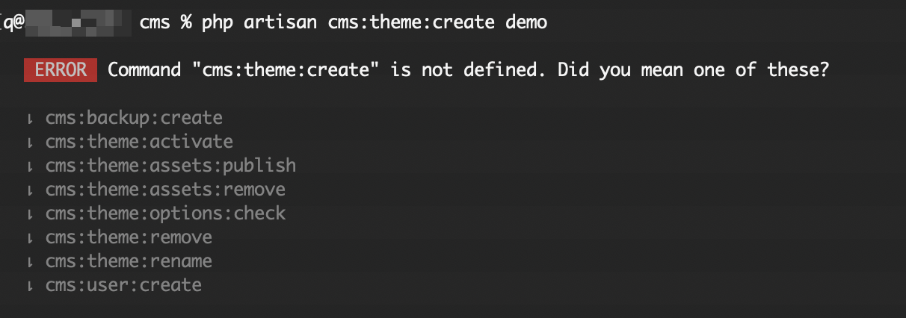

# Theme

::: warning
Dev tools are removed in the download package, you need to delete folder `/vendor` and run command `composer install` to
reinstall it, then you can use dev commands.
:::

## Theme Directory Structure

::: tip IMPORTANT
When developing a theme, you only need to create files in `platform/themes/{theme-name}/`. The `public/themes/{theme-name}/` directory is **automatically generated** when you activate the theme or publish assets.
:::

Botble CMS uses two directories for themes:

| Directory | Purpose |
|-----------|---------|
| `platform/themes/{name}/` | **Source files** - Where you develop your theme. Contains views, functions, widgets, and a `public/` subfolder for assets. |
| `public/themes/{name}/` | **Published assets** - Auto-generated from `platform/themes/{name}/public/`. Do NOT edit files here directly. |

### How It Works

1. **You create/edit** files in `platform/themes/{theme-name}/`
2. **The CMS automatically copies** contents of `platform/themes/{theme-name}/public/` to `public/themes/{theme-name}/` when:
   - You activate the theme
   - You run `php artisan cms:theme:assets:publish`
   - You save theme options

### Theme Source Structure

```
platform/themes/your-theme/
├── assets/              # Source files (SCSS, JS before compilation) - optional
│   ├── sass/
│   └── js/
├── functions/           # Theme functions (shortcodes, theme options, etc.)
├── lang/                # Translation files
├── layouts/             # Layout files
├── partials/            # Partial views
├── public/              # PUBLIC ASSETS - these get published to public/themes/your-theme/
│   ├── css/             # Compiled CSS
│   ├── js/              # Compiled/final JS
│   ├── images/          # Images
│   └── fonts/           # Fonts
├── routes/              # Theme routes
├── views/               # Theme views
├── widgets/             # Theme widgets
├── config.php           # Theme configuration
├── screenshot.png       # Theme preview image
├── theme.json           # Theme metadata
└── webpack.mix.js       # Asset compilation config (optional)
```

::: warning
When you install a theme package, you only need to extract it to `platform/themes/`. The `public/themes/` directory will be created automatically when the theme is activated.
:::

## Creating a Theme

The first time you have to create theme "demo" structure, using the artisan command:

```bash
php artisan cms:theme:create demo
```

### Troubleshoot

If you get an error like this:



You need to delete folder `/vendor` and run command `composer install` to reinstall it, then you will have that command.

To delete an existing theme, use the command:

```bash
php artisan cms:theme:remove demo
```

## Configuration

::: info
The main config for theme is located in /platform/themes/[theme]/config.php
:::

The config is convenient for setting up basic CSS/JS, partial composer, breadcrumb template and also metas.

Example:

```php
'events' => [
    
    // Before event inherit from package config and the theme that call before,
    // you can use this event to set meta, breadcrumb template or anything
    // you want inheriting.
    'before' => function($theme)
    {
        // You can remove this line anytime.
        $theme->setTitle('Copyright ©  2017 - Botble CMS');
    },
    
    // Listen on event before render a theme,
    // this event should call to assign some assets,
    // breadcrumb template.
    'beforeRenderTheme' => function($theme)
    {
        // You may use this event to set up your assets.
        // $theme->asset()->usePath()->add('core', 'core.js');
        // $theme->asset()->add('jquery', 'vendor/jquery/jquery.min.js');
        // $theme->asset()->add('jquery-ui', 'vendor/jqueryui/jquery-ui.min.js', array('jquery'));
    
    
        // $theme->partialComposer('header', function($view)
        // {
        //     $view->with('auth', Sentinel::user());
        // });
    },
    
    // Listen on event before render a layout,
    // this should call to assign style, script for a layout.
    'beforeRenderLayout' => array(
    
        'default' => function($theme)
        {
            // $theme->asset()->usePath()->add('ipad', 'css/layouts/ipad.css');
        }
    
    )
]
```

## Basic usage

```php
namespace App\Http\Controllers;
    
use Theme;

class HomeController extends Controller {

    public function getIndex()
    {
        $theme = Theme::uses('default')->layout('mobile');

        $view = [
            'name' => 'Botble'
        ];

        // home.index will look up the path 'platform/themes/your-theme/views/home/index.blade.php'
        return $theme->scope('home.index', $view)->render();
    }

}
```

::: info
Get only content "$theme->of('home.index')->content();".
:::

To find the location of a view.

```php
$which = $theme->scope('home.index')->location();
    
echo $which; // theme::views.home.index

$which = $theme->scope('home.index')->location(true);

echo $which; // ./platform/themes/name/views/home/index.blade.php
```

### Partials

Render a partial in your layouts or views.

```php
// This will look up to "platform/themes/[theme]/partials/header.php"
echo Theme::partial('header', ['title' => 'Header']);

// Partial with current layout specific.
// This will look up up to "platform/themes/[theme]/partials/[CURRENT_LAYOUT]/header.php"
echo Theme::partialWithLayout('header', ['title' => 'Header']);
```

Finding from both theme's partial and application's partials.

```php
echo Theme::watchPartial('header', ['title' => 'Header']);
```

Partial composer.

```php
$theme->partialComposer('header', function($view) {
    $view->with('key', 'value');
});

// Working with partialWithLayout.
$theme->partialComposer('header', function($view) {
    $view->with('key', 'value');
}, 'layout-name');
```

## Working with regions.

Theme has magic methods to set, prepend and append anything.

```php
$theme->setTitle('Your title');
    
$theme->appendTitle('Your appended title');

$theme->prependTitle('Hello: ....');

$theme->setAnything('anything');

$theme->setFoo('foo');

// or

$theme->set('foo', 'foo');
```

Render in your layout or view.

```php
Theme::getAnything();
    
Theme::getFoo();

// or use place.

Theme::place('anything');

Theme::place('foo', 'default-value-if-it-does-not-exist');

// or

Theme::get('foo');
```

Check if the place exists or not.

```php
@if (Theme::has('title'))
    {{ Theme::place('title') }}
@endif

// or

@if (Theme::hasTitle())
    {{ Theme::getTitle() }}
@endif
```

Get argument assigned to content in layout or region.

```php
Theme::getContentArguments();
    
// or

Theme::getContentArgument('name');

// To check if it exists

Theme::hasContentArgument('name');
```

::: info
Theme::place('content') is a reserve region to render sub-view.
:::

## Preparing data to view

Sometimes you don't need to execute heavy processing, so you can prepare and use when you need it.

```php
$theme->bind('something', function() {
    return 'This is bound parameter.';
});
```

Using bound data on view.

```php
echo Theme::bind('something');
```

## Using theme global

```php
use Botble\Theme\Contracts\Theme;
use App\Http\Controllers\Controller;

class BaseController extends Controller {

    protected $theme;

    public function __construct(Theme $theme)
    {
        // Using theme as a global.
        $this->theme = $theme->uses('default')->layout('ipad');
    }

}
```

To override theme or layout.

```php
public function getIndex()
{
    $this->theme->uses('newone');

    // or just override layout
    $this->theme->layout('desktop');

    $this->theme->of('somewhere.index')->render();
}
```

## Rename the theme to the new name

### Using command line (Recommended):

```bash
php artisan cms:theme:rename [current-name] [new-name]
```

This command handles all the renaming automatically, including database entries.

### Manually

1. Rename folder `platform/themes/[current-theme-name]` to `platform/themes/[new-name]`.
2. Delete folder `public/themes/[current-theme-name]` (it will be regenerated).
3. Open table `settings` and replace all keys `theme-[current-theme-name]` to `theme-[new-name]`, change setting `theme` to `[new-name]`.
4. Open table `widgets` and replace all values in `theme` column to the new name `[new-name]`.
5. Run `php artisan cms:theme:assets:publish [new-name]` to regenerate `public/themes/[new-name]`.

::: tip
You don't need to manually copy/rename `public/themes/`. Just delete the old one and the CMS will regenerate it when you activate the theme or publish assets.
:::