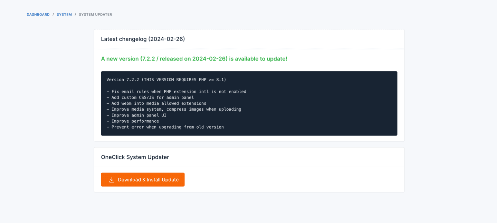
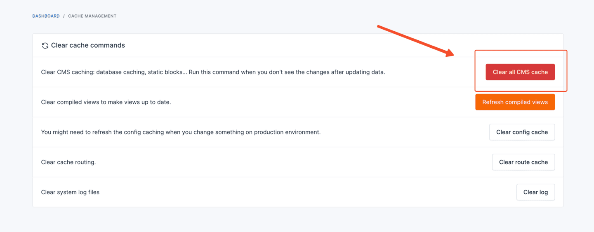
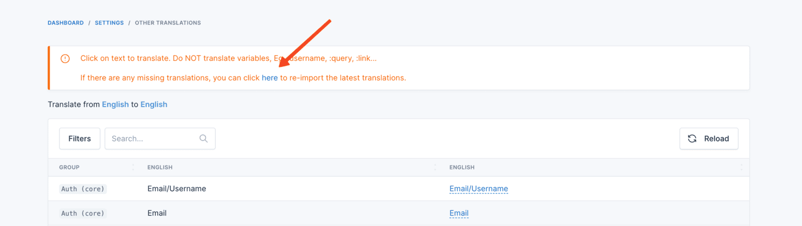

# Upgrade Guide

This guide will walk you through the process of upgrading Botble CMS based products. There are three ways to upgrade
your product:

1. **Automatic Update** (in-app updater) — easiest, recommended for most users.
2. **Command Line Update** (`php artisan cms:update`) — most reliable, recommended if you have SSH access.
3. **Manual Update** (download and extract) — last resort when neither of the above works.

## Automatic Update

To update your product automatically, follow these steps:

1. Log in to your admin panel.
2. Go to `Platform Administration` -> `System Updater`.
3. If there is a new version available, you will see a `Download & Install Update` button. Click on it to start the
   automatic update process.



::: tip
If the automatic update fails with errors like **HTTP 504**, **Invalid or uninitialized Zip object**, or a **500 error
mid-progress**, use the [Command Line Update](#command-line-update) method below — it bypasses the web-server timeouts
that cause these failures. See [Troubleshooting - System Updater Errors](/cms/troubleshooting#system-updater-errors)
for more details.
:::

## Command Line Update

If you have SSH access to your server, this is the most reliable way to update. The CLI command bypasses every web-tier
timeout (Cloudflare's 100-second connection cap, nginx and php-fpm proxy timeouts, browser request limits) that
typically causes the in-app updater to fail mid-progress on slower connections or behind a reverse proxy. It also
retries the update download up to 3 times automatically and bumps PHP execution time and memory limits at runtime.

1. SSH into your server and `cd` to your project root:

   ```bash
   cd /path/to/your/project
   ```

2. Run the update command:

   ```bash
   php artisan cms:update
   ```

3. Confirm the prompts. The command will download the latest update, extract files, run database migrations, publish
   assets, and clear caches in a single pass with live progress output. If anything fails, you will see the exact step
   and error message in the terminal.

::: tip
The command does the same work as the in-app updater (download → extract → migrate → publish → clear cache) but as a
CLI process it is not subject to web request timeouts. This is the recommended path for any update that fails in the
browser.
:::

::: warning
Increasing `max_execution_time` in `php.ini` does **not** help against Cloudflare's 100-second connection cap or
upstream proxy timeouts in nginx / php-fpm — those limits live above PHP. Use the command line method when you hit
those.
:::

## Manual Update

::: danger Warning: Backup `.env` first
The CodeCanyon package contains a default `.env` file. If you extract the package on top of your live install with a
tool that does not skip `.env`, your real database credentials, `APP_KEY`, and other settings **will be overwritten**
and your site will go down with a database connection error. Always back up your `.env` before extracting, or extract
to a temporary directory first and copy files manually.

The in-app updater and `php artisan cms:update` both refuse to apply any update that contains a `.env` file, exactly
to prevent this. Manual extraction has no such guard. If you have already overwritten `.env`, see
[Troubleshooting - .env Overwritten After Manual Update](/cms/troubleshooting#env-overwritten-after-manual-update).
:::

This way is a bit more complex, but it gives you more control over the upgrade process. Here are the steps:

1. **Back up your `.env` file** before doing anything else.
2. Download the latest version of the product from CodeCanyon.
3. Extract the downloaded file.
4. Upload the extracted files to your server, overwrite the following directories and files (and **never** the `.env`
   file in your project root):
   * `app`
   * `database`
   * `config`
   * `platform`
   * `public/themes`
   * `public/vendor`
   * `bootstrap`
   * `vendor`
   * `composer.json`
   * `composer.lock`
   * `public/index.php`
5. Verify your `.env` file is unchanged. If it was overwritten, restore it from your backup before reloading the site.
6. Clear the cache by navigating to `Platform Administration` -> `Cache Management` and clicking on
   the `Clear all CMS cache` button.

   
7. Deactivate all plugins by going to `Plugins` -> `Installed Plugins`, and then activate them again.
8. Update the translations by going to `Settings` -> `Localization` -> `Other Translations` and click to the `here` link
   to update the translations.

   
