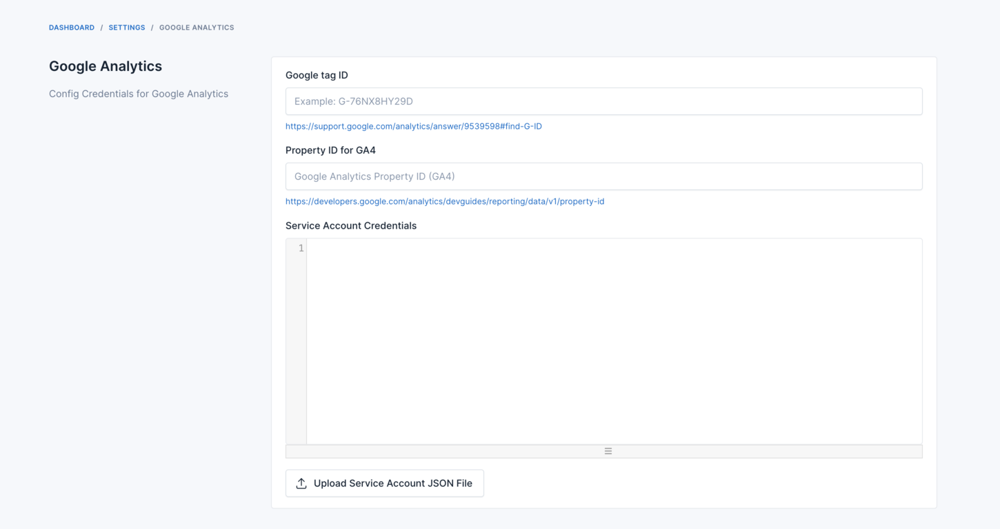
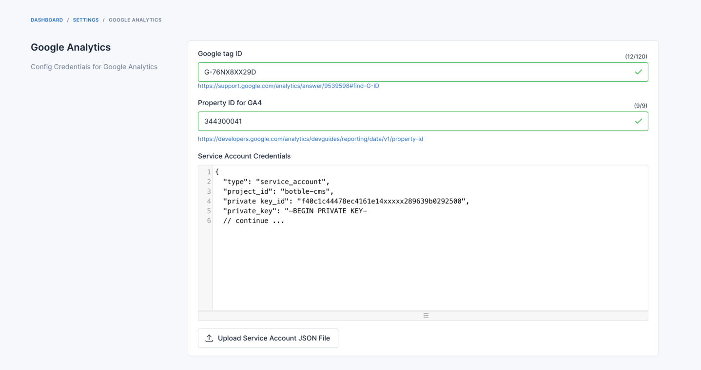
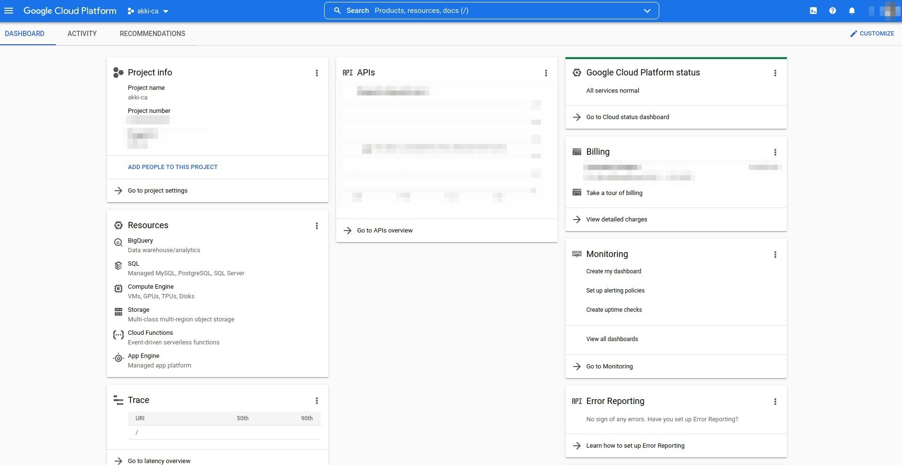
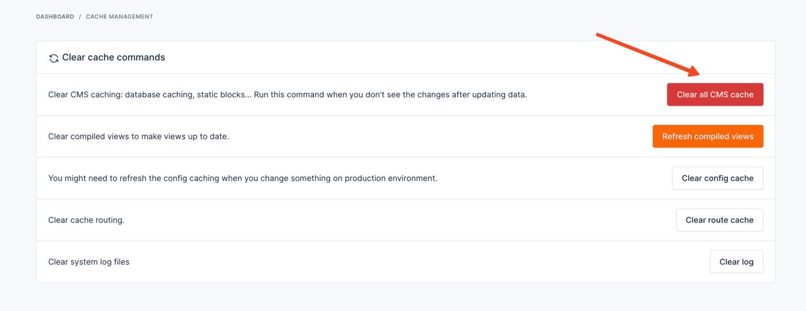

# Analytics

Integrate with Google Analytics

## Getting credentials

Navigate to `Settings` -> `Others` -> `Google Analytics` to find instructions for integrating with Google Analytics.

* Google tag ID: Follow [this link](https://support.google.com/analytics/answer/9539598#find-G-ID) to find your Google
  Tag ID.
* Property ID: Visit [this link](https://developers.google.com/analytics/devguides/reporting/data/v1/property-id) to
  find your Property ID.
* Service Account Credentials: Follow the
  instructions [here](https://github.com/akki-io/laravel-google-analytics/wiki/2.-Configure-Google-Service-Account-&-Google-Analytics)
  to set up Service Account Credentials.

After obtaining the JSON credential file, open it and copy its content to the "Service Account Credential" field.

Watch this video for a visual guide.

<iframe width="560" height="315" src="https://www.youtube.com/embed/2q7ufd8W8WI?si=XZnYcfZ55vg2WgSg" title="YouTube video player" frameborder="0" allow="accelerometer; autoplay; clipboard-write; encrypted-media; gyroscope; picture-in-picture; web-share" allowfullscreen></iframe>

## Troubleshooting

### Service Not Enabled Error

If you encounter the "Service is not enabled" error:

1. **Enable Google Analytics Data API**

   Go to your Google Cloud Console, select your project, search for "APIs & Services", and enable the "Google Analytics
   Data API".

   

   

   

2. **Setup Timezone and Clear Cache**

   In admin panel, go to -> `Settings` -> `General` and set your local timezone. Then, go
   to `Platform Administration` -> `Cache Management` and clear your site cache.

   

   

::: tip
The analytics data in the Admin dashboard is displayed daily and resets every day. It is not real-time data but data
from the API. Please wait until your site has data from the API.
:::
