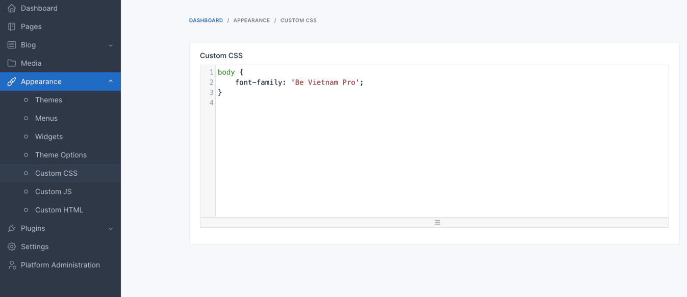
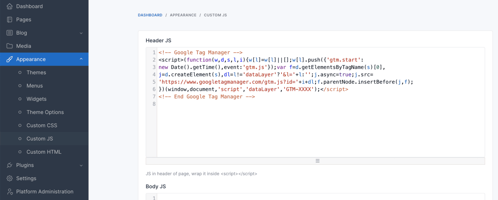

# Custom CSS/JS

Customize your site's appearance by easily adding custom CSS and JS code without modifying the theme's source code.

## Custom CSS

In admin panel, go to `Appearance` -> `Custom CSS`.

## Custom JS

In admin panel, go to `Appearance` -> `Custom JS`.

## Add your CSS/JS directly in the source code

You can add your CSS/JS directly in `platform/themes/[your-theme]/partials/footer.blade.php`.
