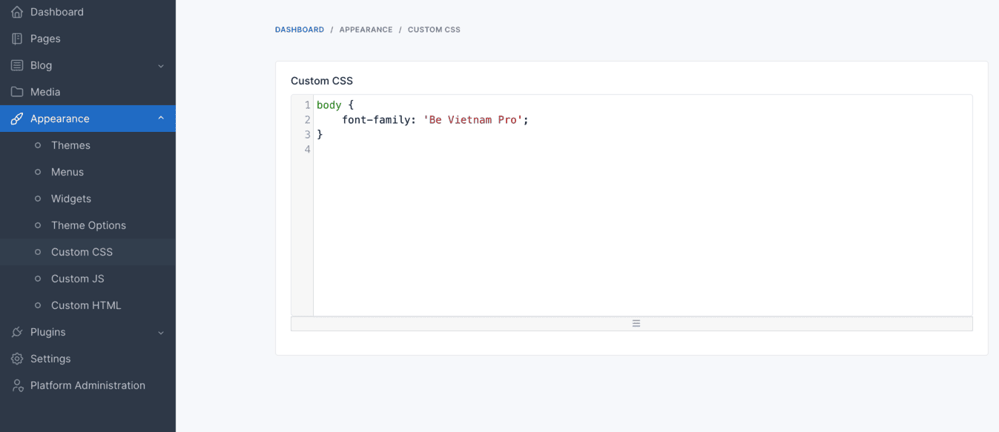
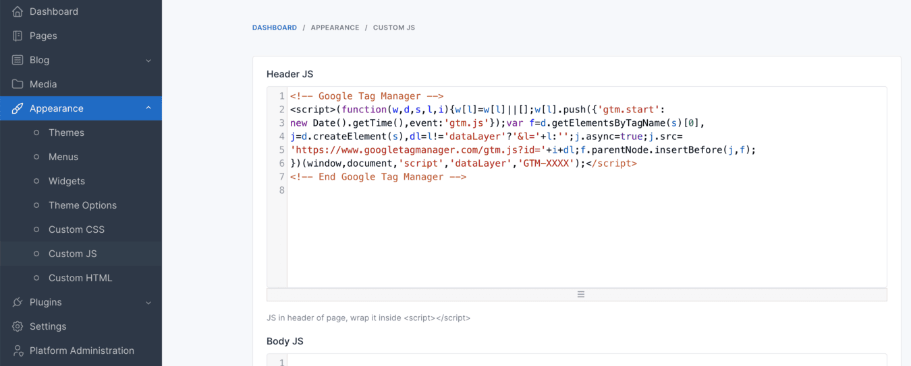

# Custom CSS/JS

Customize your site's appearance and behavior without modifying the theme's source code. Three approaches, in order of
complexity — pick the simplest one that fits.

## Option 1: Admin panel (no code, no rebuild)

Best for snippets, small style overrides, and quick fixes.

### Custom CSS

In the admin panel, go to **Appearance → Custom CSS**.



### Custom JS

In the admin panel, go to **Appearance → Custom JS**.



Both are stored in the database, so they survive theme updates and CMS updates.

::: danger Do not put tracking code here
**Appearance → Custom HTML** strips `<script>`, `<style>`, and `<iframe>` tags on save, so a pasted GA4/GTM/AdSense
snippet silently disappears. Analytics and marketing tags belong in **Settings → Website Tracking** — see
[Website Tracking](/cms/usage-website-tracking).
:::

## Option 2: Edit the theme source and rebuild

Best when you are making substantial design changes and already work with the theme's build pipeline.

Edit `platform/themes/{theme}/assets/js/main.js` or the `.scss` files, then rebuild from the project root:

```bash
npm install
npm run production
```

Vite writes the compiled output to `public/themes/{theme}/js/` and `public/themes/{theme}/css/`.

::: warning Never edit files inside `public/themes/{theme}/`
Those are build artifacts. They are overwritten on every rebuild, and on every theme update.
:::

See [Asset Compilation](/cms/asset-compilation) for the full build reference.

## Option 3: Register a separate file (canonical pattern)

Best when you want your customizations in version control, separate from both the theme source and the database.

1. Create your file, for example `public/themes/{theme}/js/custom.js` or `public/themes/{theme}/css/custom.css`.

2. Register it in `platform/themes/{theme}/config.php`, inside the `beforeRenderTheme` closure, alongside the existing
   `main.js` / `style.css` registrations:

   ```php
   // JavaScript, loaded in the footer, after jQuery
   $theme->asset()->container('footer')->usePath()
       ->add('custom', 'js/custom.js', ['jquery']);

   // CSS
   $theme->asset()->usePath()->add('custom-css', 'css/custom.css');
   ```

Placing a file in the folder is **not** enough — an asset only loads once it is registered.

## Notes

- Custom JS runs in the browser only. It does not add server-side validation or security of any kind; use it for UI
  behavior.
- After changing CSS/JS through any of the three options, clear the cache at
  **Platform Administration → Cache Management**, and purge your CDN if you use one.
- For theme-wide customization that goes beyond CSS and JS, use a
  [child theme](/cms/child-theme-development) so your changes survive theme updates.

## Related

- [Website Tracking](/cms/usage-website-tracking)
- [Asset Compilation](/cms/asset-compilation)
- [Theme Assets](/cms/theme-development/theme-assets)
- [Child Theme Development](/cms/child-theme-development)
