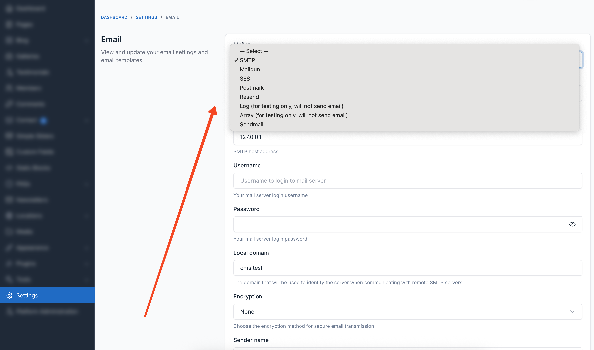
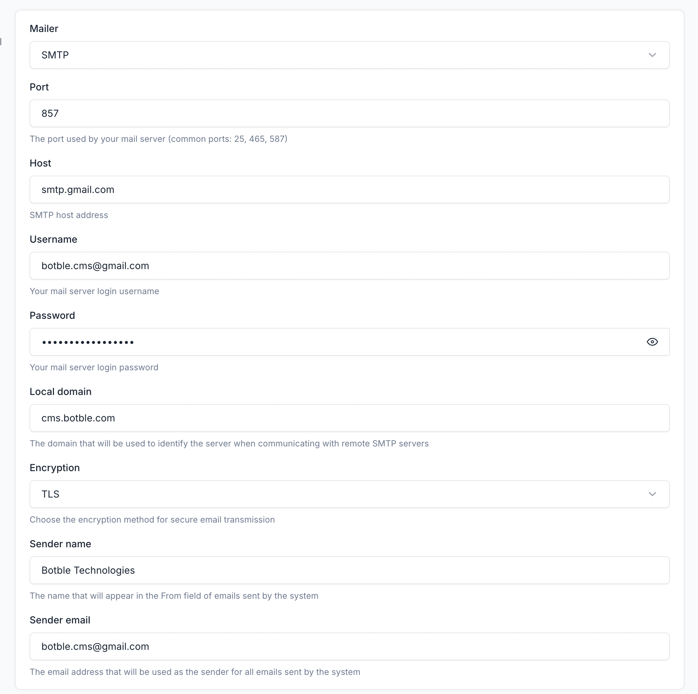
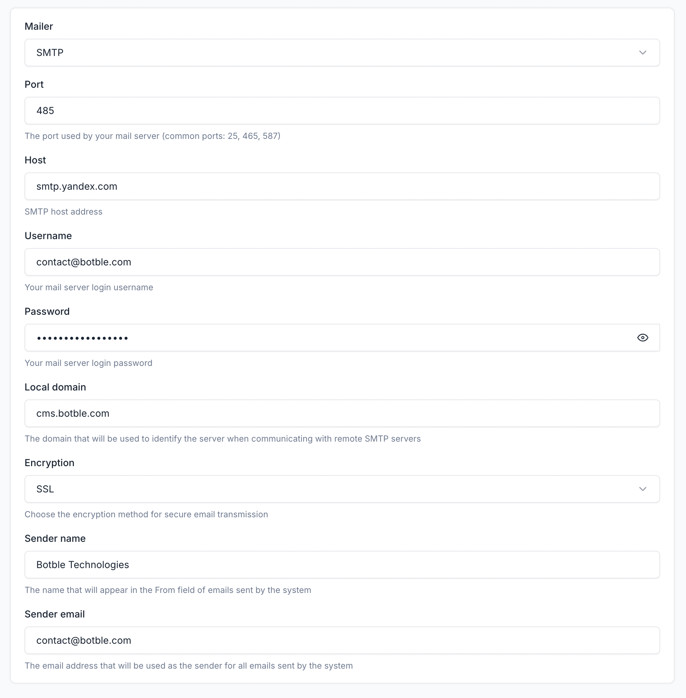
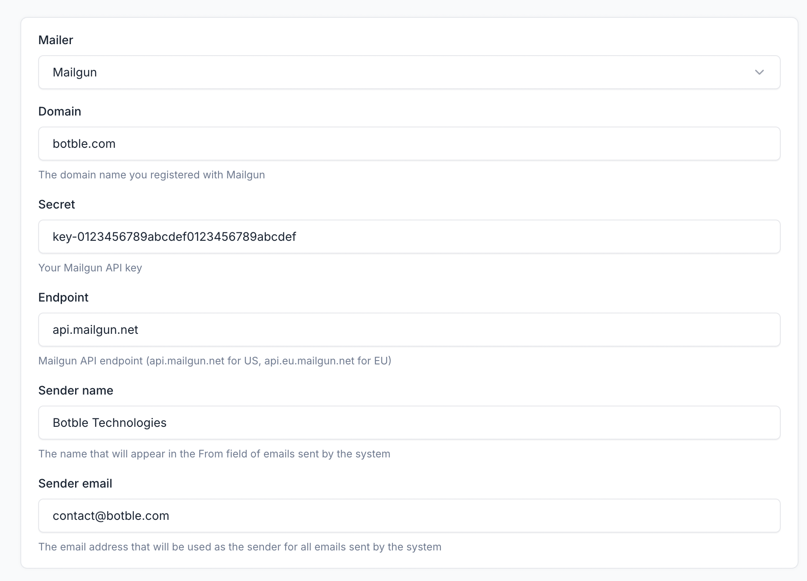
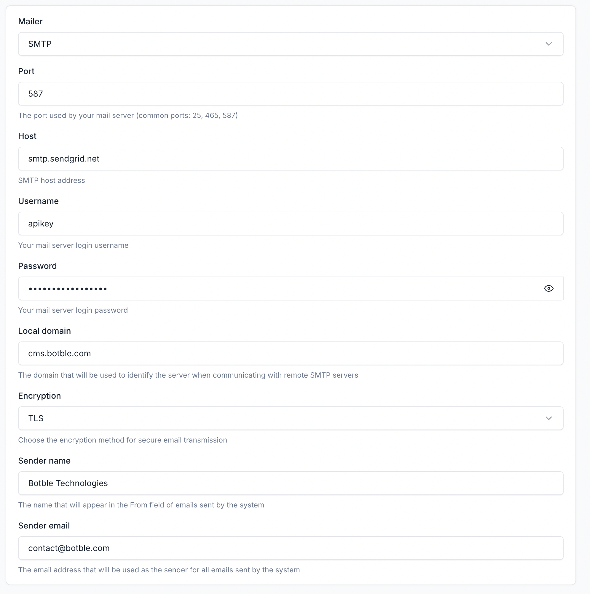
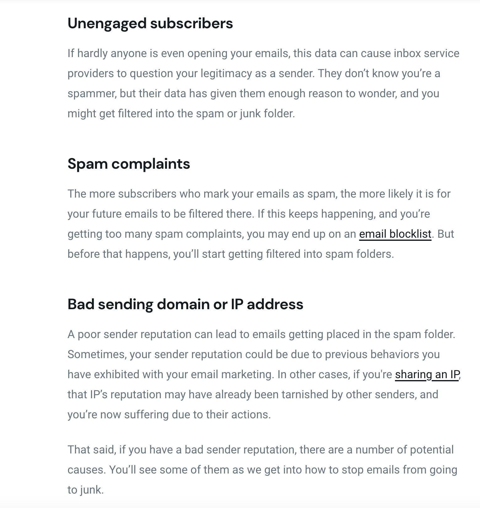
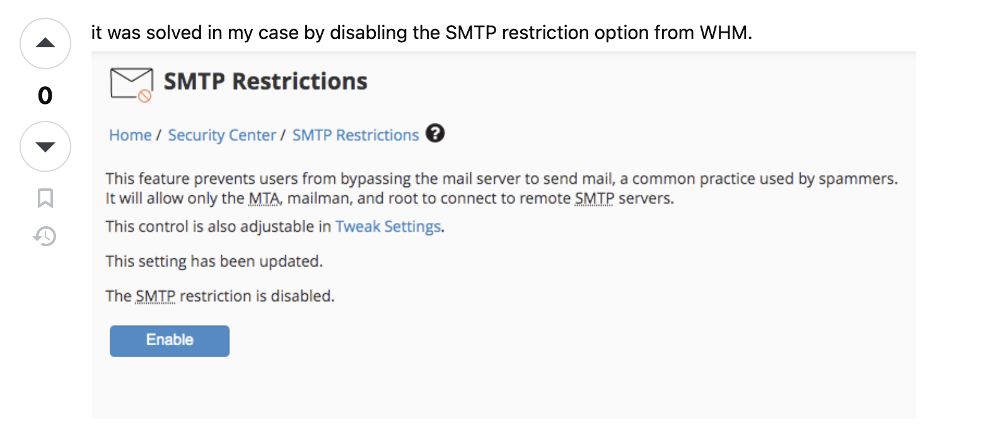
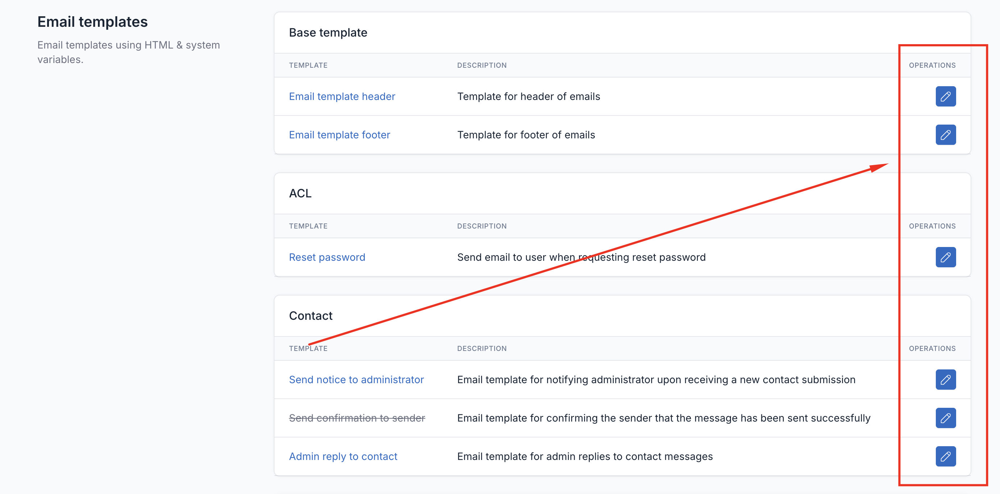
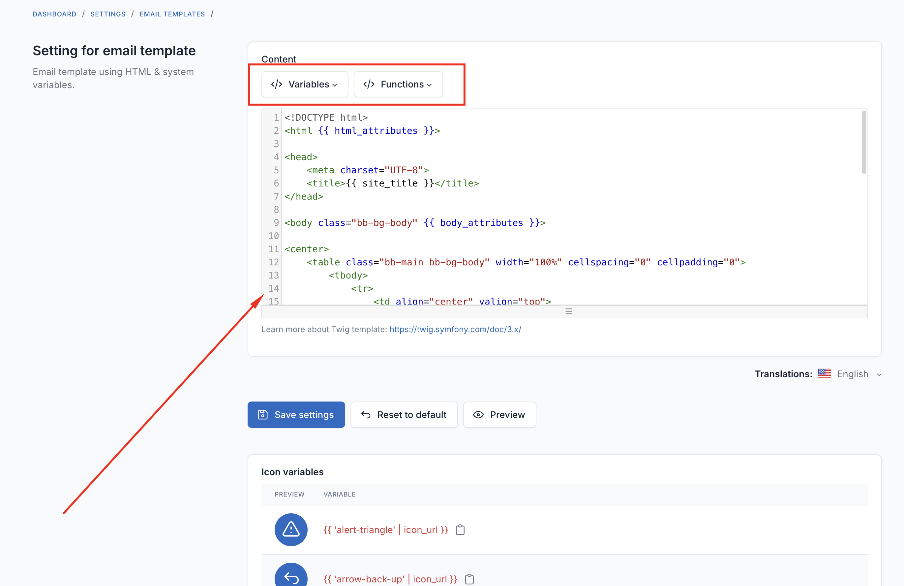

# Email

This guide will help you configure email sending for your website. Email is essential for features like contact forms, password resets, order notifications, and newsletters.

## Accessing Email Settings

1. Log in to your admin panel
2. Go to **Settings** → **Email**
3. Or visit directly: `your-domain.com/admin/settings/email`

## Choosing the Right Mailer

The system supports multiple email services. Here's a guide to help you choose:

| Mailer | Best For | Difficulty | Cost |
|--------|----------|------------|------|
| **SMTP** | Most users, shared hosting | Easy | Depends on provider |
| **Mailgun** | High volume, better deliverability | Medium | Free tier available |
| **SendGrid** | Transactional emails, analytics | Medium | Free tier available |
| **Amazon SES** | Large scale, AWS users | Advanced | Pay per use |
| **Postmark** | Fast delivery, developers | Medium | Paid |
| **Resend** | Modern alternative, developers | Medium | Free tier available |
| **Sendmail** | Server-based (advanced) | Advanced | Free |
| **Log** | Testing only | Easy | Free |

### Recommendation for Beginners

- **Shared Hosting**: Use your hosting provider's SMTP or Mailgun
- **VPS/Dedicated Server**: Mailgun or SendGrid for best deliverability
- **Gmail Users**: Use SMTP with Gmail (see configuration below)

## Setting Up SMTP

SMTP is the most common method and works with most email providers.

### General SMTP Settings

1. Select **SMTP** as the Mailer
2. Fill in the following fields:
   - **Host**: Your email provider's SMTP server address
   - **Port**: Usually 587 (TLS) or 465 (SSL)
   - **Username**: Your email address or account username
   - **Password**: Your email password or app password
   - **Encryption**: TLS (recommended) or SSL
3. Set the **Sender Name** and **Sender Email**
4. Click **Save Settings**
5. Use **Send Test Email** to verify

### Common SMTP Ports

| Port | Encryption | Notes |
|------|------------|-------|
| 587 | TLS/STARTTLS | Recommended for most providers |
| 465 | SSL | Legacy SSL, still widely used |
| 25 | None | Often blocked by hosting providers |
| 2525 | TLS | Alternative when 587 is blocked |

### Using Gmail

**Configuration:**
- **Mailer**: SMTP
- **Host**: `smtp.gmail.com`
- **Port**: `587`
- **Encryption**: TLS
- **Username**: `your-email@gmail.com`
- **Password**: Use an **App Password** (not your regular password)

**Important: Getting a Gmail App Password**

1. Go to [Google Account Security](https://myaccount.google.com/security)
2. Enable **2-Step Verification** if not already enabled
3. Go to **App Passwords** (search for it in your Google Account)
4. Select "Mail" and "Other (Custom name)"
5. Enter a name like "My Website"
6. Click **Generate** and copy the 16-character password
7. Use this password in your email settings

For more details: [Google App Passwords Help](https://support.google.com/mail/answer/185833)

### Using Outlook/Office 365

- **Host**: `smtp.office365.com`
- **Port**: `587`
- **Encryption**: TLS
- **Username**: Your full email address
- **Password**: Your account password or app password

### Using Yahoo Mail

- **Host**: `smtp.mail.yahoo.com`
- **Port**: `587` or `465`
- **Encryption**: TLS or SSL
- **Username**: Your Yahoo email address
- **Password**: App password (generate from Yahoo Account Security)

### Using Yandex

- **Host**: `smtp.yandex.com`
- **Port**: `465`
- **Encryption**: SSL
- **Username**: Your Yandex email address
- **Password**: App password

## Setting Up Mailgun

Mailgun is a professional email service with excellent deliverability. They offer a free tier for low-volume sending.

**Steps:**

1. Create a [Mailgun account](https://www.mailgun.com/)
2. Add and verify your domain in Mailgun
3. Get your API credentials from the Mailgun dashboard
4. In your email settings:
   - **Mailer**: Mailgun
   - **Domain**: Your verified Mailgun domain
   - **Secret**: Your API key (must start with `key-`)
   - **Endpoint**: `api.mailgun.net` (US) or `api.eu.mailgun.net` (EU)

**Note:** The secret key must have the prefix `key-`. Example: `key-xxxxx`

## Setting Up SendGrid

SendGrid is another popular email service with good analytics features.

**Configuration:**
- **Mailer**: SMTP
- **Host**: `smtp.sendgrid.net`
- **Port**: `587`
- **Encryption**: TLS
- **Username**: Must be exactly `apikey`
- **Password**: Your SendGrid API Key

**Getting your API Key:**
1. Log in to [SendGrid](https://sendgrid.com/)
2. Go to **Settings** → **API Keys**
3. Create a new API key with "Mail Send" permissions
4. Copy and save the key (it won't be shown again)

## Setting Up Amazon SES

Amazon Simple Email Service (SES) is ideal for high-volume sending at low cost.

1. Select **SES** as the Mailer
2. Enter your AWS credentials:
   - **Key**: Your AWS Access Key ID
   - **Secret**: Your AWS Secret Access Key
   - **Region**: Your SES region (e.g., `us-east-1`, `eu-west-1`)

**Prerequisites:**
- AWS account with SES enabled
- Verified domain or email addresses in SES
- SES moved out of sandbox mode for production use

## Setting Up Postmark

1. Select **Postmark** as the Mailer
2. Enter your **Postmark Server Token**
   - Find this in your Postmark server settings under "API Tokens"

## Setting Up Resend

Resend is a modern email API service with a clean interface.

1. Select **Resend** as the Mailer
2. Enter your **API Key**
   - Get it from the [Resend Dashboard](https://resend.com/api-keys)

## Sender Information

Regardless of which mailer you choose, always configure:

- **Sender Name**: The name that appears in recipients' inbox (e.g., "My Website")
- **Sender Email**: The email address that appears as the sender

**Tip:** Use an email address from your own domain for better deliverability.

## Testing Your Configuration

**Always test before saving!**

1. Configure all settings
2. Click **Save Settings**
3. Click **Send Test Email**
4. Enter your email address
5. Check your inbox (and spam folder)

If the test email arrives, your configuration is working correctly.

## Common Issues and Solutions

### SMTP Blocked by Hosting Provider

**Problem:** Many shared hosting providers block outgoing SMTP connections on ports 25, 465, and 587 to prevent spam.

::: warning Important
Make sure that your hosting provider doesn't block SMTP ports. If SMTP port is blocked, you need to send mail using an API service such as **Mailgun**, **SendGrid**, or **Amazon SES**. These services use HTTPS instead of SMTP, bypassing port restrictions.
:::

**Solutions:**
1. **Use your host's mail server**: Most hosting providers offer their own SMTP server. Contact support for details.
2. **Use port 2525**: Some providers allow this alternative port.
3. **Use an API-based service**: Switch to Mailgun, SendGrid, or Resend which use HTTPS instead of SMTP.
4. **Contact your hosting provider**: Request SMTP to be unblocked for your account.

### Emails Going to Spam

::: info Note
We cannot control whether emails go to the main inbox or spam/junk folder. This depends on many factors including your IP address, hosting provider, sender reputation, and recipient's email settings.
:::

**Why emails go to spam:**
- Poor sender reputation (IP address blacklisted)
- Missing or incorrect SPF, DKIM, DMARC records
- Using shared hosting with bad IP reputation
- Content triggers spam filters
- Recipient marked similar emails as spam

**Solutions:**
1. **Use a professional email service**: Switch to **Mailgun**, **SendGrid**, or **Amazon SES** for better deliverability and sender reputation.
2. **Set up SPF, DKIM, and DMARC records**: These DNS records verify your email authenticity.
3. **Verify sender domain**: Make sure your sender email matches your domain.
4. **Avoid spam trigger words**: Don't use excessive caps, exclamation marks, or spammy phrases.
5. **Warm up your sending IP**: Start with low volume and gradually increase.

For more tips on improving email deliverability, see: [Mailgun - How to Stop Emails Going to Spam](https://www.mailgun.com/blog/deliverability/avoid-emails-going-to-spam/)

### "Connection Timed Out" Error

**Causes:**
- Firewall blocking outgoing connections
- Wrong port or host
- ISP/hosting blocking SMTP

**Solutions:**
1. Verify the host and port are correct
2. Try different ports (587, 465, 2525)
3. Contact your hosting provider
4. Switch to an API-based mailer (Mailgun, SendGrid)

### "Authentication Failed" Error

**Causes:**
- Wrong username or password
- Account requires app password
- Less secure apps disabled (Gmail)

**Solutions:**
1. Double-check username and password
2. For Gmail: Use an App Password instead of regular password
3. For other providers: Check if 2FA requires an app password
4. Verify your email account is not locked or suspended

### Error Code 535 (WHM/cPanel SMTP Restriction)

**Problem:** You receive an error like "Expected response code 235 but got code 535" when trying to send emails from a cPanel/WHM hosted server.

**Cause:** WHM has SMTP Restrictions enabled that block outgoing SMTP authentication from your account.

**Solution:**

1. Log in to **WHM** (Web Host Manager) as root
2. Go to **Server Configuration** → **SMTP Restrictions**
3. Either:
   - **Disable SMTP Restrictions** entirely, or
   - **Add your account to the whitelist** to allow SMTP access
4. Save changes and try sending email again

**Note:** If you don't have WHM access, contact your hosting provider and ask them to:
- Disable SMTP restrictions for your account, or
- Whitelist your cPanel account for SMTP access

This is a common restriction on shared hosting to prevent spam abuse.

For more details, see: [Stack Overflow - Expected response code 235 but got code 535](https://stackoverflow.com/questions/61222340/authenticator-login-returned-expected-response-code-235-but-got-code-535-with)

### Emails Not Sending (No Error)

**Possible causes:**
1. **Queue not running**: If you see a warning about queue configuration, emails are queued but not processed.
2. **Wrong sender email**: Some providers reject emails from unverified sender addresses.

**Solutions:**
1. Set up a queue worker if using queues (ask your developer)
2. Verify your sender email address with your email provider
3. Check the Laravel log files for errors

### SSL Certificate Errors

**Solutions:**
1. Try switching between TLS and SSL encryption
2. If using port 465, use SSL; if using 587, use TLS
3. Try setting encryption to "None" temporarily to test (not recommended for production)

## Email Templates

You can customize the content and appearance of system emails.

### Editing Templates

1. Go to **Settings** → **Email**
2. Scroll down to see available email templates
3. Click on a template to edit it

### Using Variables

Templates support dynamic variables that are replaced with actual data when emails are sent.

Click the **Variables** dropdown to see available placeholders for each template. Common variables include:
- `{{ site_title }}` - Your website name
- `{{ site_url }}` - Your website URL
- `{{ date_time }}` - Current date and time

### Enabling/Disabling Templates

Each email template can be turned on or off individually. If you don't want certain notification emails to be sent, simply toggle them off.

## Best Practices

1. **Use a professional email service** for business websites (Mailgun, SendGrid, Amazon SES)
2. **Test thoroughly** before going live
3. **Monitor your sender reputation** through your email service dashboard
4. **Set up DNS records** (SPF, DKIM, DMARC) for better deliverability
5. **Don't use free email addresses** (gmail.com, yahoo.com) as your sender email for professional sites
6. **Keep your API keys secure** and never share them publicly

## Getting Help

If you're still having trouble:

1. Check the error messages carefully
2. Review your hosting provider's documentation
3. Contact your email service provider's support
4. Ask your web developer or system administrator
