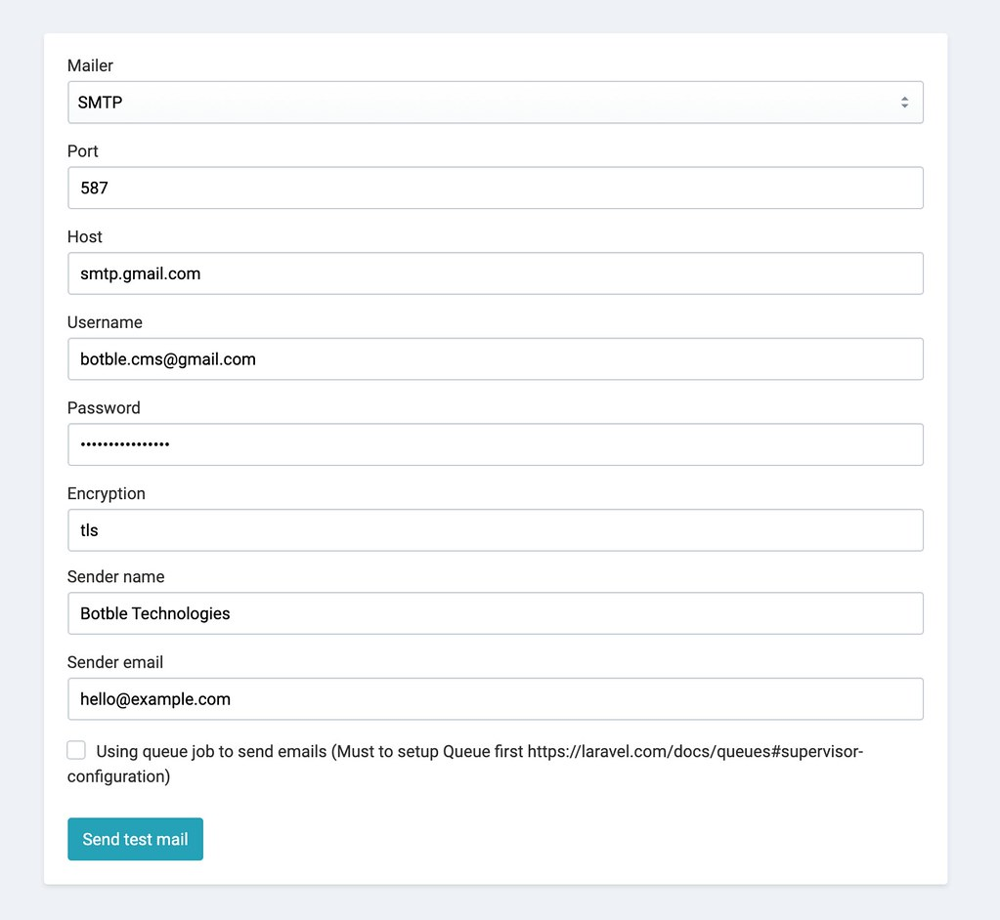

# Email

## Setup Email

In admin panel, go to `Settings` -> `Email` to configure your email settings.

Support Mailgun, SendGrid, SES, Gmail, Sendmail... and other SMTP mail services. We suggest use Mailgun to send mail.

Make sure that you have saved settings (button Save settings at the bottom of page) before sending a test email.

### Using Gmail

Example:

- Mail Driver: `SMTP`
- Mail Host: `smtp.gmail.com`
- Mail Port: 587
- Mail Encryption: `tls`
- Mail Username: `[your-gmail]`
- Mail Password: `[password-app]` (docs: https://support.google.com/mail/answer/185833?hl=en-GB)

### Using Mailgun

Example:

The secret key must have a prefix `key-`. Ex: `key-xxxxx`.

### Using SendGrid

Example:

- Mail Host: `smtp.sendgrid.net`
- Mail Port: 587
- Username must be `apikey`.

### Using Yandex

## Edit Email template

- Email template using HTML & and click dropdown **Variables* to insert available `variable`. You need to know HTML and Laravel blade.

