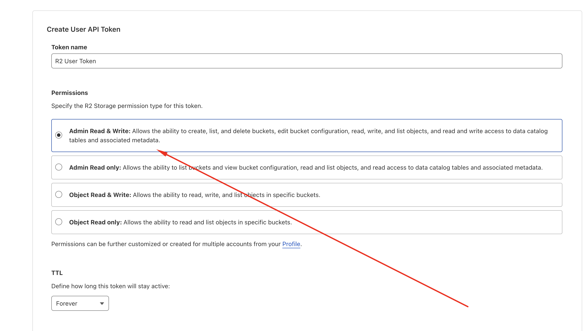

# Media - Setup Cloudflare R2

## Introduction

Cloudflare R2 is a storage solution that offers S3-compatible API with no egress fees, making it a cost-effective alternative to traditional cloud storage services. Botble CMS supports Cloudflare R2 as a media storage driver, allowing you to store your media files in Cloudflare's global network.

## Configuration

In the admin panel, go to `Settings` -> `Media` to configure Cloudflare R2 for storage.

1. Select `r2` as the driver
2. Enter your Cloudflare R2 credentials and settings


## Required Settings

| Setting | Description | Example                                          |
|---------|-------------|--------------------------------------------------|
| Access Key ID | Your Cloudflare R2 Access Key ID | `a56438098e18dc7444bxxxx`                        |
| Secret Key | Your Cloudflare R2 Secret Key | `3e63ead6a418e3b78eca46ddfe82595cd12583071bxxxxx` 
| Bucket | The name of your R2 bucket | `mybucket`                                       |
| URL | The public URL for your bucket | `https://pub-f70218cc331a40689xxx.r2.dev`        |
| Endpoint | The R2 API endpoint | `https://xxx.r2.cloudflarestorage.com`           |
| Use Path Style Endpoint | Whether to use path-style endpoint access | `Yes` (recommended for R2)                       |

## Getting Access Key ID and Secret Key

1. Log in to your Cloudflare dashboard
2. Navigate to `R2` from the sidebar
3. Go to `Manage API Tokens`


   
4. Create a new User API token with appropriate permissions


   


   

5. You will receive an Access Key ID and Secret Key


   

## Creating a Bucket

1. In your Cloudflare dashboard, go to `R2`
2. Click on `Create bucket`
3. Enter a name for your bucket
4. Choose your settings (public or private access)
5. Click `Create bucket`

## Setting Up Public Access

For media files to be publicly accessible:

1. Go to your bucket settings
2. Navigate to the `Public Access` tab
3. Enable public access for your bucket
4. You can create a custom domain or use the default R2 domain

## Troubleshooting

### SignatureDoesNotMatch Error

If you encounter a `SignatureDoesNotMatch` error like:

```
SignatureDoesNotMatch: The request signature we calculated does not match the signature you provided. Check your secret access key and signing method.
```

This usually indicates one of the following issues:

1. **Incorrect Secret Key**: Double-check your Secret Key for any typos or extra spaces
2. **Clock Synchronization**: Ensure your server's clock is synchronized correctly
3. **Path Style Endpoint**: Try toggling the "Use Path Style Endpoint" setting
4. **Region Setting**: For Cloudflare R2, the region should always be set to `auto` (this is handled automatically by the CMS)

### Access Denied Errors

If you receive `Access Denied` errors:

1. Verify that your API token has the correct permissions for the bucket
2. Check that the bucket name is correct and exists in your Cloudflare account
3. Ensure that the bucket policy allows the operations you're trying to perform

## Video Tutorial

Watch this video for a step-by-step guide on setting up Cloudflare R2 with Botble CMS:

<iframe width="100%" height="360" src="https://www.youtube.com/embed/2q5lXEkufwk" title="YouTube video player" frameborder="0" allow="accelerometer; autoplay; clipboard-write; encrypted-media; gyroscope; picture-in-picture" allowfullscreen></iframe>
