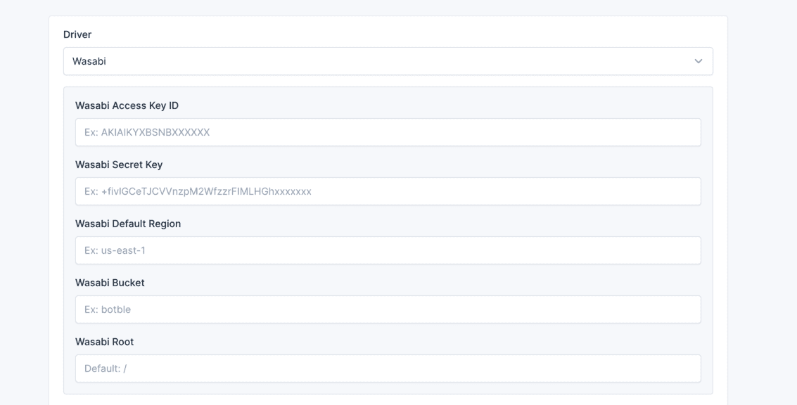
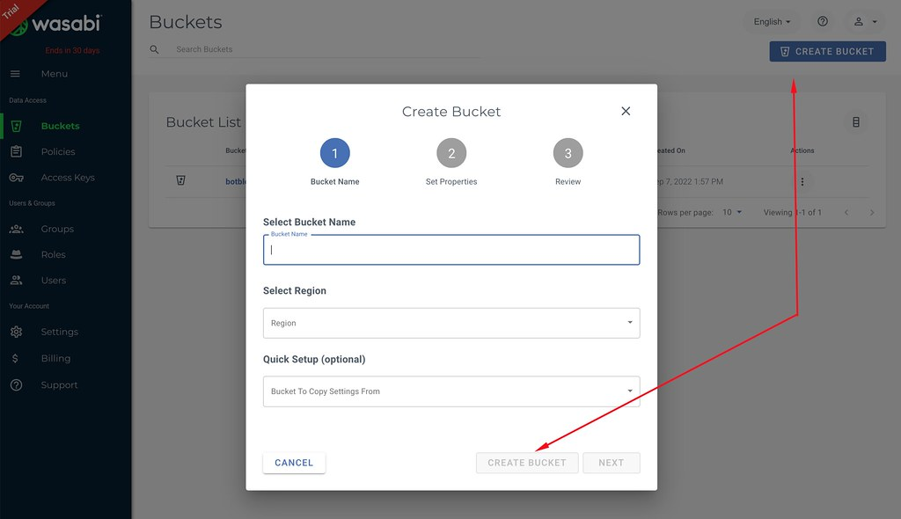
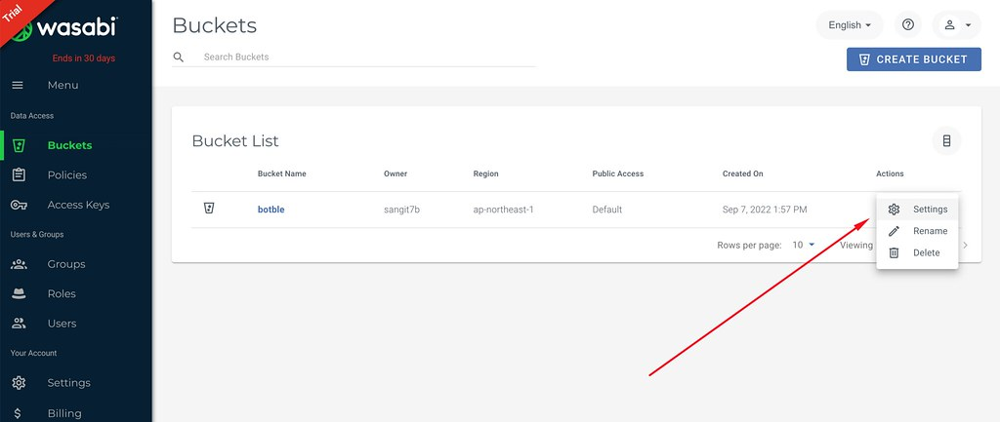
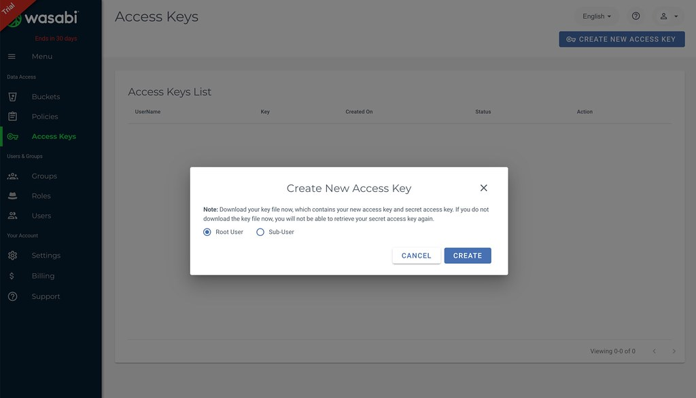

# Media - Setup Wasabi

## Instruction

In admin panel, go to `Settings` -> `Media` to configure Wasabi for storage.

### Steps

1. Create a new bucket in Wasabi:

   

2. Change your bucket to public:

   

3. Get your access keys from Wasabi:

   

   
