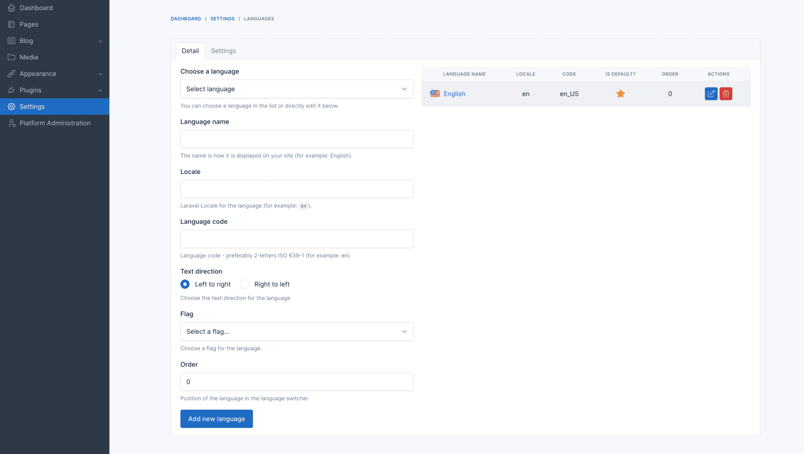
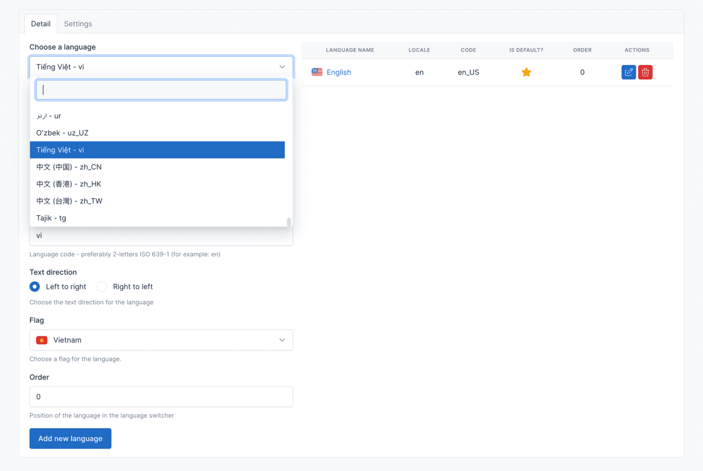
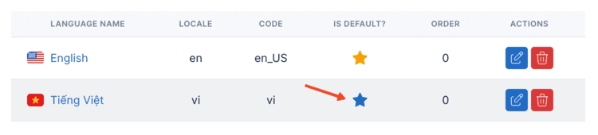
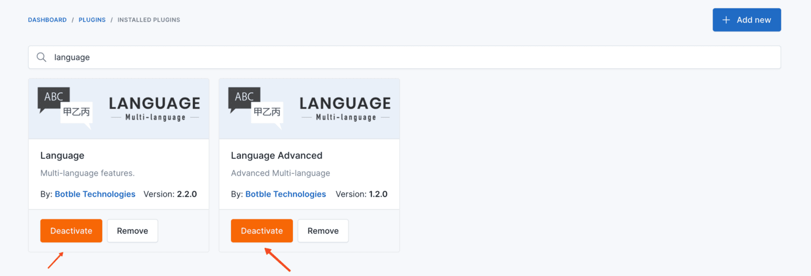

# Multi-language

## Setting Up Languages

Navigate to admin panel and click to `Settings` -> `Languages`.

## Changing the Default Language

### Adding a New Language

To change the default language, you first need to add the desired language. In this example, we will add **Tiếng Việt
** (Vietnamese) language.

### Setting the Default Language

Once the language is added, click on the **Is default?** button in the **Tiếng Việt** row to make it the default
language.

## Language Settings

Open **Settings → Languages** and switch to the **Settings** tab to control how the switcher behaves:

| Setting | Default | Purpose |
| --- | --- | --- |
| Hide default language in URL | On | The default language is served at `/about-us`; other languages get a prefix such as `/vi/about-us`. |
| Language display | All | Show flag + name, flag only, or name only in the switcher. |
| Switcher display | Dropdown | Render the switcher as a dropdown or as an inline list. |
| Hide languages | — | Hide a specific non-default language from the switcher without deleting it. |
| Auto-detect user language | Off | Redirect visitors to the language matching their browser's `Accept-Language` header. |

::: warning Auto-detection overrides your default language
If you set the site's default to a non-English language but visitors keep landing on English, **Auto-detect user
language** is the cause. It reads the browser's `Accept-Language` header, not the visitor's location, so it is
frequently wrong. Turn it off to always serve your configured default.
:::

## Translating Content

Each language has its own content record. Open a page, post, or other translatable model, switch the language tab in
the editor, and fill in that language's fields. Editing one language does not change another — if it appears to, you
are editing the same tab twice.

::: tip Slugs are not translated automatically
Switching language changes the locale prefix in the URL (`/vi/about-us`), but the slug itself is not translated. To get
a fully localized URL, edit the slug in each language tab.
:::

For static theme strings ("Read more", "Contact", "Search"), use **Settings → Theme Translations**. For admin panel
strings, use **Settings → Other Translations**. See [Localization](/cms/localization).

## Shared vs Translatable Fields

When multiple languages are configured, most settings are stored per language. However, visual/design properties (colors, logos, layout styles) typically don't change between languages.

Botble CMS supports marking fields as **shared** so they are configured once and apply to all languages. Only text content fields need per-language translation.

### Theme Options

Theme option fields and sections can be marked as shared using `->shared()`. See the [Theme Options documentation](/cms/theme-development/theme-options#shared-fields-multi-language) for details.

**Examples of shared fields:** primary color, logo image, layout style, social media URLs.

**Examples of translatable fields:** site title, copyright text, banner heading.

### Widgets

Widgets fall back to the default language's configuration when no locale-specific widgets are set. See the [Widget documentation](/cms/theme-development/theme-widget#multi-language-widget-fallback) for details.

## Reducing the Site Back to One Language

::: danger Do not deactivate the Language plugin to hide the language switcher
This looks like the obvious fix and it breaks your navigation.

When you add a language, the CMS **clones every menu** for that language and attaches each clone to the **same menu
location**. The Language plugin is what filters those clones down to the current locale at render time. Deactivate it
and the location resolves to *all* of them at once — your header renders the English, Arabic, Vietnamese, and French
menus stacked on top of each other.

If you have already done this, re-activate the plugin. The navigation returns to normal immediately.
:::

Follow this order instead:

1. **Settings → Languages** — delete the extra languages, keeping only the one you want.
2. **Appearance → Menus** — delete the leftover cloned menus. Deleting a language does *not* delete its cloned menus;
   they remain until you remove them. Clone slugs carry the language code as a suffix, for example `main-menu-ar`,
   `main-menu-vi`, `main-menu-fr`.
3. **Leave the Language plugin active.** Once a single language remains, the switcher disappears on its own.
4. Clear caches at **Platform Administration → Cache Management**.

## Disabling Multi-language Entirely

If the site was never translated and you want the plugins gone completely — for example on a fresh install where no
language beyond the default was ever added — go to **Plugins → Installed Plugins**, search for **language**, and
deactivate **Language** and **Language Advanced**.

Only do this when **no additional languages have ever been added**. If they have, follow the section above first, so no
cloned menus are left behind.

