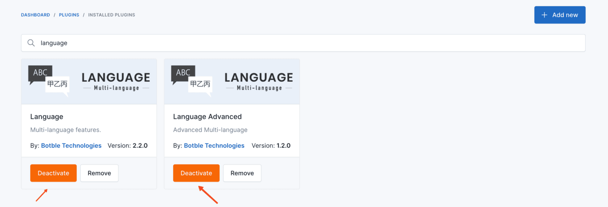

# Multi-language

## Setting Up Languages

Navigate to admin panel and click to `Settings` -> `Languages`.

## Changing the Default Language

### Adding a New Language

To change the default language, you first need to add the desired language. In this example, we will add **Tiếng Việt
** (Vietnamese) language.

### Setting the Default Language

Once the language is added, click on the **Is default?** button in the **Tiếng Việt** row to make it the default
language.

## Shared vs Translatable Fields

When multiple languages are configured, most settings are stored per language. However, visual/design properties (colors, logos, layout styles) typically don't change between languages.

Botble CMS supports marking fields as **shared** so they are configured once and apply to all languages. Only text content fields need per-language translation.

### Theme Options

Theme option fields and sections can be marked as shared using `->shared()`. See the [Theme Options documentation](/cms/theme-development/theme-options#shared-fields-multi-language) for details.

**Examples of shared fields:** primary color, logo image, layout style, social media URLs.

**Examples of translatable fields:** site title, copyright text, banner heading.

### Widgets

Widgets fall back to the default language's configuration when no locale-specific widgets are set. See the [Widget documentation](/cms/theme-development/theme-widget#multi-language-widget-fallback) for details.

## Disabling Multi-language

Navigate to `Plugins` -> `Installed Plugins` and type **language** in the search bar. Find the **Language**
and **Language Advanced** plugins and disable them to disable multi-language functionality.

