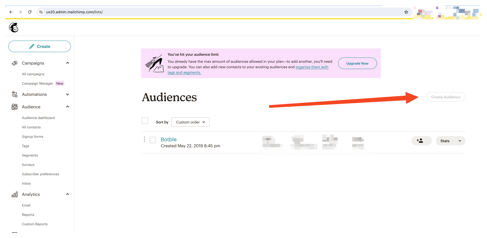
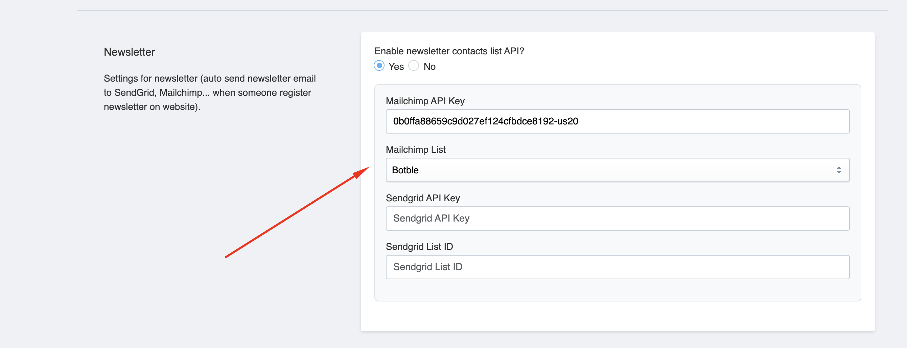

# Newsletter

## Connect Mailchimp

1.  Go to [Mailchimp](https://mailchimp.com/) and create an account.
2.  Create a new list in Mailchimp https://us20.admin.mailchimp.com/lists.

    

3.  Go to Account -> Extras -> API keys https://us20.admin.mailchimp.com/account/api/.

    

4.  Copy API key and paste to Admin -> Settings -> Newsletter -> Mailchimp API key.

    

5.  Copy List ID and paste to Admin -> Settings -> Newsletter -> Mailchimp List ID, then click Save. Or just click Save setting, and it will auto get List ID.

    