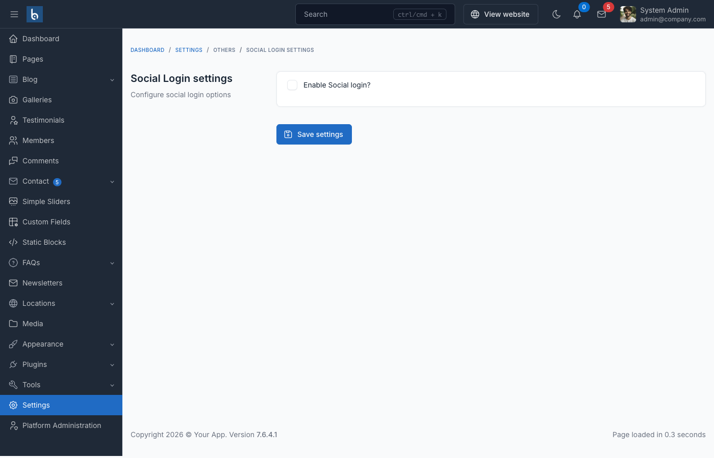

# Setup social login



## Facebook login

Enable Facebook login in Admin -> Settings -> Social login

- How to get Facebook App ID & Secret:
  <iframe width="560" height="315" src="https://www.youtube.com/embed/LTAlXYwU0Ak" title="YouTube video player" frameborder="0" allow="accelerometer; autoplay; clipboard-write; encrypted-media; gyroscope; picture-in-picture; web-share" allowfullscreen></iframe>

## Google login

Enable Google login in Admin -> Settings -> Social login, then add your Client ID & Secret from the [Google Cloud Console](https://console.cloud.google.com/).

In the Google Cloud Console, set the **Authorized redirect URI** to:

```
https://your-domain.com/auth/callback/google
```

The path order is `auth/callback/google` — not `auth/google/callback`.

## Troubleshooting

If social login fails with `InvalidStateException` or `Missing required parameter: code`, see [Social Login Fails](/cms/troubleshooting#social-login-fails-invalidstateexception-or-missing-required-parameter-code) in the troubleshooting guide. The most common cause on shared hosting is ModSecurity stripping the OAuth callback query string.
