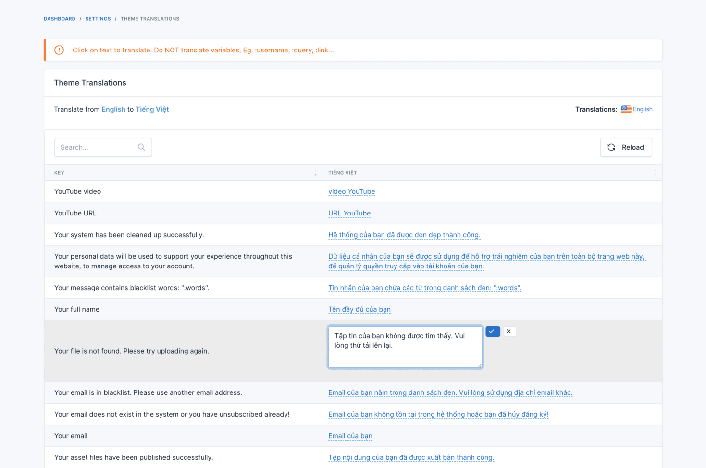
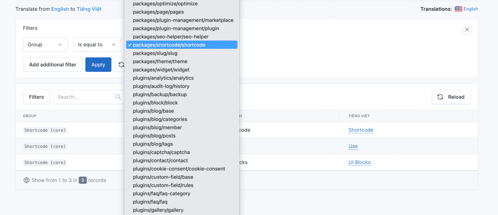

# Translation

## Adding a new Language

Prefer go to [Multi Language](./usage-multi-language.md#adding-a-new-language) to read more about how to add a new language.

## Translating the Theme

Go to `Admin` -> `Translation` -> `Theme translations`

Click to your language on the right side to translate it to your language.

## Translating Other Elements

Go to `Admin` -> `Translation` -> `Other translations`

You also can filter the translations by the group:

