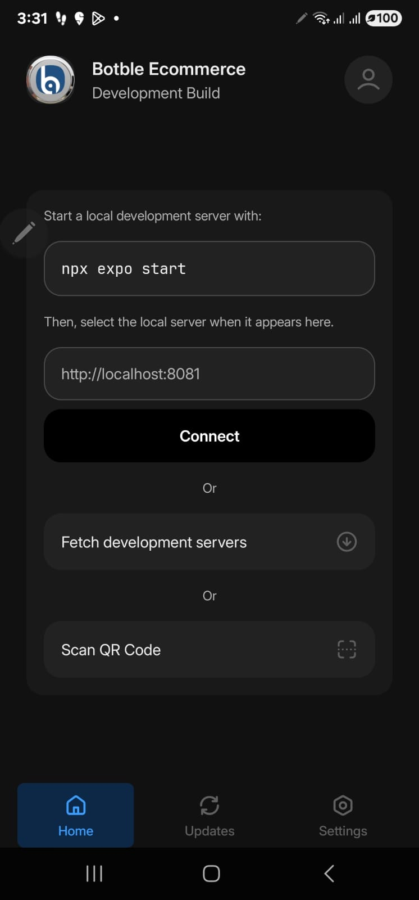

# Deploying Your App

## Overview

This guide covers deploying your app to the Apple App Store and Google Play Store using Expo Application Services (EAS).

::: tip Understanding Build Types
When you run `npx expo start`, you're running a **Development Build** that requires a local server connection. To test on your physical device without a computer, you need to build a **Production APK** (Android) or **IPA** (iOS). See the [Development Build vs Production Build](#development-build-vs-production-build) section below.
:::

## Development Build vs Production Build

### What is a "Development Build"?

When you see this screen on your device:



This means you installed a **development build**. Development builds:
- Require a local development server running (`npx expo start`)
- Need your computer and phone on the same network
- Are for developers to test code changes with hot reload
- Cannot work standalone - they always need the dev server

### What You Need: Production Build (APK/IPA)

To use the app without a development server (like a regular app), you need a **production build**:
- **Android**: APK file - can be installed directly on any Android device
- **iOS**: IPA file - requires TestFlight or App Store distribution

### Quick Comparison

| Feature | Development Build | Production Build (APK/IPA) |
|---------|-------------------|----------------------------|
| Needs dev server | Yes | No |
| Hot reload | Yes | No |
| Standalone use | No | Yes |
| For end users | No | Yes |
| Build location | Local machine | EAS cloud or local |

## Prerequisites

### Required Accounts

1. **Apple Developer Account** ($99/year) - *Optional for APK testing*
   - [developer.apple.com](https://developer.apple.com)
   - Required only for iOS App Store publishing

2. **Google Play Developer Account** ($25 one-time) - *Optional for APK testing*
   - [play.google.com/console](https://play.google.com/console)
   - Required only for Google Play Store publishing

3. **Expo Account** (free) - **Required for all builds**
   - [expo.dev](https://expo.dev)
   - Required to use EAS Build

## Setting Up EAS (Expo Application Services)

### Step 1: Create an Expo Account

1. Go to [expo.dev/signup](https://expo.dev/signup)
2. Choose one of these options:
   - **Sign up with Email**: Enter your email and create a password
   - **Sign up with GitHub**: Click "Continue with GitHub"
   - **Sign up with Google**: Click "Continue with Google"
3. Verify your email if required
4. Complete your profile

### Step 2: Install EAS CLI

Open your terminal and run:

```bash
npm install -g eas-cli
```

### Step 3: Login to EAS

```bash
eas login
```

You'll see a prompt like this:
```
Log in to EAS with email or username (exit and run eas login --help to see other login options)
? Email or username ›
```

**Enter your Expo account credentials:**
- Type your email or username and press Enter
- Type your password and press Enter

**Alternative login methods:**

```bash
# Login with SSO (Google/GitHub)
eas login --sso

# Check if you're already logged in
eas whoami
```

### Step 4: Verify Login

```bash
eas whoami
```

This should display your username if logged in successfully.

## Environment Variables (Critical)

::: danger Important - Read Before Building
Your `.env` file is gitignored and **will NOT be included in EAS builds**. You must configure environment variables using EAS Secrets before building. Skipping this step will result in a **black screen** when you open the app.
:::

### Why .env Doesn't Work with EAS

| Source | Local Dev | EAS Build |
|--------|-----------|-----------|
| `.env` file | Yes | No |
| EAS Secrets | No | Yes |
| `eas.json` env | No | Yes |

EAS Build runs in the cloud and only has access to:
- Your Git repository
- EAS Secrets

Since `.env` is gitignored (for security), EAS cannot read it.

### Step 1: Set Environment Variables with EAS Secrets

**Required variables:**
```bash
eas secret:create --name API_BASE_URL --value "https://your-website.com"
eas secret:create --name API_KEY --value "your-api-key"
```

**Optional but recommended:**
```bash
eas secret:create --name APP_NAME --value "Your App Name"
eas secret:create --name APP_ENV --value "production"
```

**Bulk import from .env (recommended for many variables):**
```bash
cat .env | xargs -L 1 eas secret:create
```

This creates one secret per variable automatically.

### Step 2: Verify Secrets

```bash
eas secret:list
```

You should see your variables listed.

### Managing Secrets

```bash
# List all secrets
eas secret:list

# Delete a secret
eas secret:delete API_BASE_URL

# Update a secret (delete and recreate)
eas secret:delete API_BASE_URL
eas secret:create --name API_BASE_URL --value "https://new-url.com"
```

### Environment Variables Reference

| Variable | Required | Description |
|----------|----------|-------------|
| `API_BASE_URL` | Yes | Your website URL (without /api/v1) |
| `API_KEY` | Yes | API key from backend API settings |
| `APP_NAME` | No | App display name |
| `APP_ENV` | No | production, staging, or development |
| `APP_VERSION` | No | App version (default: 1.0.0) |
| `PRIMARY_COLOR` | No | Brand color hex without # (default: 2d5481) |
| `DEFAULT_LANGUAGE` | No | Language code: en, ar, vi, es, fr |

### Alternative: Configure in eas.json

You can also set env variables directly in `eas.json`:

```json
{
  "build": {
    "production": {
      "env": {
        "API_BASE_URL": "https://your-website.com",
        "API_KEY": "your-api-key",
        "APP_NAME": "Your App Name",
        "APP_ENV": "production"
      }
    }
  }
}
```

::: tip EAS Secrets vs eas.json
- **EAS Secrets**: More secure, not committed to Git, managed via CLI
- **eas.json env**: Simpler, but committed to Git (visible in repository)

For API keys and sensitive data, use EAS Secrets.
:::

### Best Practices Summary

| Purpose | Method |
|---------|--------|
| Local development | `.env` file |
| Production builds | EAS Secrets |
| Non-secret values | `eas.json` env or `EXPO_PUBLIC_*` |

### Common Mistakes

| Mistake | Result |
|---------|--------|
| Not setting EAS Secrets before build | Black screen on app launch |
| Expecting EAS to read `.env` | App has no API configuration |
| Committing `.env` to Git | Security risk |

## Building APK for Android Testing

::: tip Quick Start for Android Testing
If you just want to test your app on an Android device without a development server, follow this section. No Google Play account needed!
:::

There are two ways to build an APK:
1. **Local Build** (Recommended) - Build directly on your machine using Gradle
2. **EAS Cloud Build** - Build on Expo's servers

## Option 1: Local APK Build (Recommended)

This method builds the APK locally on your machine without requiring an Expo account or EAS subscription.

### Prerequisites

- **Node.js** (v18 or higher)
- **Java JDK** (v17 recommended)
- **Android SDK** (via Android Studio or standalone)

::: tip Verify Java Installation
```bash
java -version
# Should show java 17.x.x or higher
```
:::

### Step 1: Install Dependencies

```bash
npm install --legacy-peer-deps
```

### Step 2: Configure Environment

Edit `.env` file with your configuration:

```
API_BASE_URL=https://your-website.com
API_KEY=your-api-key
APP_NAME=Your App Name
```

### Step 3: Generate Native Android Project

```bash
npx expo prebuild --platform android --clean
```

This creates the `android/` folder with native Android project files.

### Step 4: Generate Release Keystore

Create a keystore for signing the APK:

```bash
keytool -genkeypair \
    -v \
    -storetype PKCS12 \
    -keystore android/app/release.keystore \
    -alias release \
    -keyalg RSA \
    -keysize 2048 \
    -validity 10000 \
    -storepass your_password_here \
    -keypass your_password_here \
    -dname "CN=Your Name, OU=Mobile, O=Your Company, L=City, ST=State, C=US"
```

::: warning Keep Your Keystore Safe
Store your keystore file and passwords securely. You'll need the same keystore to update your app in the future. If you lose it, you won't be able to publish updates to the same app on the Play Store.
:::

### Step 5: Configure Signing

Add signing configuration to `android/gradle.properties`:

```properties
# Release signing configuration
MYAPP_UPLOAD_STORE_FILE=release.keystore
MYAPP_UPLOAD_KEY_ALIAS=release
MYAPP_UPLOAD_STORE_PASSWORD=your_password_here
MYAPP_UPLOAD_KEY_PASSWORD=your_password_here
```

Add signing config to `android/app/build.gradle`. Find the `android {` block and add:

```gradle
android {
    // ... existing config ...

    signingConfigs {
        release {
            if (project.hasProperty('MYAPP_UPLOAD_STORE_FILE')) {
                storeFile file(MYAPP_UPLOAD_STORE_FILE)
                storePassword MYAPP_UPLOAD_STORE_PASSWORD
                keyAlias MYAPP_UPLOAD_KEY_ALIAS
                keyPassword MYAPP_UPLOAD_KEY_PASSWORD
            }
        }
    }

    buildTypes {
        release {
            signingConfig signingConfigs.release
            // ... existing release config ...
        }
    }
}
```

### Step 6: Build the APK

```bash
cd android
./gradlew assembleRelease
```

The APK will be generated at:
```
android/app/build/outputs/apk/release/app-release.apk
```

### Step 7: Verify APK Signature (Optional)

```bash
# Using jarsigner
jarsigner -verify android/app/build/outputs/apk/release/app-release.apk

# Or using apksigner (if Android SDK build-tools is in PATH)
apksigner verify --print-certs android/app/build/outputs/apk/release/app-release.apk
```

### Step 8: Install on Device

Transfer the APK to your Android device and install it:
- Email it to yourself
- Upload to cloud storage (Google Drive, Dropbox)
- Use `adb install` if device is connected via USB:

```bash
adb install android/app/build/outputs/apk/release/app-release.apk
```

### Troubleshooting Local Build

**"SDK location not found" error:**

Create `android/local.properties` with your Android SDK path:
```properties
sdk.dir=/Users/YOUR_USERNAME/Library/Android/sdk
```

**"JAVA_HOME is not set" error:**

Set JAVA_HOME environment variable:
```bash
export JAVA_HOME=$(/usr/libexec/java_home -v 17)
```

**Build fails with memory error:**

Increase Gradle memory in `android/gradle.properties`:
```properties
org.gradle.jvmargs=-Xmx4096m -XX:MaxMetaspaceSize=1024m
```

---

## Option 2: EAS Cloud Build

Build on Expo's cloud servers without local Android SDK setup.

### Step 1: Configure EAS Build

Run this command in your project folder:

```bash
eas build:configure
```

This creates an `eas.json` file in your project and updates `app.json` with the project ID.

::: warning Verify projectId Location
After running `eas build:configure`, verify that the `projectId` is in the correct location in your `app.json`:

**Correct** - inside `expo.extra.eas`:
```json
{
  "expo": {
    "extra": {
      "eas": {
        "projectId": "your-project-id"
      }
    }
  }
}
```

**Incorrect** - directly under `expo.eas`:
```json
{
  "expo": {
    "eas": {
      "projectId": "your-project-id"
    }
  }
}
```

If the `projectId` is in the wrong location, you'll get `Cannot read properties of undefined (reading 'projectId')` error. See [Troubleshooting](troubleshooting.md#cannot-read-properties-of-undefined-reading-projectid) for details.
:::

### Step 2: Update eas.json for APK Build

Open `eas.json` and update it to include APK output:

```json
{
  "cli": {
    "version": ">= 5.0.0"
  },
  "build": {
    "development": {
      "developmentClient": true,
      "distribution": "internal"
    },
    "preview": {
      "distribution": "internal",
      "android": {
        "buildType": "apk"
      }
    },
    "production": {}
  },
  "submit": {
    "production": {}
  }
}
```

### Step 3: Build the APK

```bash
eas build --platform android --profile preview
```

**What happens:**
1. EAS uploads your project to cloud servers
2. Build runs on Expo's servers (no local Android SDK needed!)
3. You'll see a progress bar and build URL
4. When complete, download link appears

### Step 4: Download and Install APK

1. Wait for build to complete (usually 10-15 minutes for first build)
2. Download the APK from the link in terminal or from [expo.dev](https://expo.dev) → Your Project → Builds
3. Transfer APK to your Android device (email, cloud drive, USB)
4. On Android device:
   - Open the APK file
   - Allow installation from unknown sources if prompted
   - Install and open the app

::: warning First Time Build
The first build takes longer as EAS sets up credentials. Subsequent builds are faster.
:::

### Troubleshooting EAS Build

**"Not logged in" error:**
```bash
eas login
```

**"No project found" error:**
```bash
eas build:configure
```

**Build fails with credential error:**
```bash
eas credentials --platform android
```

## Initial Setup

### Step 1: Configure EAS

```bash
eas build:configure
```

This creates `eas.json` in your project:

```json
{
  "cli": {
    "version": ">= 5.0.0"
  },
  "build": {
    "development": {
      "developmentClient": true,
      "distribution": "internal"
    },
    "preview": {
      "distribution": "internal"
    },
    "production": {}
  },
  "submit": {
    "production": {}
  }
}
```

### Step 2: Update app.json

```json
{
  "expo": {
    "name": "Your Store Name",
    "slug": "your-store",
    "version": "1.0.0",
    "ios": {
      "bundleIdentifier": "com.yourcompany.yourstore",
      "buildNumber": "1"
    },
    "android": {
      "package": "com.yourcompany.yourstore",
      "versionCode": 1
    }
  }
}
```

## Building for iOS

### Build for App Store

```bash
eas build --platform ios --profile production
```

First time setup:
- EAS will ask to create Apple credentials
- Follow the prompts to authenticate

### Build for TestFlight (Preview)

```bash
eas build --platform ios --profile preview
```

### Submit to App Store

```bash
eas submit --platform ios
```

## Building for Android

### Build for Play Store

```bash
eas build --platform android --profile production
```

First time:
- Creates upload keystore (keep this safe!)
- Follow prompts for configuration

### Build APK (for testing)

Add to `eas.json`:

```json
{
  "build": {
    "preview": {
      "android": {
        "buildType": "apk"
      }
    }
  }
}
```

Then:
```bash
eas build --platform android --profile preview
```

### Submit to Play Store

```bash
eas submit --platform android
```

## Build Both Platforms

```bash
eas build --platform all --profile production
```

## Version Management

### Before Each Release

Update in `app.json`:

```json
{
  "expo": {
    "version": "1.1.0",
    "ios": {
      "buildNumber": "2"
    },
    "android": {
      "versionCode": 2
    }
  }
}
```

- **version**: User-visible version (1.0.0, 1.1.0, etc.)
- **buildNumber/versionCode**: Internal build number (increment each build)

## App Store Listings

### Required Assets

- **Screenshots**: Multiple sizes for different devices
- **App Icon**: 1024x1024 PNG
- **Description**: Short and long descriptions
- **Keywords**: Relevant search terms
- **Privacy Policy URL**: Required for both stores

### iOS App Store

1. Go to [App Store Connect](https://appstoreconnect.apple.com)
2. Create new app
3. Fill in app information
4. Upload build from EAS
5. Submit for review

### Google Play Store

1. Go to [Google Play Console](https://play.google.com/console)
2. Create new app
3. Complete store listing
4. Upload AAB from EAS
5. Submit for review

## Environment Variables for Builds

### Using EAS Secrets

```bash
eas secret:create --name API_BASE_URL --value "https://mystore.com"
eas secret:create --name API_KEY --value "your-api-key"
eas secret:create --name APP_NAME --value "Your Store Name"
```

### In eas.json

```json
{
  "build": {
    "production": {
      "env": {
        "API_BASE_URL": "https://mystore.com",
        "API_KEY": "your-api-key",
        "APP_NAME": "Your Store Name"
      }
    }
  }
}
```

## Over-the-Air Updates

Update JavaScript without app store review:

```bash
eas update --branch production --message "Bug fixes"
```

Configure in `app.json`:

```json
{
  "expo": {
    "updates": {
      "url": "https://u.expo.dev/your-project-id"
    },
    "runtimeVersion": {
      "policy": "sdkVersion"
    }
  }
}
```

## Troubleshooting

### Build Failed

1. Check build logs on expo.dev
2. Verify app.json configuration
3. Ensure valid credentials

### Submission Rejected

Common reasons:
- Missing privacy policy
- Incomplete metadata
- Guideline violations
- Bug reports from review

### Credentials Issues

```bash
# Clear credentials and reconfigure
eas credentials
```

## Deployment Checklist

### Before Submission

- [ ] Test on real devices
- [ ] Verify all features work
- [ ] Check performance
- [ ] Review app size
- [ ] Update version numbers
- [ ] Prepare store listings
- [ ] Create screenshots
- [ ] Write descriptions
- [ ] Set up privacy policy

### After Submission

- [ ] Monitor review status
- [ ] Respond to reviewer questions
- [ ] Plan next updates

## Need Help?

- Check [EAS Documentation](https://docs.expo.dev/eas/)
- Read the [Troubleshooting Guide](troubleshooting.md)
- Contact support for assistance
