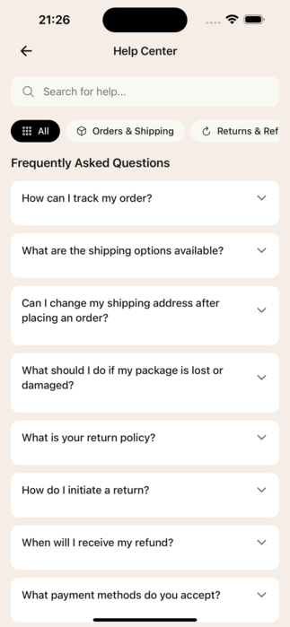

# Customizing Help Center

## Overview

The Help Center provides FAQ and customer service information. FAQ data is stored in a JSON file for easy editing.



## FAQ Data

### Location
`src/data/faq.json`

### Structure

```json
{
  "categories": [
    {
      "id": "orders",
      "name": "Orders & Shipping",
      "icon": "truck",
      "questions": [
        {
          "id": 1,
          "question": "How can I track my order?",
          "answer": "You can track your order by going to..."
        }
      ]
    }
  ]
}
```

### Editing FAQs

Open `src/data/faq.json` and modify:

1. **Add a category:**
```json
{
  "id": "warranty",
  "name": "Warranty & Support",
  "icon": "shield",
  "questions": []
}
```

2. **Add a question:**
```json
{
  "id": 17,
  "question": "Your question here?",
  "answer": "Your detailed answer here."
}
```

3. **Edit existing content:**
Simply change the `question` or `answer` text.

### Available Icons

Use icon names from Lucide React Native:
- `truck` - Orders & Shipping
- `refresh` - Returns & Refunds
- `credit-card` - Payments
- `user` - Account & Security
- `package` - Products & Stock
- `shield` - Warranty
- `help-circle` - General Help

## Customer Service Page

### Location
`app/help/customer-service.tsx`

### Contact Methods

Update the `contactMethods` array:

```typescript
const contactMethods: ContactMethod[] = [
  {
    icon: Phone,
    title: t("customerService.contact.phoneTitle"),
    description: t("customerService.contact.phoneDesc"),
    value: "+1 (800) 123-4567",        // Your phone number
    action: "tel:+18001234567",
  },
  {
    icon: Mail,
    title: t("customerService.contact.emailTitle"),
    description: t("customerService.contact.emailDesc"),
    value: "support@yourstore.com",     // Your email
    action: "mailto:support@yourstore.com",
  },
];
```

### Business Hours

```typescript
const businessHours = [
  { day: "Monday - Friday", time: "9:00 AM - 6:00 PM" },
  { day: "Saturday", time: "10:00 AM - 4:00 PM" },
  { day: "Sunday", time: "Closed" },
];
```

### Office Address

Find and update the address text in the component:

```tsx
<Text>
  123 Your Street, Suite 100{"\n"}
  Your City, State 12345, Country
</Text>
```

## Using App Config

For centralized contact info, update `.env`:

```env
APP_CONTACT_PHONE=+1 (800) 123-4567
APP_CONTACT_EMAIL=support@yourstore.com
```

Then access via `appConfig.contact.phone` and `appConfig.contact.email`.

## Quick Customization Checklist

- [ ] Edit FAQ categories and questions in `src/data/faq.json`
- [ ] Update phone number and email in customer-service.tsx
- [ ] Change business hours
- [ ] Update office address
- [ ] Update translations for all supported languages

## Tips

1. **Keep answers concise** - Clear, direct answers work best on mobile
2. **Organize by topic** - Group related questions in categories
3. **Test contact links** - Ensure phone/email links work correctly
4. **Use consistent icons** - Match icons to category topics
