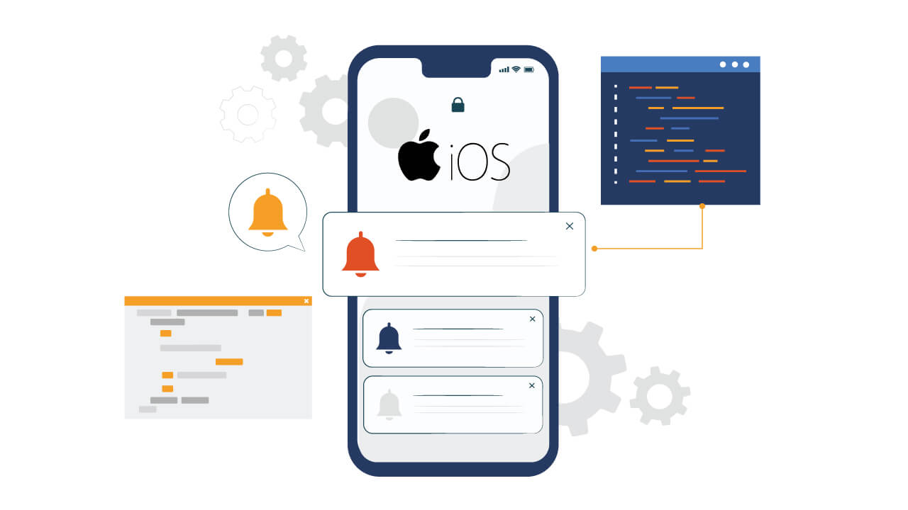

# Push Notifications Setup Guide

This guide will help you set up push notifications for your Botble Ecommerce Mobile App. Follow these steps to enable notifications for both Android and iOS.

## What You'll Need

Before starting, make sure you have:
- A Google account (for Firebase)
- Access to your app's source code
- For iOS: An Apple Developer account ($99/year)
- Your Botble website admin access

## Overview

Push notifications in this app work through Firebase Cloud Messaging (FCM):

1. **Mobile App** → Registers device token with your Botble backend
2. **Botble Backend** → Stores device tokens and sends notifications via FCM
3. **FCM** → Delivers notifications to devices

## Step 1: Create a Firebase Project

1. Go to [Firebase Console](https://console.firebase.google.com/)
2. Click **"Create a project"** or **"Add project"**
3. Enter your project name (e.g., "My Ecommerce App")
4. Follow the setup wizard (you can disable Google Analytics if not needed)
5. Click **"Create project"** and wait for it to complete
6. **Note your Project ID** - you'll need this later



## Step 2: Configure Android App

### 2.1 Register Android App in Firebase

1. In Firebase Console, click **"Add app"** → **"Android"**
2. Enter your Android package name
   - Find it in `app.json` under `android.package` (e.g., `com.yourcompany.app`)
3. (Optional) Add app nickname and SHA-1 certificate
4. Click **"Register app"**

### 2.2 Download Configuration File

1. Click **"Download google-services.json"**
2. Save this file to your computer

### 2.3 Add to Your Expo Project

Place the `google-services.json` file in your project root directory (same level as `app.json`).

Then update your `app.json` to reference it:

```json
{
  "expo": {
    "android": {
      "package": "com.yourcompany.app",
      "googleServicesFile": "./google-services.json"
    }
  }
}
```

For detailed instructions, visit: [Firebase Android Setup Guide](https://firebase.google.com/docs/android/setup)

## Step 3: Configure iOS App

### 3.1 Register iOS App in Firebase

1. In Firebase Console, click **"Add app"** → **"iOS"**
2. Enter your iOS bundle ID
   - Find it in `app.json` under `ios.bundleIdentifier` (e.g., `com.yourcompany.app`)
3. (Optional) Add app nickname
4. Click **"Register app"**

### 3.2 Download Configuration File

1. Click **"Download GoogleService-Info.plist"**
2. Save this file to your computer

### 3.3 Add to Your Expo Project

Place the `GoogleService-Info.plist` file in your project root directory (same level as `app.json`).

Then update your `app.json` to reference it:

```json
{
  "expo": {
    "ios": {
      "bundleIdentifier": "com.yourcompany.app",
      "googleServicesFile": "./GoogleService-Info.plist"
    }
  }
}
```

### 3.4 Enable Push Notifications Capability

When building for iOS, EAS Build will automatically add the Push Notifications capability. However, you need to ensure your Apple Developer account has push notifications enabled:

1. Go to [Apple Developer Portal](https://developer.apple.com/)
2. Navigate to **Certificates, Identifiers & Profiles**
3. Select your App ID
4. Enable **Push Notifications** capability

For detailed instructions, visit: [Firebase iOS Setup Guide](https://firebase.google.com/docs/ios/setup)

## Step 4: Configure APNs for iOS

For iOS devices to receive push notifications, you need to set up APNs (Apple Push Notification service):

### Option A: APNs Authentication Key (Recommended)

1. Go to [Apple Developer Portal](https://developer.apple.com/)
2. Navigate to **Keys** and create a new key
3. Enable **Apple Push Notifications service (APNs)**
4. Download the `.p8` key file
5. In Firebase Console:
   - Go to **Project Settings** → **Cloud Messaging** tab
   - Under **Apple app configuration**, click **Upload** for APNs Authentication Key
   - Upload your `.p8` file
   - Enter your Key ID and Team ID

### Option B: APNs Certificates

1. In Firebase Console:
   - Go to **Project Settings** → **Cloud Messaging** tab
   - Under **Apple app configuration**, click **Upload** for APNs Certificates
2. Follow Firebase's guide to create and upload certificates from Apple Developer Portal

## Step 5: Configure Botble Backend

Your Botble website needs to be configured to send push notifications.

### 5.1 Generate Service Account Key

1. In Firebase Console, go to **Project Settings** (gear icon)
2. Click **Service accounts** tab
3. Click **"Generate new private key"**
4. Download the JSON file (keep this secure!)

### 5.2 Configure Botble Admin Panel

1. Log in to your Botble admin panel
2. Go to **Settings** → **API Settings**
3. Scroll to **Push Notifications (FCM v1 API)** section
4. Enable **Push Notifications**
5. Enter your **Firebase Project ID**
6. Upload the **Service Account JSON file** you downloaded


### 5.3 Test Notification

1. In Botble admin, go to **Settings** → **API Settings**
2. Scroll to **Send Custom Notification** section
3. Enter a test title and message
4. Select target devices (All Devices, Android Only, iOS Only, or Customers Only)
5. Click **Send Notification**

## Step 6: Build and Test

### Build Your App

After adding the Firebase configuration files, rebuild your app:

```bash
# For development
npx expo prebuild --clean
npx expo run:android
npx expo run:ios

# For production build
eas build --platform all
```

### Test Notifications

1. Install the app on a real device (not simulator/emulator)
2. Open the app and log in (this registers the device token)
3. Send a test notification from Botble admin
4. You should receive the notification on your device

## Troubleshooting

### Notifications not appearing

- **Use a real device** - Simulators/emulators often don't support push notifications
- **Check Firebase configuration** - Ensure files are in the correct locations
- **Verify app.json** - Make sure `googleServicesFile` paths are correct
- **Check device token** - Verify tokens are being registered in Botble admin (Settings → API Settings → Active Device Tokens)

### iOS notifications not working

- Ensure Push Notifications capability is enabled in Apple Developer Portal
- Verify APNs key/certificate is uploaded to Firebase
- Check that the bundle ID matches in Firebase and your app

### Android notifications not working

- Verify `google-services.json` is in the project root
- Check that the package name matches in Firebase and your app
- Ensure you rebuilt the app after adding the config file

### Where to find package name/bundle ID

- **Android package**: Check `app.json` under `expo.android.package`
- **iOS bundle ID**: Check `app.json` under `expo.ios.bundleIdentifier`

### No device tokens in Botble admin

- Make sure the app is connecting to your Botble API correctly
- Check that users are logged in (device tokens are registered on login)
- Verify API is enabled in Botble settings

## Security Notes

- **Never commit** your `google-services.json` or `GoogleService-Info.plist` to public repositories
- **Keep your service account JSON file secure** - it has full access to send notifications
- Add Firebase config files to `.gitignore` if your repository is public:

```gitignore
# Firebase config files
google-services.json
GoogleService-Info.plist
```

## Need More Help?

If you're stuck:
1. Double-check you followed all steps above
2. Make sure file names are exactly `google-services.json` and `GoogleService-Info.plist`
3. Verify files are in the correct locations (project root)
4. Check [Troubleshooting Guide](troubleshooting.md) for more solutions
5. Contact support at [botble.ticksy.com](https://botble.ticksy.com)
