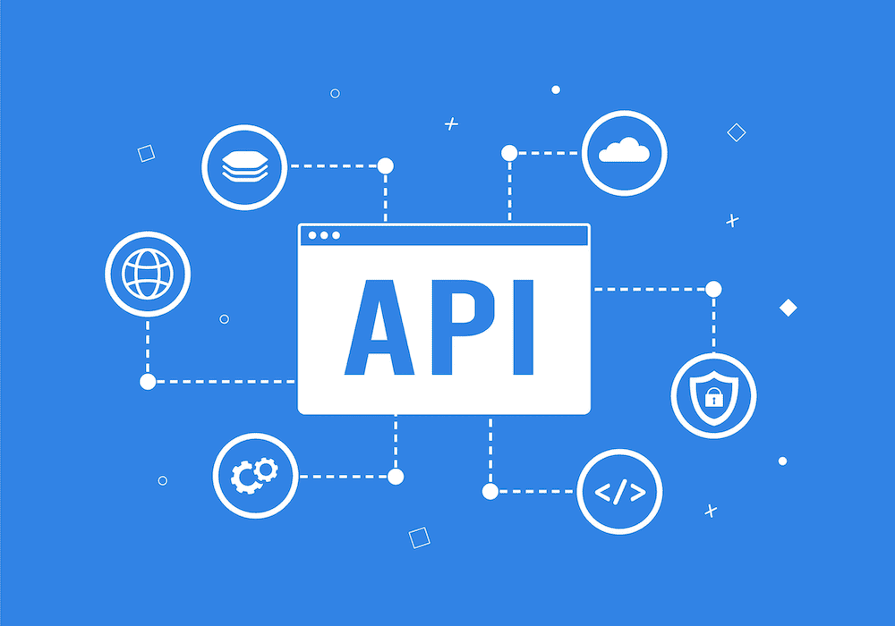

# API Integration Guide

This guide explains how the app communicates with the Botble E-commerce backend API.



## API Overview

The app uses the Botble E-commerce REST API for all data operations. The API documentation is available at [https://ecommerce-api.botble.com/docs](https://ecommerce-api.botble.com/docs).

## Configuration

### Base URL

Set your API base URL in the `.env` file:

```env
API_BASE_URL=https://your-website.com
API_KEY=your-api-key
```

**Note**: The app automatically appends `/api/v1` to `API_BASE_URL` for API calls.

### API Client

The app uses a centralized API client located at `src/services/apiClient.ts`. Configuration is loaded from `src/config/app.ts` which reads environment variables through `app.config.ts`:

```typescript
import { appConfig } from '@/config/app';
const API_URL = appConfig.api.baseUrl;

export const apiClient = {
  get: async (endpoint: string, token?: string) => {
    const response = await fetch(`${API_URL}${endpoint}`, {
      headers: {
        'Accept': 'application/json',
        'Content-Type': 'application/json',
        ...(token && { 'Authorization': `Bearer ${token}` }),
      },
    });
    return response.json();
  },

  post: async (endpoint: string, data: any, token?: string) => {
    const response = await fetch(`${API_URL}${endpoint}`, {
      method: 'POST',
      headers: {
        'Accept': 'application/json',
        'Content-Type': 'application/json',
        ...(token && { 'Authorization': `Bearer ${token}` }),
      },
      body: JSON.stringify(data),
    });
    return response.json();
  },
};
```

## Authentication

### Login

```
POST /api/v1/ecommerce/login
```

Request:
```json
{
  "email": "user@example.com",
  "password": "password123"
}
```

Response:
```json
{
  "error": false,
  "data": {
    "token": "eyJhbGciOiJIUzI1NiIsInR5cCI6IkpXVCJ9...",
    "user": {
      "id": 1,
      "name": "John Doe",
      "email": "user@example.com"
    }
  }
}
```

### Register

```
POST /api/v1/ecommerce/register
```

Request:
```json
{
  "name": "John Doe",
  "email": "user@example.com",
  "password": "password123",
  "password_confirmation": "password123"
}
```

### Token Storage

Tokens are stored securely using Expo Secure Store:

```typescript
import * as SecureStore from 'expo-secure-store';

// Store token
await SecureStore.setItemAsync('auth_token', token);

// Retrieve token
const token = await SecureStore.getItemAsync('auth_token');

// Remove token
await SecureStore.deleteItemAsync('auth_token');
```

## Products

### Get Products

```
GET /api/v1/ecommerce/products
```

Query Parameters:
- `page` - Page number
- `per_page` - Items per page
- `categories[]` - Filter by category IDs
- `brands[]` - Filter by brand IDs
- `min_price` - Minimum price
- `max_price` - Maximum price
- `sort_by` - Sort field (name, price, created_at)
- `order_by` - Sort order (asc, desc)

### Get Product Detail

```
GET /api/v1/ecommerce/products/{slug}
```

### Get Categories

```
GET /api/v1/ecommerce/categories
```

### Get Brands

```
GET /api/v1/ecommerce/brands
```

### Search Products

```
GET /api/v1/ecommerce/products?keyword={query}
```

## Cart

### Get Cart

```
GET /api/v1/ecommerce/cart
```

### Add to Cart

```
POST /api/v1/ecommerce/cart/add
```

Request:
```json
{
  "product_id": 123,
  "quantity": 1,
  "options": {
    "attribute_color": "Red",
    "attribute_size": "M"
  }
}
```

### Update Cart Item

```
PUT /api/v1/ecommerce/cart/update
```

### Remove from Cart

```
DELETE /api/v1/ecommerce/cart/remove/{rowId}
```

### Apply Coupon

```
POST /api/v1/ecommerce/coupon/apply
```

Request:
```json
{
  "coupon_code": "DISCOUNT10"
}
```

### Remove Coupon

```
POST /api/v1/ecommerce/coupon/remove
```

## Wishlist

### Get Wishlist

```
GET /api/v1/ecommerce/wishlist
```

### Add to Wishlist

```
POST /api/v1/ecommerce/wishlist
```

Request:
```json
{
  "product_id": 123
}
```

### Remove from Wishlist

```
DELETE /api/v1/ecommerce/wishlist/{product_id}
```

## Orders

### Get Orders

```
GET /api/v1/ecommerce/orders
```

### Get Order Detail

```
GET /api/v1/ecommerce/orders/{id}
```

### Cancel Order

```
POST /api/v1/ecommerce/orders/{id}/cancel
```

## Addresses

### Get Addresses

```
GET /api/addresses
```

### Create Address

```
POST /api/addresses
```

Request:
```json
{
  "name": "John Doe",
  "phone": "+1234567890",
  "email": "john@example.com",
  "country": "United States",
  "state": "California",
  "city": "Los Angeles",
  "address": "123 Main St",
  "zip_code": "90001",
  "is_default": true
}
```

### Update Address

```
PUT /api/addresses/{id}
```

### Delete Address

```
DELETE /api/addresses/{id}
```

### Get Countries

```
GET /api/countries
```

## Checkout

### WebView Checkout

The app uses a WebView-based checkout for payment processing:

```
GET /checkout/cart/{cartId}?token={authToken}
```

This opens the website's checkout page with the user's cart and authentication.

## Error Handling

### Standard Error Response

```json
{
  "error": true,
  "message": "Error description",
  "errors": {
    "field_name": ["Validation error message"]
  }
}
```

### Error Codes

| Code | Meaning |
|------|---------|
| 400 | Bad Request - Invalid data |
| 401 | Unauthorized - Invalid/expired token |
| 403 | Forbidden - Access denied |
| 404 | Not Found - Resource doesn't exist |
| 422 | Validation Error |
| 500 | Server Error |

### Handling Errors in Code

```typescript
try {
  const data = await fetchProducts();
} catch (error) {
  if (error.status === 401) {
    // Token expired, redirect to login
    logout();
  } else if (error.status === 422) {
    // Show validation errors
    showValidationErrors(error.errors);
  } else {
    // Show generic error
    showToast('Something went wrong');
  }
}
```

## React Query Integration

### Query Example

```typescript
import { useQuery } from '@tanstack/react-query';
import { fetchProducts } from '@/services/api';

function ProductList() {
  const { data, isLoading, error, refetch } = useQuery({
    queryKey: ['products'],
    queryFn: fetchProducts,
    staleTime: 5 * 60 * 1000, // 5 minutes
  });

  if (isLoading) return <LoadingSpinner />;
  if (error) return <ErrorMessage onRetry={refetch} />;

  return <ProductGrid products={data} />;
}
```

### Mutation Example

```typescript
import { useMutation, useQueryClient } from '@tanstack/react-query';
import { addToCart } from '@/services/api';

function AddToCartButton({ productId }) {
  const queryClient = useQueryClient();

  const mutation = useMutation({
    mutationFn: addToCart,
    onSuccess: () => {
      queryClient.invalidateQueries({ queryKey: ['cart'] });
      showToast('Added to cart!');
    },
    onError: (error) => {
      showToast(error.message);
    },
  });

  return (
    <Button
      onPress={() => mutation.mutate({ productId, quantity: 1 })}
      loading={mutation.isPending}
    >
      Add to Cart
    </Button>
  );
}
```

## Testing API Connections

### Check API Health

```bash
curl https://your-website.com/api/v1/ecommerce/products
```

### Test Authentication

```bash
curl -X POST https://your-website.com/api/v1/ecommerce/login \
  -H "Content-Type: application/json" \
  -d '{"email":"test@example.com","password":"password"}'
```

## Need Help?

- Check [API Documentation](https://ecommerce-api.botble.com/docs)
- Read the [Troubleshooting Guide](troubleshooting.md)
- Contact support for assistance
