# Botble Ecommerce React Native Expo App

## Introduction

Botble Ecommerce Mobile App is a feature-rich React Native application built with Expo, designed to work seamlessly with Botble E-commerce backend. This app provides a complete mobile shopping experience with a modern UI and seamless integration with Botble's API. It serves as the mobile client for the [Botble Laravel Ecommerce System](https://codecanyon.net/user/botble/portfolio).

The app offers a comprehensive mobile shopping experience with intuitive navigation, secure authentication, advanced product browsing, smart shopping cart management, and complete order tracking capabilities.

## Getting Started

**New to the app? Start here:**

1. **[App Overview](overview.md)** - What is this app and how it works (5 min read)
2. **[Installation](installation.md)** - Set up your development environment (30 min)
3. **[Configuration](configuration.md)** - Connect your app to your website (15 min)
4. **[Development Guide](development.md)** - Learn to customize your app

## Quick Setup Guides (5-15 minutes each)

**Customize your app appearance:**
1. **[Theme Colors](01_theme_colors.md)** - Change your app's colors
2. **[App Font](02_app_font.md)** - Choose different fonts
3. **[App Name](03_app_name.md)** - Change the app name
4. **[App Logo](04_app_logo.md)** - Add your logo and icons

**Basic configuration:**
5. **[API Base URL](05_api_base_url.md)** - Connect to your website
6. **[Translations](06_translations.md)** - Set up multiple languages
7. **[Running App](07_running_app.md)** - Test your app
8. **[Deploying App](08_deploying_app.md)** - Publish to app stores
9. **[Version Management](09_version_management.md)** - Manage app versions

## App Screenshots

  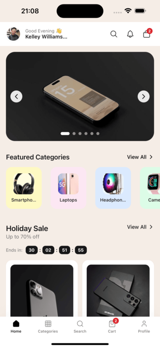
  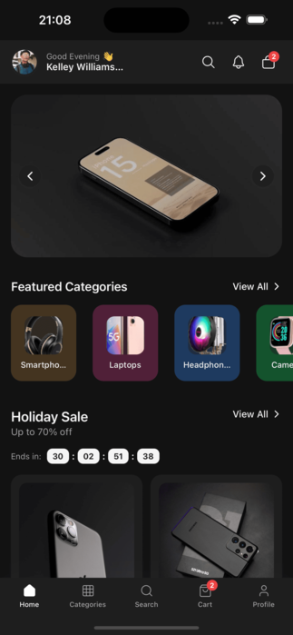

## Key Features

### 1. **User Authentication & Profile Management**
   - Secure user registration and login system
   - Password recovery with email verification
   - Comprehensive user profile management
   - Personal information editing
   - Address book management
   - Account settings and preferences

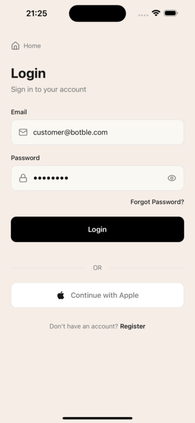

### 2. **Advanced Product Browsing**
   - Browse products by categories and brands
   - Featured products and flash sales sections
   - Advanced search functionality with filters
   - Product variations (color, size, attributes)
   - Detailed product information and images
   - Product reviews and ratings system
   - Recently viewed products tracking
   - Product comparison feature for side-by-side analysis

  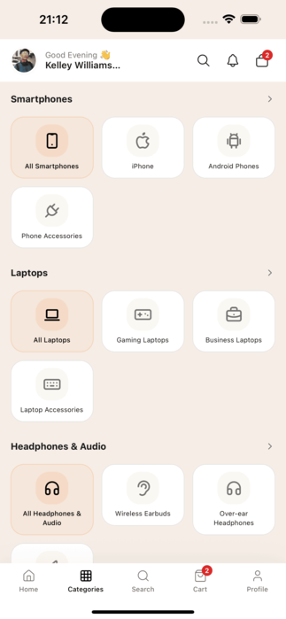
  
  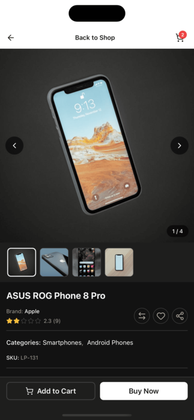
  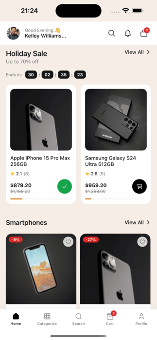

### 3. **Smart Shopping Cart & Checkout**
   - Add products to cart with quantity management
   - Apply coupon codes and discounts
   - WebView-based secure checkout
   - Multiple payment gateway integration
   - Order confirmation and tracking

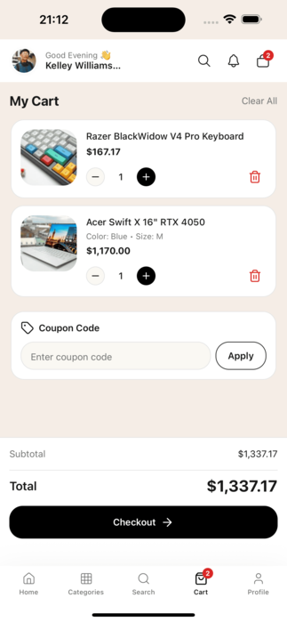

### 4. **Wishlist & Product Comparison**
   - Save favorite products for later
   - Easy wishlist management with server sync
   - Quick add to cart from wishlist
   - Compare products side-by-side
   - Detailed comparison tables with specifications

  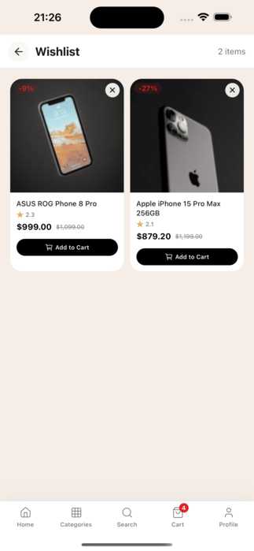
  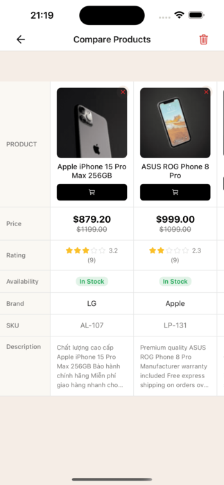

### 5. **Order Management & Tracking**
   - Complete order history
   - Real-time order status tracking
   - Order details and invoice access
   - Order cancellation and returns
   - Delivery status monitoring

  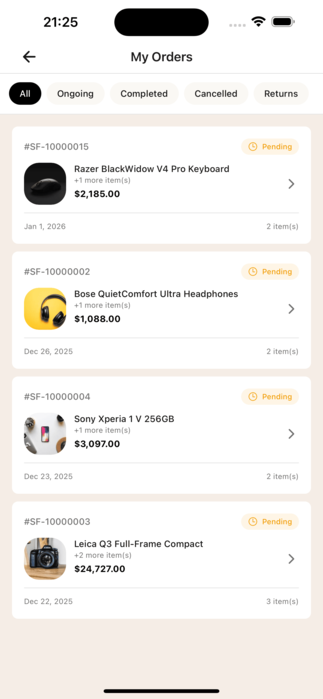
  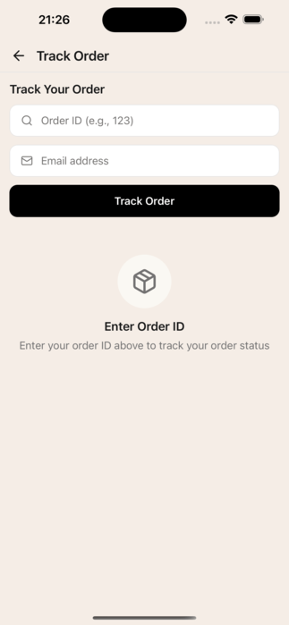

### 6. **Multi-language Support**
   - Support for multiple languages (English, Spanish, French, Arabic)
   - RTL (Right-to-Left) support for Arabic
   - Localized content and interface
   - Easy language switching

  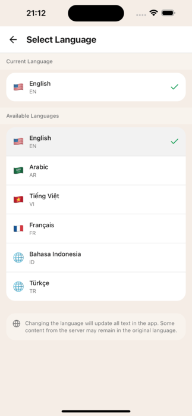
  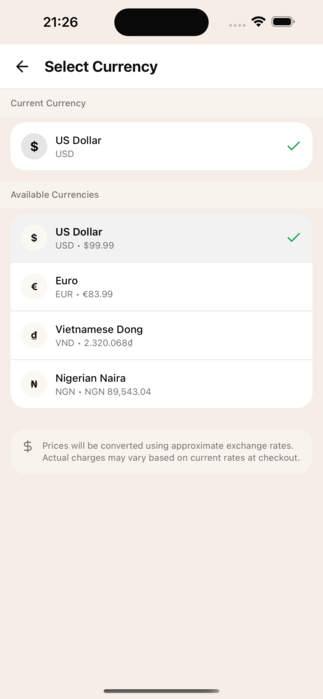

### 7. **Modern UI/UX Design**
   - Clean and intuitive interface
   - Responsive design for all screen sizes
   - Dark mode support
   - Smooth animations and transitions
   - Native platform conventions

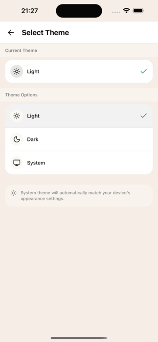

### 8. **API Integration**
   - Seamless integration with Botble E-commerce API
   - Real-time data synchronization
   - Secure authentication tokens
   - React Query for efficient caching
   - Error handling and offline support

### More Features

  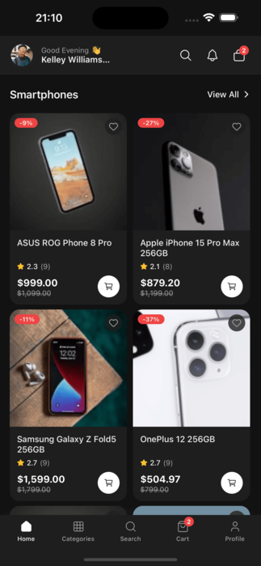
  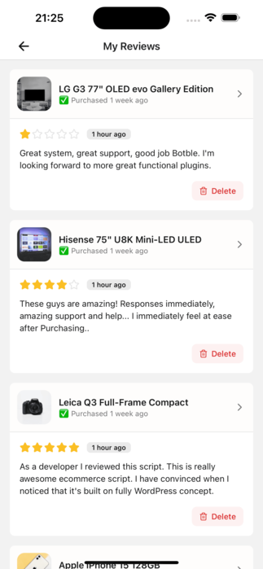
  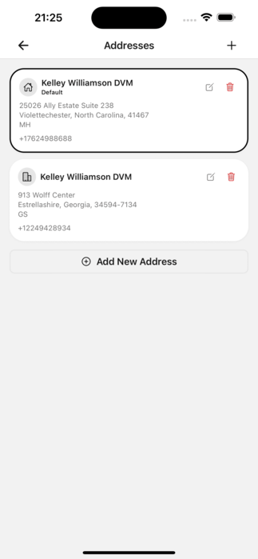
  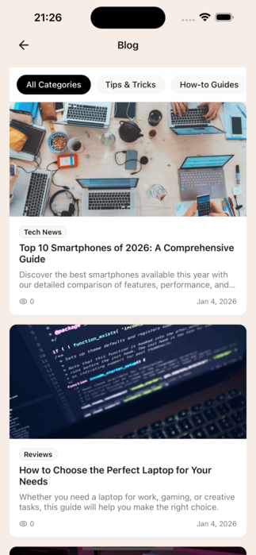

## Technical Specifications

### Requirements
- Node.js 18 or higher
- Expo CLI
- Botble E-commerce backend with API access
- VS Code or any code editor

### Architecture
- **Framework**: React Native with Expo SDK 54
- **Language**: TypeScript (strict mode)
- **State Management**: React Query + Context API
- **Navigation**: Expo Router v6 (file-based routing)
- **Styling**: NativeWind (Tailwind CSS for React Native)
- **Localization**: react-i18next with JSON translation files

### Supported Platforms
- iOS 14.0+
- Android 8.0+ (API level 26)
- Web (Expo web)

## Integration with Botble E-commerce

This React Native app is designed to work with the Botble E-commerce System, which provides:

- **Comprehensive Backend**: Full-featured e-commerce backend with admin panel
- **API Endpoints**: RESTful API for mobile integration
- **Multi-vendor Support**: Marketplace functionality
- **Payment Gateways**: Multiple payment method integrations
- **Product Management**: Advanced product catalog management
- **Order Processing**: Complete order management system
- **Customer Management**: User account and profile management

## API Documentation

The app integrates with the Botble E-commerce API, documented at [https://ecommerce-api.botble.com/docs](https://ecommerce-api.botble.com/docs). The API provides endpoints for:

- Authentication and user management
- Product catalog and search
- Shopping cart operations
- Order processing and tracking
- Payment gateway integration
- Wishlist management
- Address and profile management

## Help & Support

**Get help when you need it:**
- **[Support & Contact](support.md)** - All contact information and support options
- **[FAQ](faq.md)** - Common questions and quick answers
- **[Troubleshooting](troubleshooting.md)** - Fix common problems
- **[Upgrade Guide](upgrade.md)** - Update to newer versions safely

## Advanced Documentation

**For developers and technical users:**
- **[API Integration](api-integration.md)** - Detailed API integration guide
- **[Development Guide](development.md)** - Customize and extend the app
- **[Release Notes](releases.md)** - Version history and updates

## Contact & Resources

### **Contact Information:**
- **Email**: contact@botble.com
- **Website**: https://botble.com
- **Support Center**: https://botble.ticksy.com
- **Online Documentation**: https://docs.botble.com/ecommerce-mobile-app

### **Resources:**
- **Backend Demo**: https://martfury.botble.com
- **API Documentation**: https://ecommerce-api.botble.com/docs
- **Backend System**: [Botble Laravel E-commerce](https://codecanyon.net/user/botble/portfolio)

## Botble Team

Developed by the Botble team. Visit us at [botble.com](https://botble.com).
