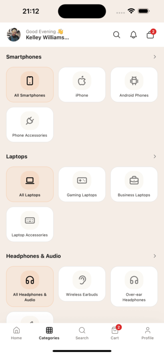

# Botble Ecommerce Mobile App (React Native + Expo)

A React Native (Expo) mobile e-commerce app that connects to a [Botble e-commerce backend](https://codecanyon.net/user/botble/portfolio). One codebase builds Android and iOS.

  
  

## Get started

1. [Overview](overview.md)
2. [Installation](installation.md)
3. [Configuration](configuration.md)
4. [Complete Setup & Publishing Guide](complete-setup-and-publishing-guide.md)

## Customize the app

| Topic | Guide |
|---|---|
| Colors | [01_theme_colors.md](01_theme_colors.md) |
| Font | [02_app_font.md](02_app_font.md) |
| App name | [03_app_name.md](03_app_name.md) |
| Logo and icons | [04_app_logo.md](04_app_logo.md) |
| API URL & key | [05_api_base_url.md](05_api_base_url.md) |
| Translations | [06_translations.md](06_translations.md) |
| Help center | [10_help_center.md](10_help_center.md) |
| Onboarding screens | [12_onboarding.md](12_onboarding.md) |
| License activation | [13_license_activation.md](13_license_activation.md) |

## Build & deploy

- [Running the app](07_running_app.md)
- [Deploying to stores](08_deploying_app.md)
- [Version management](09_version_management.md)

## Social login

- [Setup guide](11_social_login_setup.md) (Google, Apple, Facebook)

## Push notifications

- [Firebase Cloud Messaging setup](14_push_notifications.md)

## Feature highlights

- Product browse, search, categories, brands, flash sales, recently viewed
- Authentication (email/password, social)
- Cart, coupons, wishlist (server-synced), product comparison
- WebView checkout (compatible with all backend payment gateways)
- Order history, tracking, cancellation, returns
- 15+ built-in languages, RTL support
- Light / dark / system theme

  
  
  
  

## Tech stack

- React Native + Expo SDK 54
- TypeScript (strict)
- Expo Router v6 (file-based routing)
- React Query + Context API
- NativeWind (Tailwind for React Native)
- react-i18next

## Reference

- [API Integration](api-integration.md)
- [Development Guide](development.md)
- [Upgrade Guide](upgrade.md)
- [Troubleshooting](troubleshooting.md)
- [FAQ](faq.md)
- [Support](support.md)
- [Release notes](releases.md)

## Resources

- Documentation: https://docs.botble.com/ecommerce-mobile-app
- Backend demo: https://ecommerce-mobile-app.botble.com
- API reference: https://ecommerce-api.botble.com/docs
- Support tickets: https://botble.ticksy.com
- Email: contact@botble.com
