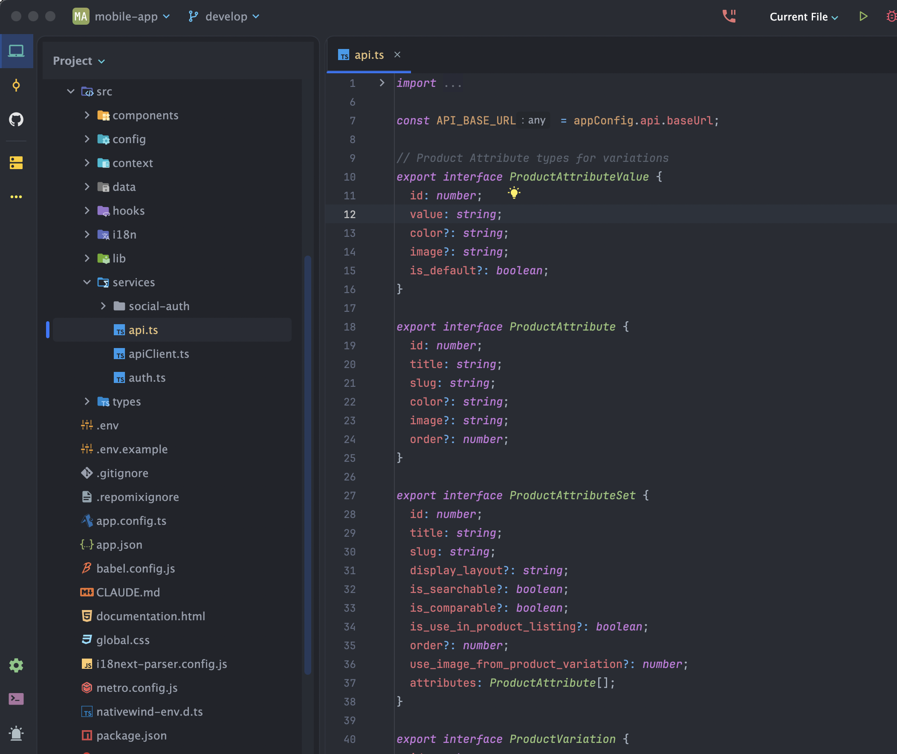

# Installation Guide

Simple steps to get your Botble Ecommerce Mobile App running on your computer.

## Quick Start

### What You Need
- A computer (Windows, Mac, or Linux)
- Node.js 18 or higher
- Internet connection
- About 30 minutes of your time

### Step 1: Install Node.js

1. Go to [nodejs.org](https://nodejs.org)
2. Download the LTS version (18 or higher)
3. Run the installer
4. Verify installation:
   ```bash
   node --version
   npm --version
   ```

### Step 2: Install Expo CLI

```bash
npm install -g expo-cli
```

### Step 3: Get the App Code

1. Download your app files from CodeCanyon
2. Extract them to a folder on your computer
3. Remember where you put this folder!

### Step 4: Install Dependencies

1. Open Terminal (Mac/Linux) or Command Prompt (Windows)
2. Navigate to your app folder:
   ```bash
   cd path/to/your/ecommerce-mobile-app
   ```
3. Install dependencies:
   ```bash
   npm install
   ```

### Step 5: Configure Your App

1. Open the `.env` file and update your settings:
   ```env
   # Your website URL
   API_BASE_URL=https://your-website.com
   API_KEY=your-api-key
   APP_NAME=Your Store Name
   ```

2. Save the file

See **[Configuration Guide](configuration.md)** for all customization options.

### Step 6: Test the App

1. Start the development server:
   ```bash
   npm start
   ```

2. You'll see a QR code in the terminal

3. To run on specific platforms:
   ```bash
   # iOS Simulator (Mac only)
   npm run ios

   # Android Emulator
   npm run android

   # Web browser
   npm run web
   ```

4. Or scan the QR code with Expo Go app on your phone

Your app should start!

## Development Tools

### Recommended IDE
- **VS Code** with extensions:
  - ESLint
  - Prettier
  - React Native Tools
  - Tailwind CSS IntelliSense

### Mobile Testing
- **iOS**: Xcode Simulator (Mac only)
- **Android**: Android Studio Emulator
- **Physical Device**: Expo Go app

## If Something Goes Wrong

### "npm not found"
- Make sure you installed Node.js correctly
- Restart your terminal/command prompt
- Try running `node --version` to check

### "expo command not found"
- Install Expo CLI globally:
  ```bash
  npm install -g expo-cli
  ```

### "Cannot find module"
- Run these commands:
  ```bash
  rm -rf node_modules
  npm install
  ```

### "Build failed"
- Clear cache and reinstall:
  ```bash
  npm start -- --clear
  ```

### "No devices found"
- For iOS: Make sure Xcode is installed (Mac only)
- For Android: Make sure Android Studio and emulator are set up
- For physical device: Install Expo Go app

## Project Structure

After installation, you'll have this structure:



```
ecommerce-mobile-app/
├── app/                    # Screen components (Expo Router)
│   ├── (auth)/            # Authentication screens
│   ├── (tabs)/            # Tab navigation screens
│   ├── account/           # Account management
│   └── ...
├── src/
│   ├── components/        # Reusable components
│   ├── context/           # State management
│   ├── services/          # API services
│   ├── hooks/             # Custom hooks
│   ├── i18n/              # Translations
│   └── lib/               # Utilities
├── assets/                # Images, fonts
├── .env                   # Environment configuration
├── app.config.ts         # Expo configuration
├── package.json          # Dependencies
└── tailwind.config.js    # Styling configuration
```

## Next Steps

Once your app is running:
1. **Configure it**: Follow the [Configuration Guide](configuration.md)
2. **Customize it**: Follow the [Theme Colors Guide](01_theme_colors.md)
3. **Deploy it**: Follow the [Deployment Guide](08_deploying_app.md)

## Need Help?

- Check the [FAQ](faq.md) for common questions
- Read the [Troubleshooting Guide](troubleshooting.md)
- Contact support if you're still stuck

**Remember**: Don't worry if this seems complicated at first. Most people get it working within an hour, and we're here to help!
