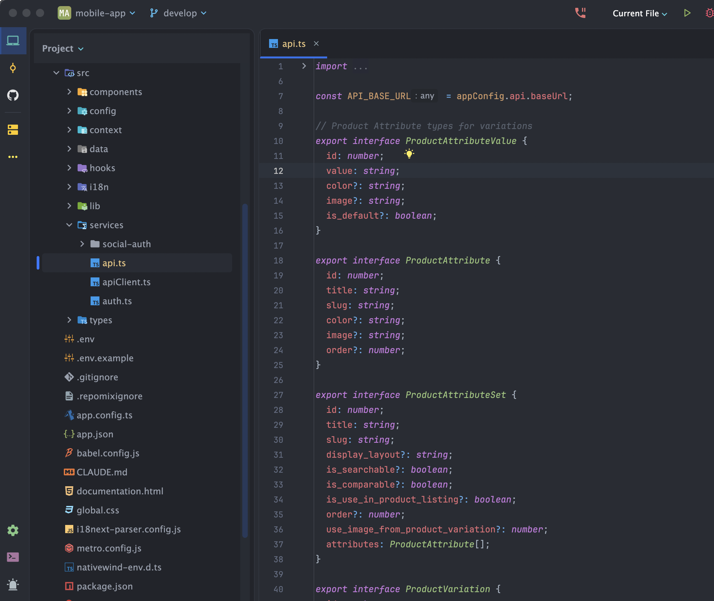

# Installation

## Requirements

- Node.js 18 or higher
- Expo CLI
- iOS Simulator (Xcode, Mac only) or Android Emulator (Android Studio), or the Expo Go app on a physical device

## Steps

### 1. Install Node.js

Install the LTS version from [nodejs.org](https://nodejs.org), then verify:

```bash
node --version
npm --version
```

### 2. Install Expo CLI

```bash
npm install -g expo-cli
```

### 3. Extract the source

Download the source from CodeCanyon and extract it.

### 4. Install dependencies

```bash
cd path/to/ecommerce-mobile-app
npm install
```

### 5. Configure `.env`

```bash
API_BASE_URL=https://your-domain.com
API_KEY=<from Admin → Settings → API Settings>
APP_NAME=Your Store Name
```

See [API Base URL](05_api_base_url.md) for `API_KEY` details.

### 6. Run

```bash
npm start
```

Then either scan the QR code with Expo Go, or run on a target:

```bash
npm run ios       # iOS Simulator (macOS)
npm run android   # Android Emulator
npm run web       # Browser
```

## Project structure



```
ecommerce-mobile-app/
├── app/                    Expo Router screens
│   ├── (auth)/             auth flows
│   ├── (tabs)/             main tab navigator
│   └── account/            account screens
├── src/
│   ├── components/         shared components
│   ├── context/            state providers
│   ├── services/           API clients
│   ├── hooks/
│   ├── i18n/               translations
│   └── lib/                utilities
├── assets/                 images, fonts
├── .env                    environment config
├── app.config.js           Expo config
├── package.json
└── tailwind.config.js
```

## Common errors

| Error | Fix |
|---|---|
| `npm: command not found` | Re-install Node.js, restart terminal. |
| `expo: command not found` | `npm install -g expo-cli` |
| `Cannot find module` | `rm -rf node_modules && npm install` |
| Build / cache errors | `npm start -- --clear` |
| No devices | Start an emulator, or install Expo Go on a physical device. |

## Next steps

- [Configuration](configuration.md)
- [Theme Colors](01_theme_colors.md)
- [Deploying the App](08_deploying_app.md)
- [Troubleshooting](troubleshooting.md)
