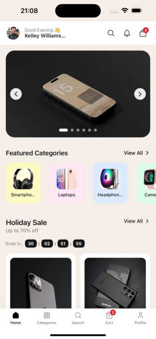
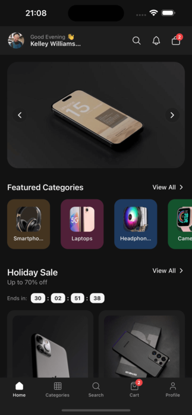
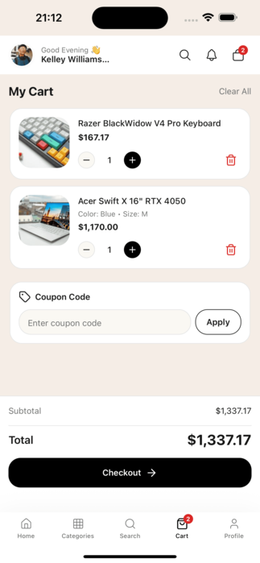
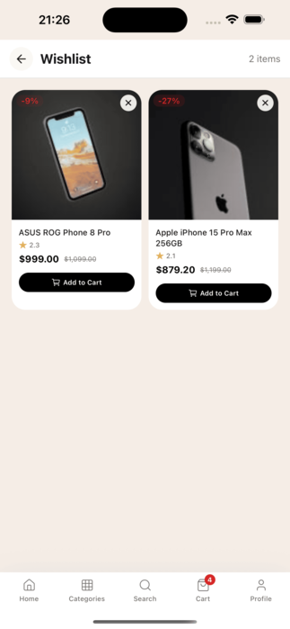

# Overview

Botble Ecommerce Mobile App is a React Native (Expo) mobile e-commerce app that connects to a Botble e-commerce backend. One codebase builds Android and iOS.

  
  

## Features

- Product browse, search, categories, brands, flash sales
- Authentication (email/password)
- Cart, coupons, wishlist (synced via API)
- WebView-based checkout (compatible with all backend payment gateways and shipping plugins)
- Order history and tracking
- 8 built-in languages: en, vi, zh, es, fr, de, ja, ar
- Light / dark / system theme

  
  
  

## Requirements

- A Botble e-commerce website with the API plugin enabled
- Node.js 18 or higher
- Expo CLI
- Google Play Developer account ($25 one-time) for Android publishing
- Apple Developer account ($99/year) for iOS publishing

## Get started

1. [Installation](installation.md)
2. [Configuration](configuration.md)
3. [Theme Colors](01_theme_colors.md)
4. [Deploying the App](08_deploying_app.md)

## Resources

- Documentation: https://docs.botble.com/ecommerce-mobile-app
- Backend demo: https://martfury.botble.com
- API reference: https://ecommerce-api.botble.com/docs
- Support tickets: https://botble.ticksy.com
- Email: contact@botble.com
