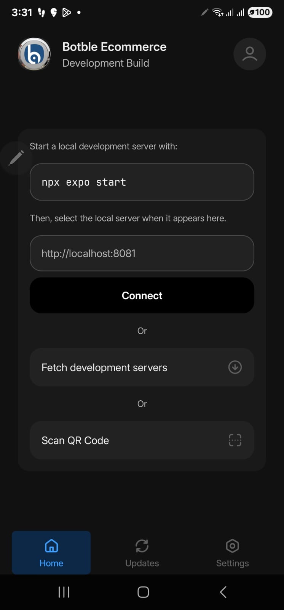

# Troubleshooting

## "Development Build" screen on device



A development build needs Metro running on your computer. To run the app standalone, build a preview or production binary with EAS:

```bash
npm install -g eas-cli
eas login
eas build:configure
eas build --platform android --profile preview
```

Install the resulting APK from [expo.dev](https://expo.dev). See [Deploying the App](08_deploying_app.md).

To keep using the development build instead, run `npx expo start` on your computer (same WiFi as the phone), then tap **Fetch development servers** in the app.

## Black screen after installing APK / AAB

`.env` is gitignored and not included in EAS builds. Set EAS Secrets and rebuild:

```bash
eas secret:create --name API_BASE_URL --value "https://your-domain.com"
eas secret:create --name API_KEY --value "<your-api-key>"
eas secret:list                  # verify
eas build --platform android --profile production
```

| Source | Local dev | EAS build |
|---|---|---|
| `.env` file | Yes | No |
| EAS Secrets | No | Yes |

To bulk-import all `.env` keys: `cat .env | xargs -L 1 eas secret:create`.

See [Deploying → Environment Variables](08_deploying_app.md#environment-variables-critical).

## EAS login

`eas login` asks for your **Expo account** credentials, not CodeCanyon. Sign up free at [expo.dev/signup](https://expo.dev/signup).

If you signed up via Google or GitHub, use SSO: `eas login --sso`.

To check current account: `eas whoami`.

## EAS init: "Cannot read properties of undefined (reading 'projectId')"

The `eas` block is in the wrong place in `app.json`. It must be inside `extra`:

```json
{
  "expo": {
    "extra": {
      "appConfig": { },
      "eas": {
        "projectId": "<your-project-id>"
      }
    }
  }
}
```

Move it under `expo.extra` (not directly under `expo`), then run `eas init` again.

## Installation errors

| Error | Fix |
|---|---|
| `npm: command not found` | Install Node.js LTS from [nodejs.org](https://nodejs.org), restart terminal. |
| `expo: command not found` | `npm install -g expo-cli` |
| `Cannot find module` | `rm -rf node_modules package-lock.json && npm install` |
| Metro crash / port conflict | `npm start -- --clear` or `npm start -- --port 8082` |

## API connection

### Network error

1. Confirm the website is online and reachable in a browser.
2. Verify `API_BASE_URL` in `.env` (no trailing slash, `https://` in production).
3. Test directly:

   ```bash
   curl https://your-domain.com/api/v1/ecommerce/products
   ```

### 401 Unauthorized — "Invalid or missing API key"

The `API_KEY` in `.env` does not match the key saved on the backend.

1. Open `https://your-domain.com/admin`
2. Go to **Settings → API Settings**
3. Click **Generate** if no key is shown, or copy the existing key
4. Paste into `.env` as `API_KEY=...` (or set the EAS Secret if building)
5. Restart Metro: `npm start -- --clear`

Do not put your Envato purchase code in `API_KEY`. The purchase code is for development license validation only. See [API Configuration](05_api_base_url.md#api-key).

### CORS error

The backend rejects requests from the app. Configure CORS on the Botble backend to allow the mobile app origin.

### SSL certificate error

Use a valid certificate. Self-signed certificates are not supported on iOS or Android in production.

## Build failures

### iOS

```bash
eas credentials --platform ios
eas build --platform ios --clear-cache
```

Common causes: bundle identifier in use, missing Apple credentials, provisioning profile expired.

### Android

```bash
eas credentials --platform android
eas build --platform android --clear-cache
```

Common causes: package name in use, keystore mismatch, SDK version conflict.

## Runtime issues

### App crashes on launch

Run in dev mode (`npm start`) and read the Metro output. Production crashes appear in EAS Build logs and the device's native log.

### Products not loading

1. Verify `API_BASE_URL` and `API_KEY`.
2. Confirm products are published on the website.
3. Inspect the network response in the React Native Debugger.

### Images missing or broken

- Use HTTPS for images. iOS blocks plain HTTP by default.
- Backend image URLs must be publicly accessible.
- Optimize image size — large images time out on slow connections.

### Cart not updating

Log out and back in. Verify the cart endpoints respond on the website.

### Login failing

1. Confirm login works on the website itself.
2. Check `API_BASE_URL` and `API_KEY`.
3. Inspect the response payload in the debugger.

## Social login

General checklist:

- Use a development or preview build, not Expo Go.
- All required keys set in `.env` and Metro restarted.
- The backend has the social provider configured.

See [Social Login Setup](11_social_login_setup.md).

### Twitter error 302

In the Twitter Developer Portal → User authentication settings:

| Setting | Value |
|---|---|
| Type of App | **Native App** |
| Client type | **Public client** |
| OAuth 2.0 | enabled |
| Callback URL | `botble://twitter-auth` |

### Google Sign-In failing

- Use the **Web application** Client ID, not Android/iOS.
- Add SHA-1 fingerprints for debug and release keystores.
- Test on a device with Google Play Services.

### Apple Sign-In button missing

- Apple Sign-In is iOS-only by design.
- Set `usesAppleSignIn: true` in `app.config.js` and rebuild the development build.

### Facebook "Invalid Key Hash"

```bash
keytool -exportcert -alias androiddebugkey -keystore ~/.android/debug.keystore | openssl sha1 -binary | openssl base64
```

Add the output to Facebook app → Settings → Android → Key Hashes (debug and release).

## Performance

- Run a release-mode build to benchmark, not the dev server: `npx expo start --no-dev --minify`.
- Hermes is on by default in SDK 54+.
- Use `FlatList` (not `ScrollView`) for long product lists.
- Optimize images on the backend; use `PRODUCT_IMAGE_THUMBNAIL_SIZE`.

## Platform-specific

### iOS Simulator does not open

```bash
xcode-select --install
xcrun simctl shutdown all
npm run ios
```

### Android Emulator does not start

Start the emulator manually from Android Studio → Device Manager, then run `npm run android`.

### Physical device cannot connect

Use tunnel mode if not on the same WiFi:

```bash
npm start -- --tunnel
```

## Environment variables

`.env` changes do not apply via fast refresh. Stop Metro and run:

```bash
npm start -- --clear
```

For production builds, `.env` is **not** read. Use EAS Secrets (see [Black screen after installing APK / AAB](#black-screen-after-installing-apk-aab)).
