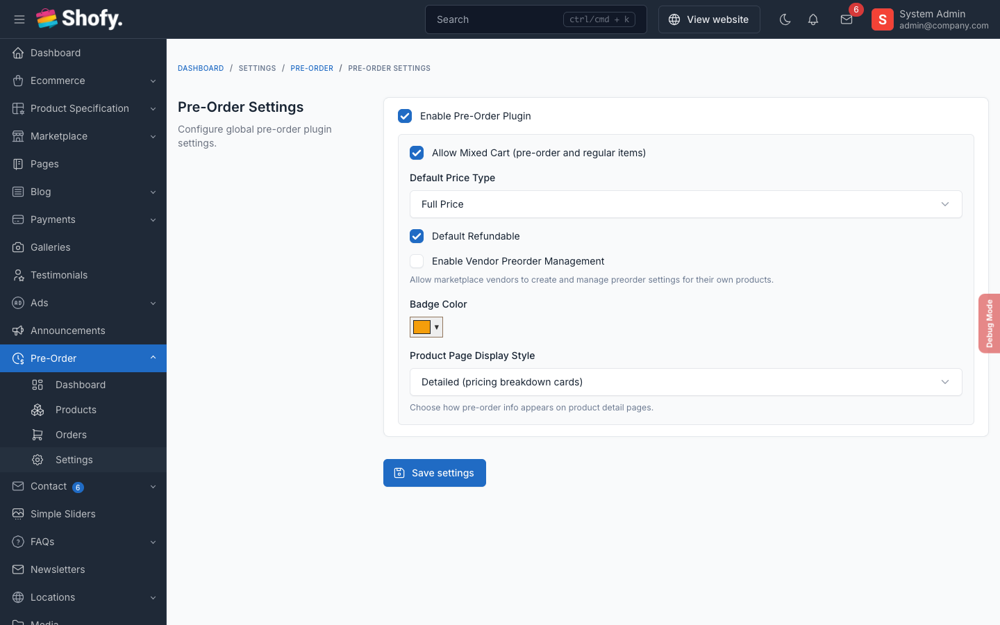

# Configuration

All preorder settings are in one place: **Preorder > Settings** in your admin panel.



## Core Settings

### Enable Preorder

Turns the entire preorder system on or off without deactivating the plugin. When disabled, all preorder badges, buttons, and customer dashboard features are hidden.

**Default:** Enabled

### Allow Mixed Cart

Controls whether customers can add both regular products and preorder products to the same cart:

- **Enabled** (default) — Customers can mix regular and preorder items freely
- **Disabled** — Cart must contain only regular items or only preorder items. Useful when preorder items have different shipping timelines.

::: tip
If disabled and a customer tries to add a preorder item to a cart that already has regular items, they'll see an error message asking them to complete the current order first.
:::

### Default Price Type

Sets the default pricing strategy when creating new preorder products. You can override this per product.

| Price Type | How it works | Example ($100 product) |
|------------|-------------|----------------------|
| **Full Price** | Customer pays the full preorder price at checkout | Pays $100 now |
| **Deposit Percentage** | Customer pays a percentage upfront, balance due later | 30% = pays $30 now, $70 later |
| **Deposit Fixed** | Customer pays a fixed amount upfront, balance due later | $20 deposit = pays $20 now, $80 later |

**Default:** Full Price

### Default Refundable

Whether new preorder products allow refund requests by default. Can be overridden per product.

**Default:** Enabled

## Display Settings

### Badge Text

Text shown on preorder product badges throughout the store (product cards, product pages, cart).

**Default:** "Pre-Order"

### Badge Color

Hex color for the preorder badge.

**Default:** `#f59e0b` (amber)

### Button Text

Text for the preorder add-to-cart button, replacing the regular "Add to Cart".

**Default:** "Add to Pre-Order"

### Display Style

Controls how preorder information appears on the product detail page:

| Style | What it shows |
|-------|-------------|
| **Detailed** (default) | Full info card with pricing breakdown, availability date, discount label, and custom message |
| **Minimal** | Compact badge with brief text |

### Default Message

Fallback message shown on preorder products when no custom message is set. Supports the `:date` placeholder, which is replaced with the formatted availability date.

**Example:** `This product is available for pre-order. Expected availability: :date`

## Vendor Settings

### Vendor Management Enabled

::: info
Only appears when the Marketplace plugin is active.
:::

When enabled, vendors can create and manage their own preorder products and orders from the vendor dashboard.

**Default:** Disabled

## Permissions

Preorder adds these permissions that you can assign to admin roles at **Admin > Users > Roles**:

| Permission | What it allows |
|------------|---------------|
| `preorder.index` | Access preorder admin menu |
| `preorder.products.index` | View preorder products list |
| `preorder.products.create` | Create new preorder products |
| `preorder.products.edit` | Edit existing preorder products |
| `preorder.products.destroy` | Delete preorder products |
| `preorder.orders.index` | View preorder orders list |
| `preorder.orders.edit` | Update order status |
| `preorder.orders.destroy` | Delete preorder orders |
| `preorder.settings` | Access preorder settings page |

### Suggested role setups

**Store Manager** — All preorder permissions

**Sales Staff** — View products, view and edit orders. No settings or delete access.

**Customer Service** — View products, view orders. Cannot edit or delete.

## Cronjob

The plugin registers a daily command to automatically disable expired preorder products. Make sure your server's cronjob is configured:

```bash
* * * * * cd /path-to-your-project && php artisan schedule:run >> /dev/null 2>&1
```

The command `preorder:disable-expired` runs daily at midnight. It sets any published preorder product with **Auto-Disable** enabled and a past availability date to draft status.

You can also run it manually:

```bash
php artisan preorder:disable-expired
```
