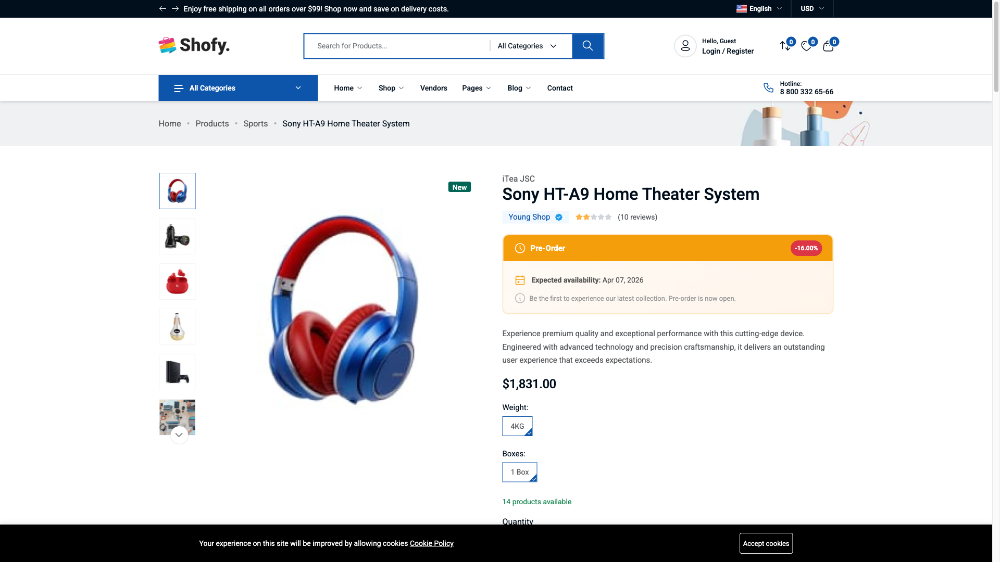

# Customer Guide

This guide is for your customers — people who want to pre-order products from your store. You can link to this page from your store's footer or help center.

## Browsing Preorder Products

### Finding preorder products

Preorder products are shown throughout the store with a badge (typically "Pre-Order" in amber). You can also browse all available preorder products at `/preorder-products` on the store website.

### What you see on a preorder product page

When you visit a preorder product, you'll see:

- **Preorder badge** — Indicates this product is available for pre-order
- **Availability date** — When the product is expected to ship
- **Pricing breakdown** — What you pay now vs. what you pay later
- **Custom message** — Any additional info from the store (e.g., "Ships by June 15, 2026")
- **Pre-Order button** — Instead of the regular "Add to Cart"

**Example pricing display:**

| Detail | Amount |
|--------|--------|
| Original price | ~~$1,200~~ |
| Preorder price | $1,140 (5% off) |
| Deposit (30%) | **$342** (pay now) |
| Balance due | $798 (pay later) |

## Placing a Preorder

### Step 1: Add to cart

1. Visit a preorder product page
2. Select your variant options (size, color, etc.) if applicable
3. Click the **Add to Pre-Order** button

### Step 2: Review your cart

In the cart, preorder items show:
- A preorder badge
- Estimated availability date
- Deposit amount (what you pay now)
- Balance due (what you pay later)

::: info
If the store doesn't allow mixing regular and preorder items in the same cart, you'll need to complete separate orders.
:::

### Step 3: Checkout

Complete checkout as normal. For deposit-based pricing, you only pay the deposit amount at checkout. The remaining balance is collected later.

## Managing Your Preorders

### Accessing your preorder dashboard

1. Log in to your account
2. Go to **My Account**
3. Click **Preorders** in the sidebar menu

The menu item shows a badge with the count of pending preorders.

### Preorder list

Your preorder dashboard shows all your preorders with:
- Order code
- Product name and image
- Quantity
- Total amount
- Current status
- Date placed

### Preorder detail page

Click a preorder to see the full details. The page shows a 3-step accordion view:

**Step 1: Prepayment**

When the store requests your deposit payment, this section becomes active. Click to pay via the available payment methods (COD, bank transfer, Stripe, PayPal — depends on the store's setup).

**Step 2: Final Order**

After your deposit is confirmed and the product becomes available, this section lets you pay the remaining balance to complete your order.

**Step 3: Refund (if applicable)**

If your order was cancelled and the product allows refunds, you can submit a refund request here.

## What You Can Do at Each Stage

| Your preorder status | Actions available |
|---------------------|------------------|
| **Requested** | Cancel |
| **Accepted** | Cancel |
| **Prepayment Requested** | Pay deposit, Cancel |
| **Prepayment Confirmed** | Wait for product availability |
| **Final Order** | Pay remaining balance |
| **In Shipping** | Track your order |
| **Delivered** | Order complete |
| **Cancelled** | Request refund (if product is refundable) |

## Common Questions

### I placed a preorder but my status is still "Requested"

The store admin needs to review and accept your preorder. Processing time varies. If it's been more than a few days, contact the store.

### I can't add both regular and preorder items to my cart

Some stores don't allow mixing regular and preorder items in the same cart. Complete your current order first, then add the preorder item separately.

### How do I cancel my preorder?

Go to **My Account > Preorders**, open the preorder, and click **Cancel**. You can only cancel when the status is Requested, Accepted, or Prepayment Requested. Once you've paid the deposit, cancellation is no longer available from your dashboard — contact the store.

### Can I get a refund?

If your order was cancelled and the product is refundable, you can submit a refund request from your preorder detail page. The store will review and process your refund.

### When will I receive my product?

Check the **availability date** on your preorder detail page. The store will notify you when the product is ready and request the final payment.

## Getting Support

Contact the store directly for help with:
- Your preorder status
- Payment issues
- Cancellation requests
- Refund questions
