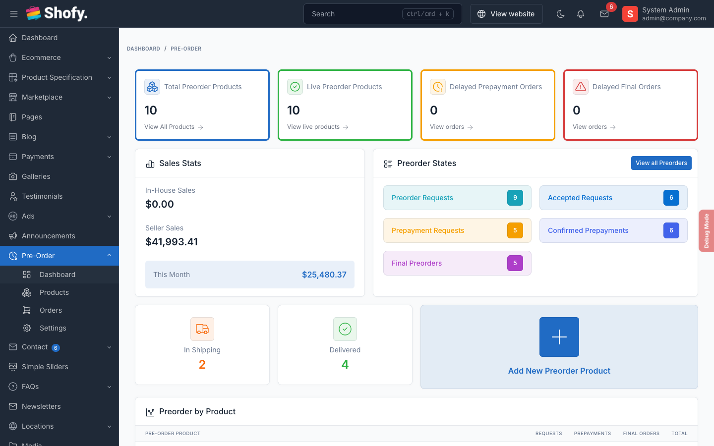

# Usage Overview

This section covers everything you need to manage preorders on your site. Pick the guide that matches what you want to do.

## Admin Guides

### [Preorder Products](/ecommerce-preorder/usage/preorder-products)

Create and manage preorder configurations for your products. Set pricing strategies, availability dates, stock limits, and display options.

**Go to:** Preorder > Products

### [Preorder Orders](/ecommerce-preorder/usage/preorder-orders)

Track and manage customer preorders through the full lifecycle. Handle payments, status updates, and refunds.

**Go to:** Preorder > Orders

### [Customer Guide](/ecommerce-preorder/usage/customer-guide)

How your customers browse preorder products, place requests, make payments, and manage their preorders from their dashboard.

### [Vendor Guide](/ecommerce-preorder/usage/vendor-guide)

How vendors manage their own preorder products and orders when the Marketplace plugin is active.

## How Everything Fits Together

```
1. You create a preorder product with pricing strategy and availability date
                    ↓
2. Customer sees the preorder badge and pricing on the product page
                    ↓
3. Customer adds to cart → pays deposit at checkout
                    ↓
4. You review and accept the preorder request
                    ↓
5. You request prepayment → customer pays deposit
                    ↓
6. Product becomes available → customer pays remaining balance
                    ↓
7. You ship the product → customer receives it
```

### What controls the price a customer pays?

There are two layers of pricing:

**Layer 1: Preorder Price** — Each preorder product has its own price, which can differ from the regular product price.

**Layer 2: Deposit** — For deposit-based pricing, the customer pays only the deposit amount at checkout. The remaining balance is collected later.

**Example:**

Product: Wireless Headphones, retail price $200

- You set preorder price at $180 (10% pre-order discount)
- Price type: Deposit Percentage at 30%
- Customer pays $54 now (30% of $180)
- Customer pays $126 later when the product ships

## Dashboard



View aggregated statistics at **Preorder > Dashboard**:

- Total preorder products and active count
- Delayed orders (past availability date)
- Status breakdown across all orders
- Sales summary and top products
