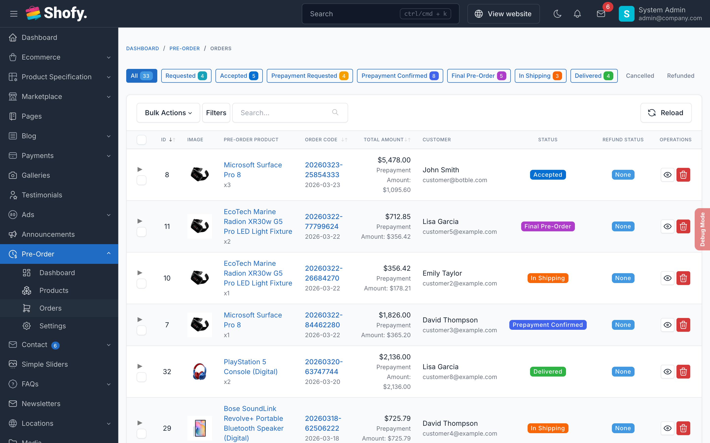

# Preorder Orders

Manage preorder orders at **Preorder > Orders** in the admin panel.

## Order Lifecycle

Every preorder moves through these statuses:

| Status | What happens | Who acts |
|--------|-------------|----------|
| **Requested** | Customer submitted a preorder request | Customer |
| **Accepted** | Admin approved the preorder | Admin |
| **Prepayment Requested** | Waiting for customer to pay the deposit | Admin triggers |
| **Prepayment Confirmed** | Deposit payment received | Automatic |
| **Final Pre-Order** | Customer paid the remaining balance | Customer |
| **In Shipping** | Product shipped to customer | Admin |
| **Delivered** | Order completed | Admin |
| **Cancelled** | Order was cancelled | Admin or Customer |
| **Refunded** | Refund issued to customer | Admin |

### Status flow

```
Requested → Accepted → Prepayment Requested → Prepayment Confirmed
→ Final Pre-Order → In Shipping → Delivered
```

At most stages, an order can also be **Cancelled**. Cancelled orders with refundable products can then be **Refunded**.

::: warning
Only valid next statuses are shown in the status dropdown. You cannot skip steps — for example, you can't go from "Requested" directly to "In Shipping".
:::

## The Preorder Admin Menu

| Menu Item | What it does | Admin URL |
|-----------|-------------|-----------|
| **Dashboard** | Aggregated stats and charts | `/admin/preorder/dashboard` |
| **Products** | Create and manage preorder products | `/admin/preorder/products` |
| **Orders** | View and manage preorder orders | `/admin/preorder/orders` |
| **Settings** | Configure preorder system settings | `/admin/preorder/settings` |

## Managing Orders

### Order table

The table at **Preorder > Orders** shows:

| Column | What it shows |
|--------|-------------|
| **Order Code** | Unique code like `20260324-A1B2C3D4` |
| **Product** | Product name and image |
| **Customer** | Customer name |
| **Quantity** | Number of units |
| **Total Amount** | Full order value |
| **Preorder Status** | Current lifecycle status |
| **Refund Status** | None, Requested, Approved, Refunded, or Rejected |
| **Created** | When the order was placed |



Use the status filter to show only orders in a specific status (e.g., show only "Prepayment Requested" orders that need attention).

### Order detail

Click an order to view full details:

- **Customer info** — Name, email, link to their account
- **Product info** — Name, quantity, variant details
- **Pricing breakdown** — Product price, discount, prepayment amount, balance due, total
- **Status timeline** — Timestamps for each status change (prepaid_at, confirmed_at, shipped_at, delivered_at)
- **Payment links** — Links to prepayment and final payment records

### Updating status

1. Open an order at **Preorder > Orders > Click order**
2. Use the status dropdown to select the next status
3. Click **Save**

The plugin validates transitions automatically — invalid next statuses are not available in the dropdown.

## Two-Stage Payment

For deposit-based preorders, payment happens in two stages:

### Stage 1: Prepayment (Deposit)

1. Customer places preorder → status is **Requested**
2. You review and **Accept** the preorder
3. Customer sees the deposit payment option in their dashboard and pays (via COD, bank transfer, Stripe, or PayPal)
4. On successful payment, status automatically moves to **Prepayment Confirmed**

::: tip
The customer can pay the deposit as soon as the order is **Accepted**. The admin can also manually advance to **Prepayment Requested** to prompt the customer, but payment is available from the Accepted stage.
:::

### Stage 2: Final Payment (Balance)

1. Once the deposit is confirmed (**Prepayment Confirmed**), the customer can pay the remaining balance from their dashboard
2. On successful payment, status moves to **Final Pre-Order**
3. You ship the product → set status to **In Shipping**
4. Product delivered → set status to **Delivered**

### Full price orders

For full-price preorders (no deposit split), the customer pays the complete amount at checkout. The order still moves through the same statuses, but there's no separate prepayment stage.

### Payment tracking

Each preorder order tracks two payment references:

| Field | What it stores |
|-------|---------------|
| `prepayment_payment_id` | Links to the deposit payment record |
| `final_payment_id` | Links to the balance payment record |

You can click through to view payment details in the standard Ecommerce payment records.

## Refund Management

### Refund statuses

| Status | Description |
|--------|-------------|
| **None** | No refund requested |
| **Requested** | Customer submitted a refund request |
| **Approved** | Admin approved the refund |
| **Refunded** | Refund completed |
| **Rejected** | Admin rejected the refund request |

### When a refund can be requested

Two conditions must be met:

1. The order status is **Cancelled**
2. The preorder product has **Is Refundable** enabled

### Processing a refund

1. Customer requests a refund from their dashboard
2. You see the refund request at **Preorder > Orders** (refund status column shows "Requested")
3. Open the order and review the request
4. Approve or reject the refund
5. If approved, process the actual refund through your payment provider manually

## Integration with Ecommerce Orders

When a customer completes checkout with preorder items, this happens automatically:

1. A standard ecommerce order is created
2. The plugin detects preorder items in the order
3. A `PreorderOrder` record is created linking to the ecommerce order
4. Product prices in the order are overridden to the prepayment amount
5. Order totals and invoice are recalculated
6. The preorder product's slot counter increments

## Order Codes

Preorder orders use a unique code format: `YYYYMMDD-XXXXXXXX` (date prefix + 8 random characters, e.g., `20260324-A1B2C3D4`). This is separate from the main ecommerce order number.

## Troubleshooting

### Order stuck in "Requested" status

The admin needs to manually advance the order. Go to **Preorder > Orders**, open the order, and change status to **Accepted**.

### Payment not linking to preorder order

1. Check your payment gateway callbacks are configured correctly
2. Check the `prepayment_payment_id` and `final_payment_id` fields on the order record
3. Review server logs: `storage/logs/laravel.log`

### Customer says they paid but status didn't change

1. Check the payment record in **Ecommerce > Payments** — verify it shows as completed
2. If the payment callback failed, manually update the preorder status to **Prepayment Confirmed**
3. Link the payment record to the preorder order if needed

### Preorder items showing wrong price in order

The plugin overrides cart prices to the prepayment amount at checkout. If prices look wrong:

1. Check the preorder product's pricing configuration
2. Check if other price-modifying plugins (e.g., Wholesale) are also active
3. Clear cart and re-add the product
