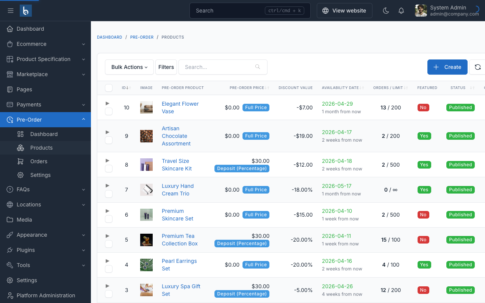
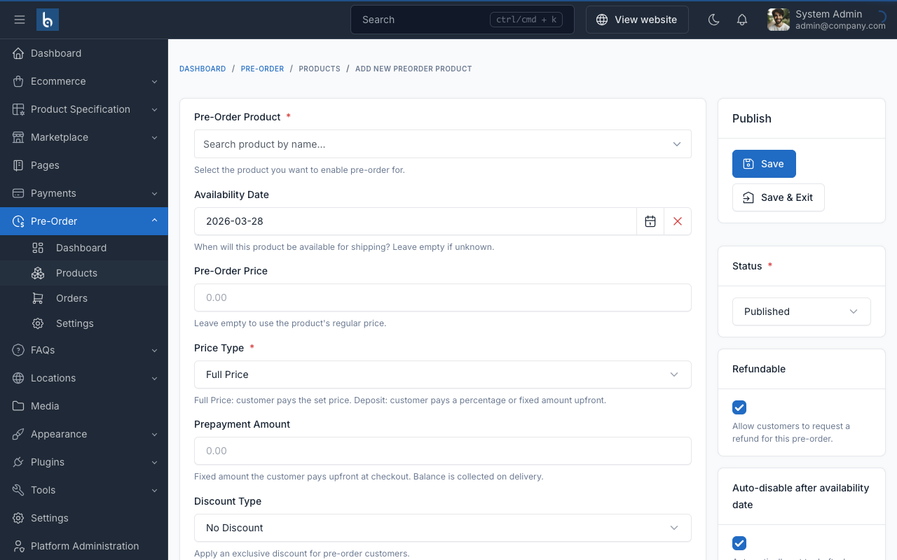
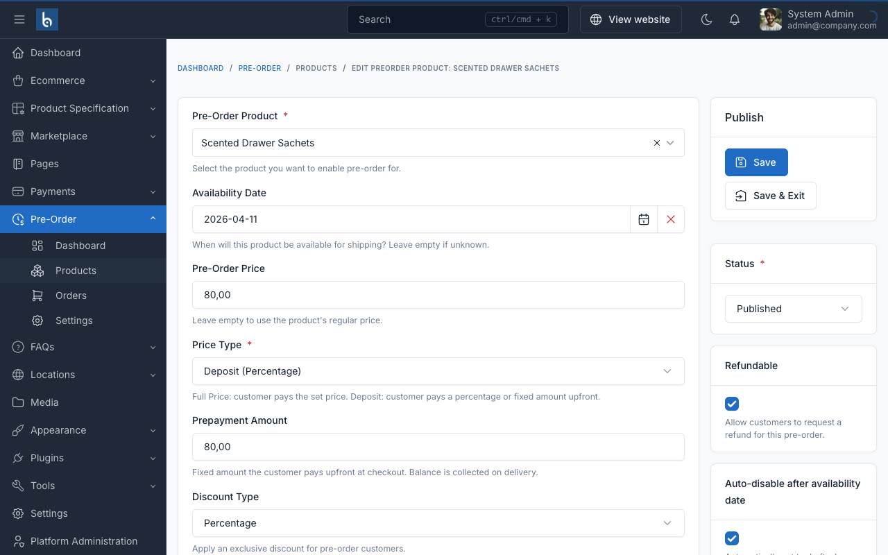

# Preorder Products

Manage preorder products at **Preorder > Products** in the admin panel.

## Creating a Preorder Product

1. Go to **Preorder > Products** in the admin sidebar
2. Click the **Create** button
3. Fill in the form:

| Field | Required | What to enter |
|-------|----------|--------------|
| **Product** | Yes | Search and select a product from your catalog |
| **Availability Date** | No | Expected shipping date, e.g., `2026-06-15`. Leave empty if unknown |
| **Preorder Price** | No | The price customers pay, e.g., `180` for $180. Leave empty to use product's regular price |
| **Price Type** | Yes | Full Price, Deposit Percentage, or Deposit Fixed |
| **Prepayment Amount** | When deposit | The deposit value — percentage (e.g., `30`) or fixed amount (e.g., `50`) |
| **Discount Type** | No | Percentage or Fixed — exclusive preorder discount |
| **Discount Value** | No | The discount number, e.g., `10` for 10% off or `20` for $20 off |
| **Min Purchase Qty** | No | Minimum units per order, e.g., `2`. Default: 1 |
| **Stock Limit** | No | Max preorder slots. `0` = unlimited |
| **Is Refundable** | No | Allow refund requests on cancelled orders. Default: Yes |
| **Auto-Disable** | No | Auto-draft the product after availability date passes |
| **Featured** | No | Show in featured preorder sections |
| **Custom Message** | No | Displayed on product page. Use `:date` for the availability date |
| **Status** | Yes | Published to activate, Draft to save without activating |

4. Click **Save**

::: warning
Each product can only have one preorder configuration. If a product already has one, edit the existing configuration instead of creating a new one.
:::

### How each price type works

**Full Price** — Customer pays the entire preorder price at checkout:
- Product price: $200, preorder price: $180
- Customer pays **$180** at checkout

**Deposit Percentage** — Customer pays a percentage upfront, balance due later:
- Product price: $200, preorder price: $180, prepayment: 30%
- Customer pays **$54** now (30% of $180), **$126** later

**Deposit Fixed** — Customer pays a fixed amount upfront, balance due later:
- Product price: $200, preorder price: $180, prepayment: $50
- Customer pays **$50** now, **$130** later

::: tip
Deposit-based pricing is the most common choice. It secures the order while reducing the customer's upfront commitment.
:::

### How discounts work

Discounts are applied **before** the prepayment calculation:

1. Start with preorder price: $200
2. Apply 10% discount: $200 - $20 = **$180**
3. Calculate 30% deposit: $180 × 0.30 = **$54**

The discount is exclusive to the preorder — regular customers see the original price.

## Quick Enable via Product Edit

You can also enable preorder directly from a product's edit page. A preorder metabox appears with a quick toggle. This creates a basic preorder configuration that you can then customize at **Preorder > Products**.

## Product Variations

Preorder settings are configured on the **parent product** level. All variants of a product share the same preorder configuration (availability date, pricing strategy, stock limit).

When a customer adds a specific variant, the variant's own price is used as the base for calculating the deposit.

## Preorder Products List

The table at **Preorder > Products** shows:

| Column | What it shows |
|--------|-------------|
| **Product** | Name and image |
| **Preorder Price** | Configured price |
| **Price Type** | Full Price, Deposit %, or Deposit Fixed |
| **Discount** | Discount label (e.g., "10% off") |
| **Availability Date** | Expected shipping date |
| **Slots** | Current preorders / stock limit |
| **Status** | Published or Draft |
| **Featured** | Yes or No |

## Setting Up a Complete Example

Let's set up a preorder for a new phone that launches June 15, 2026.

**Goal:** Accept preorders with a 30% deposit and a 5% early-bird discount.

### Step 1: Plan your pricing

| Detail | Value |
|--------|-------|
| Product | Galaxy S30 Ultra |
| Retail price | $1,200 |
| Preorder price | $1,200 |
| Discount | 5% = $60 off → $1,140 |
| Deposit | 30% of $1,140 = $342 |
| Balance due | $1,140 - $342 = $798 |
| Stock limit | 500 units |
| Availability | June 15, 2026 |

### Step 2: Create the preorder

1. Go to **Preorder > Products > Create**
2. Select "Galaxy S30 Ultra"
3. Set Availability Date: `2026-06-15`
4. Set Preorder Price: `1200`
5. Set Price Type: **Deposit Percentage**
6. Set Prepayment Amount: `30`
7. Set Discount Type: **Percentage**, Value: `5`
8. Set Stock Limit: `500`
9. Set Custom Message: `Pre-order now and save 5%! Ships by :date.`
10. Set Status: **Published**
11. Click **Save**

### Step 3: Verify on the frontend

Visit the product page. You should see:
- Preorder badge
- "Pre-order now and save 5%! Ships by June 15, 2026."
- Price breakdown: ~~$1,200~~ → $1,140 (5% off), Deposit: $342, Balance: $798
- "Add to Pre-Order" button

## Troubleshooting

### Preorder badge not showing on the product page

1. Check the preorder product status is **Published**: **Preorder > Products**
2. Check the plugin is enabled: **Preorder > Settings > Enable Preorder**
3. Clear cache: **Admin > Platform Administration > Cache management > Clear all CMS cache**

### Stock limit reached but I want more preorders

Edit the preorder product and increase the **Stock Limit**, or set it to `0` for unlimited.

### Product auto-disabled too early

The `preorder:disable-expired` command runs daily at midnight. If the availability date is today, the product will be disabled tonight. To keep it active longer, push the availability date forward or disable **Auto-Disable** on the product.
